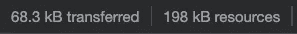
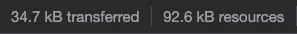

# 想让你的 Next.js App 更快？启用预先支持

> 原文：<https://javascript.plainenglish.io/next-js-preact-f993c95a3f93?source=collection_archive---------1----------------------->

## 如何在你的 Next.js 应用上启用 Preact 支持，并几乎免费节省几千字节。


Source: the author

为什么 Preact 的使用率如此之低？

不知何故，我们都知道严格控制饮食的图书馆是存在的。我们大多数人也知道 Preact 在大多数情况下更快。(我在这里做了一个比较)
然而，React 是许多开发人员的首选。

声称 Preact 是 React.js 的 100%替代品是错误的。
然而，Preact 在许多情况下是一个极好的替代品。

例如，因为它支持钩子，就像 react 中一样，并帮助我们通过 preact-compat 进行迁移，所以我将几个 React 应用程序迁移到 Preact——没有任何问题。

现在有一段时间，Next.js 也支持 Preact。我创建了同一个小应用程序，一个带有 React，一个带有 Preact 支持——结果相当不错:



Size of the Next + React app



Size of the Next + Preact app

我让你兴奋了吗？太好了！以下是如何几乎毫不费力地将 Next.js 应用程序转移到 Preact 上的方法。

## 开始基本的 Next.js 设置

对你们大多数人来说，这并不新鲜，所以让我们尽快完成。

创建一个新目录。移动到其中，运行`npm init .`和`npm install react react-dom next`。在根目录下创建一个名为`pages`的目录，在那里创建一个名为`index.js`的文件。package.json 的脚本部分应该如下所示:

```
"scripts": { 
  "start": "next start", 
  "dev": "next dev", 
  "build": "next build" 
}
```

最后，我们可以填写`pages/index.js`:

有趣的是，我们现在有了一个充满了 React 特有内容的文件。然而，我们可以很容易地将其迁移到 Preact。

## 在 Next.js 中切换到 Preact

为此，首先，我们需要安装一些东西:

```
npm install --save next next-plugin-preact preact react@npm:@preact/compat react-dom@npm:@preact/compat react-ssr-prepass@npm:preact-ssr-prepass preact-render-to-string
```

重要提示:如果你现在查看你的`package.json`，你会发现以前的依赖项 react、react-dom 等等被覆盖了。所以，如果你想回到普通反应，不要忘记改变这些。

接下来，我们需要让 Next 知道我们的变化。在项目的根目录下创建一个`next.config.js`，并像这样填充它:

```
const withPreact = require('next-plugin-preact')module.exports = withPreact({
 // all your other Next.js options
})
```

就是这样！最初，Preact 对钩子和 co .使用了与 react 不同的导入。比如`import { useState } from "preact/hooks"`。

然而，我们不需要关心这个，因为 preact-compat 帮助我们迁移。因此，您不需要更改`index.js`，即使它从 React 导入内容。

如果您现在运行`npm run build`，您的 Preact 页面就准备好了。

你也可以在`npm run build`给你的信息中看到改变的尺寸，而不仅仅是在浏览器中。如果你想把这个和普通的 React + Next 应用的包大小进行比较，记住要把`package.json`改回来，而不仅仅是`next.config.js`。

## 最后的想法

切换到 Preact 已经帮了我好几次了。但是，Preact 不能 100%替代 react。因为两个库都在不断变化，所以最好自己研究一下，确定哪些 React 特性可以毫无问题地用在 Preact 中。

然而，对于开发过程，我认为最好坚持使用 React。但是，在生产版本中，Preact 可以节省几千字节。

感谢您的阅读！

**关于 Preact 和 Next 的更多信息:**

[](/i-built-the-same-app-with-react-and-preact-here-are-the-differences-b0da382a6f72) [## 我用 React 和 Preact 构建了相同的应用程序。以下是不同之处

### 以及测量的大小、性能和实现

javascript.plainenglish.io](/i-built-the-same-app-with-react-and-preact-here-are-the-differences-b0da382a6f72) [](/next-js-webassembly-77df3537690) [## 用 Next.js 构建您的第一个 WebAssembly 组件

### 而不必首先设置编译器

javascript.plainenglish.io](/next-js-webassembly-77df3537690) 

## 进一步阅读

[](https://plainenglish.io/blog/which-database-should-you-use-for-your-next-js-app) [## Next.js 应用程序应该使用什么数据库？

### 如果你在 2022 年要开发一个全栈应用，选择流行的 Next.js 会让你有 95%的机会…

简明英语. io](https://plainenglish.io/blog/which-database-should-you-use-for-your-next-js-app) [](https://plainenglish.io/blog/how-to-build-a-graphql-ecommerce-app-from-scratch) [## 如何从头开始构建一个 GraphQL 电子商务应用程序

### 这就是你要建造的东西！埃森哲的一项调查(19 个国家的 20，000 多名消费者)发现，47%的人…

简明英语. io](https://plainenglish.io/blog/how-to-build-a-graphql-ecommerce-app-from-scratch) [](https://blog.bitsrc.io/next-js-13-what-do-the-new-bleeding-edge-features-actually-do-d3e5fd418563) [## Next.js 13:新的前沿特性实际上是做什么的？

### 你听说过 Next.js 13 是一个游戏改变者，但是为什么？让我们看看有哪些新功能，有哪些变化，以及它们…

blog.bitsrc.io](https://blog.bitsrc.io/next-js-13-what-do-the-new-bleeding-edge-features-actually-do-d3e5fd418563) 

*更多内容请看*[***plain English . io***](https://plainenglish.io/)*。报名参加我们的* [***免费周报***](http://newsletter.plainenglish.io/) *。关注我们关于*[***Twitter***](https://twitter.com/inPlainEngHQ)[***LinkedIn***](https://www.linkedin.com/company/inplainenglish/)*[***YouTube***](https://www.youtube.com/channel/UCtipWUghju290NWcn8jhyAw)*[***不和***](https://discord.gg/GtDtUAvyhW) *。对增长黑客感兴趣？检查* [***电路***](https://circuit.ooo/) *。***