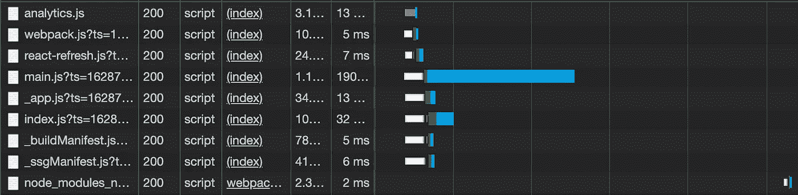
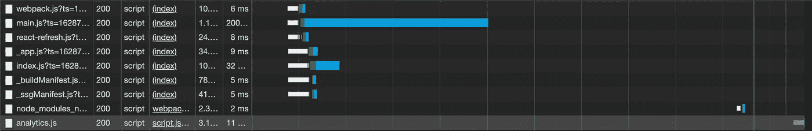

# 添加到工具箱中的 5 个有用的 Next.js 技巧

> 原文：<https://javascript.plainenglish.io/next-js-tricks-6dd97ee66c7c?source=collection_archive---------4----------------------->

## 构建脚本、加载外部 JavaScript、重定向等等。


Source: the author

Next.js 在进化。随着时间的推移，它收到了越来越多的酷功能。这里有 5 个技巧，你可能还不知道。

# 1.在构建或开发过程中运行脚本

只有当我们运行`npm run build`时才需要这个脚本，所以当我们开始构建过程时。当我们处于开发模式时，将不需要和执行该脚本。为了使这个例子完整，所以你可以尝试一下，下面是我用来测试的简单的`generateSitemap.js`:

当然，你也可以把 next.config.js 中的逻辑转过来，只在开发模式下执行某个脚本。一切都取决于你。

# 2.指定如何加载外部脚本

承认吧，我们之前都试图在 React 中使用`<script>`标签。

Next.js 现在使之成为可能，因为它为此提供了一个特殊的组件。我们不仅可以使用它来包含外部脚本，还可以指定它们应该如何加载。

我们通过提供加载策略来实现这一点，如下所示:

在这个例子中，Google Analytics 脚本将在页面开始交互之前加载。在网络选项卡中，您可以清楚地看到:



另一种策略是在其他事情都完成时加载它——这种策略用于页面中不重要的脚本。当将 Google Analytics 的脚本组件设置为`strategy='lazyOnload'`时，网络选项卡将如下所示:



是的，分析脚本在最后加载。

# 3.重定向 URL

这个很简单。当访问 Next.js 服务器上的 URL 时，如果需要，可以重定向它。这既适用于内部重定向，也适用于外部重定向。

在本例中，您可以看到一个外部重定向。

# 4.共享组件属性

我知道有很多方法可以在 React 的组件之间共享数据。这是另一个。正如你可能知道的，我们可以使用`_app.js`文件来包装我们想要渲染的所有页面。例如，这可以用于注入全局 CSS。

在这个特殊的文件中，我们还可以访问类似 props 的数据，我们可以在每个组件中指定。这里有一个例子。

这样，我们为这个页面专门定义了一个标题。在`_app.js`中，我们现在可以访问这些共享数据，并随心所欲地使用它们:

在`http://localhost:3000/`(默认)打开索引页面时，我们将看到以下输出:


# 5.核心网络重要信息

web vitals 是 Google 收集的网站性能指标。如果你以前用过 Lighthouse，你已经对它有一点了解了。

但是我们可以直接在 Next.js 组件中报告我们的 web 重要分数，而不是手动运行 Lighthouse 基准。下面是它的基本工作原理，在`_app.js`中使用:

```
export function reportWebVitals(metric) {
 console.log(metric)
}export default function App({ Component, pageProps }) {
 return <Component {…pageProps} />
}
```

这将为您提供一个 web vitals 对象，包含控制台中的大量信息。要指定想要使用的指标，可以使用:

```
export function reportWebVitals(metric) {
  switch (metric.name) {
    case 'FCP':
      console.log(metric)
   }
}
```

在这个例子中，我们使用 FCP 代表第一个内容丰富的油漆。

感谢您的阅读！

关于 Next.js 的更多信息:

[](/next-js-preact-f993c95a3f93) [## 想让你的 Next.js App 更快？启用预先支持(方法如下)

### 如何在你的 Next.js 应用上启用 Preact 支持，并几乎免费节省几千字节。

javascript.plainenglish.io](/next-js-preact-f993c95a3f93) [](/next-js-webassembly-77df3537690) [## 用 Next.js 构建您的第一个 WebAssembly 组件

### 而不必首先设置编译器

javascript.plainenglish.io](/next-js-webassembly-77df3537690) 

*更多内容尽在*[***plain English . io***](http://plainenglish.io/)