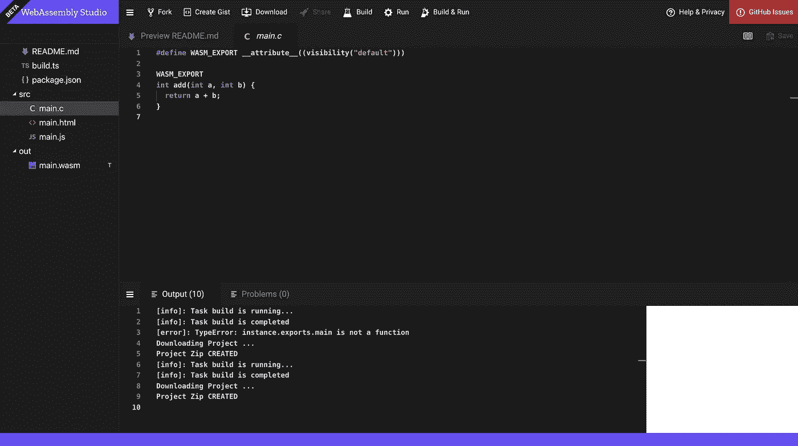

# 用 Next.js 构建您的第一个 WebAssembly 组件

> 原文：<https://javascript.plainenglish.io/next-js-webassembly-77df3537690?source=collection_archive---------2----------------------->

## 而不必首先设置编译器


Source: the author

WebAssembly 就在这里——它已经准备好包含在 React 和 Vue 等主要框架中。

Next.js 是 React 的 SSR 框架，它提供了一种不需要大量基础知识和先验知识的非常简单的入门方法。

以下是如何构建您的第一个基于 WebAssembly 的组件。好的一面是:你只需要一点 Next.js 的先验知识，而不需要安装 WASM 编译器——我们尽可能让它简单。

玩得开心！

# 编译到 WASM

我花了一段时间才明白，默认情况下，Emscripten 无法与 Next.js 使用的 Webpack 一起正常工作。

所以你不用安装任何编译器，我们只是简单的使用一个在线的 IDE 进行 web 组装——[Web Assembly Studio](https://webassembly.studio/)。

只需打开页面，选择您想要有一个“空 C”项目。

然后，您应该会看到下面的界面(只是使用了不同的 C 代码):



Source: the author

在这里，我们写下了我们想要的最终可用的 web 汇编代码——编译后的格式叫做 WASM。

作为一个代码示例，我们使用 C 中的一个简单函数将两个数相加，并最终将它们作为整数返回:

```
*#define* WASM_EXPORT __attribute__((visibility(“default”)))WASM_EXPORT
int add(int a, int b) {
  *return* a + b;
}
```

输入代码后，你可以点击顶部的“构建和运行”，然后点击“下载”

您将获得一个 zip 文件，其中包含一个名为“out”的文件夹。这个文件夹里是我们从现在开始需要的“main.wasm”。将该文件复制到我们将创建 Next.js 项目的文件夹中。

# 创建 Next.js 项目

如果你很懒，你可以从我的 [Github repo](https://github.com/LouisPetrik/next.js-webassembly) 中克隆所有代码——否则，这里有一步一步的指南。

设置 Next.js:

```
yarn init -y yarn add react react-dom next 
```

在 package.json 的脚本部分，我们需要:

```
“scripts”: {
  “build”: “next build”,
  “start”: “next start”,
  “dev”: “next dev”
}
```

next.config.js 我们需要正确处理 Web 组装:

确保将 main.wasm 直接复制到项目的根目录中。

然后我们可以创建 pages-directory，默认情况下 Next.js 会在这个目录中查找要呈现的页面。这是有趣的事情发生的地方。这是我们应用程序主页的代码，index.js 在/pages 目录中。

首先，我们从 Next.js 标准库导入“动态”。它允许我们动态地包含组件。它的工作方式类似于纯 React 中的延迟加载，这意味着 WasmComponent 内部的整个逻辑只有在 React 注意到 DOM 中确实需要该组件时才会执行。

如果你有条件地渲染组件，你会明白我的意思:即使是实际的 WASM 文件也只是在需要的时候才被浏览器加载。

令人兴奋的是，WebAssembly 代码也尽可能多地包含在 Next.js 的服务器端渲染中，在代码示例中，WASM 代码是在服务器端执行的。当我们查看来自服务器的原始响应，即浏览器中页面的代码时，我们可以最好地看到这一点:


Source: the author

正如你所看到的，我们的“6”已经被渲染了，尽管它实际上是一个懒惰的组件。Next 意识到在 DOM 中直接需要它，所以在这种情况下，WASM 的执行也直接发生在服务器上。

下面是代码，展示了相反的情况——由于延迟加载，WASM 只在浏览器中执行，而不是在服务器上执行:

为了实现这一点，我有条件地呈现 WasmComponent 只要按钮被按下，它就应该呈现并显示出来。WASM 代码也由浏览器加载，可以在网络选项卡中看到。因此，在这种情况下，没有 WASM 的服务器端渲染。

Next.js 自动为我们结合了所有世界的精华。很酷吧？

[你可以在这里找到完整的 Github 库。](https://github.com/LouisPetrik/next.js-webassembly)

感谢您的阅读！
[**想了解最新动态可以加入我的简讯。**](http://eepurl.com/hacY0v)

如果您想了解有关 WebAssembly 的更多信息，请访问:

[](/assemblyscript-4c68a3c3ecf7) [## Testosterones 上的 TypeScript 什么是 AssemblyScript？

### 轻松开始使用 WebAssembly

javascript.plainenglish.io](/assemblyscript-4c68a3c3ecf7) [](/webassembly-javascript-b3eefb1f0228) [## WebAssembly 在 Web 上会有什么变化？

### 机会、用例&这对我们热爱的 JavaScript 意味着什么

javascript.plainenglish.io](/webassembly-javascript-b3eefb1f0228) [](/made-with-webassembly-e2115fe7d97c) [## 已经采用 WebAssembly 的 3 个大项目

### 它可以用来打破 JavaScript 的限制

javascript.plainenglish.io](/made-with-webassembly-e2115fe7d97c) 

*更多内容请看*[*plain English . io*](http://plainenglish.io/)