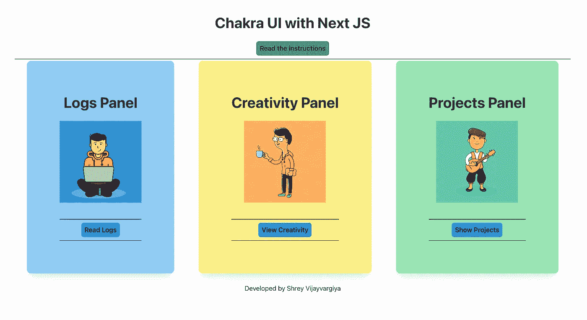

# Next.js 与 Chakra UI——测试声称是最好的 UI 库

> 原文：<https://javascript.plainenglish.io/next-js-with-chakra-ui-testing-the-claims-of-being-the-best-ui-library-fe4bec82c4cd?source=collection_archive---------4----------------------->

测试查克拉界面是否可以击败材料界面，顺风，蚂蚁设计



[The final product we will be developing](https://github.com/shreyvijayvargiya/iHateReadingLogs/tree/main/TechLogs/ChakraUI%20with%20NextJs)

对于所有新读者，我遵循为前端和后端创建所有广泛使用的存储库的概念。您可以从下面的链接中找到所有的库。

```
[**Download the repository of your choice**](http://www.ihatereading.in/repos)
```

蒂耶概念是如此容易让开发者在没有实际专业工作的情况下掌握专业经验。所以我强烈推荐去看看。

# 入门指南

在今天的故事中，我们将使用 Next.js 和 Chakra UI 创建另一个前端存储库。几天前我读了一篇关于 Chakra UI 是最好的 UI 库的文章，我也为 React 中的完美 UI 库写了一篇文章。因此，在我看来，这是一个冲突，为了决定哪一个更好，我对两者都进行了深入研究。

[](https://medium.com/nerd-for-tech/perfect-ui-library-with-react-813f41704584) [## 用 React 完善 UI 库

### 我们来讨论一下用 react 完善 UI 库即 Material UI 库及其与 Next JS 的安装。

medium.com](https://medium.com/nerd-for-tech/perfect-ui-library-with-react-813f41704584) 

# 安装

安装过程不是很重。您必须安装软件包或模块，将它们导入到应用程序的根目录，用应用程序的根目录包装提供程序，我们就完成了。

```
yarn add @chakra-ui/react @emotion/react@^11 @emotion/styled@^11 framer-motion@^4
```

查克拉用户界面的灵感来自顺风 CSS 的主题风格。它支持所有的基本颜色及其等级。

下一步是将提供者包装到应用程序的根。

```
import * as React from "react";
import { ChakraProvider } from "@chakra-ui/react";function App({ Component, pageProps }) {
  return (
     <ChakraProvider>
       <Component {...pageProps} />
      </ChakraProvider>
   );
};
```

在内页的 **_app.js** 文件中，目录添加了上面的代码。我们只是用我们的应用程序组件包装 Chakra provider，将主题和 CSS 传递给我们的应用程序。

一旦完成，我们就可以使用脉轮 UI 的组件了。

# 最终产品


# 外卖食品

我用过 Material-UI 和 Ant Design，React Bootstrap 和 Tailwind CSS 等等。为了开发这个简单的博客页面，我不必花太多时间在预先构建的组件上，这使得开发相当容易。但是我总是在网站上关注一些事情——扩展起来有多容易，网站的响应速度有多快？对我来说，Tailwind CSS 提供了一个易于开发的响应界面，但内联 CSS 在专业领域仍然没有得到高度重视。

## 颜色和色调

此外，Chakra UI 有一个好东西——它支持每个组件中的所有基本颜色和色调。这是我最喜欢的东西。第二件事是他们的特色部分，比如 RTL、`sx`道具、布局风格等等。此外，Chakra UI 提供了从主题工具中导出断点，这有助于定义您自己的断点。

```
<Text *fontSize*={{ base: "24px", md: "40px", lg: "56px" }}>
  This is responsive text
</Text>
```

在这种情况下，我们提供相同的内联 CSS 来处理响应。这也是一个很好很简单的方法，就像 Tailwind CSS 一样。

## 钩住

它们提供了多个挂钩，如 useBoolean、useClipboard、useMediaQuery、useTheme 等等。这些钩子有助于处理特定的情况，比如响应汉堡、滚动到视图属性，尽管许多 UI 库确实提供了这种钩子。

```
[https://chakra-ui.com/docs/hooks/use-boolean](https://chakra-ui.com/docs/hooks/use-boolean)
```

## CSS 变量

```
[https://chakra-ui.com/docs/features/css-variables](https://chakra-ui.com/docs/features/css-variables)
```

这对我来说是件新鲜事。您可以在任何组件的内联 CSS 中声明变量，并在组件中使用它们。

```
<Box sx={{ "--my-color": "#53c8c4" }}>   
 <Heading color="var(--my-color)" size="lg">     
   This uses CSS Custom Properties!   
 </Heading> 
</Box>
```

# 结论

我已经提到了 Chakra UI 提供的特性。不过，选择权在你。这因公司而异，因人而异，由他们决定哪种库更适合他们的情况。

答案是政治上正确的答案，但这是我所经历的，即使 Material-UI 有很多 GitHub 明星。但是，Ant Design、Bootstrap、Tailwind CSS 和 Chakra UI 也已经被广泛使用，并被人们所接受。对于我的第一个客户，我仍然记得他们有多喜欢蚂蚁设计。

您可以在下面的链接中找到该存储库:

```
😉 [Code](https://github.com/shreyvijayvargiya/iHateReadingLogs/tree/main/TechLogs/ChakraUI%20with%20NextJs)
😇 More such repos - [iHateReading repos](http://www.ihatereading.in/repos)
```

此外，如果你想每周获得更多这样的细节(没有电子邮件的轰炸)，我们已经开始了每周杂志(**一周中的一天**)，你可以在免费订阅后获得。

```
😬 [Weekly Magazine](http://www.ihatereading.in/subscribe)
```

下次见！祝大家愉快。

[](https://medium.com/nerd-for-tech/creating-fake-node-js-server-4525def1aea5) [## 创建假节点 JS 服务器

### 使用 json-server 开发假端点

medium.com](https://medium.com/nerd-for-tech/creating-fake-node-js-server-4525def1aea5) [](https://shreyvijayvargiya26.medium.com/one-json-object-for-developing-the-complete-currency-select-b6da93dacc4e) [## 一个用于开发完整货币选择的 JSON 对象

### 从单个 JSON 对象在 react 应用程序中创建货币选择下拉列表

shreyvijayvargiya26.medium.com](https://shreyvijayvargiya26.medium.com/one-json-object-for-developing-the-complete-currency-select-b6da93dacc4e) 

*更多内容尽在*[plain English . io](http://plainenglish.io/)