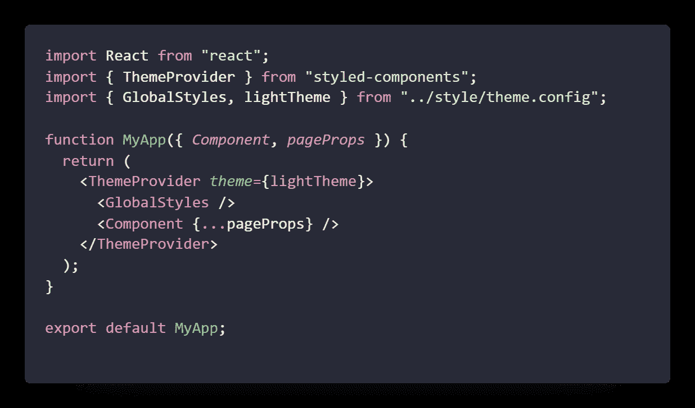

# Next.js 和样式化组件入门

> 原文：<https://javascript.plainenglish.io/nextjs-and-styled-components-f6c542ffb688?source=collection_archive---------2----------------------->


Photo by [Pietro Mattia](https://unsplash.com/@pietromattia?utm_source=medium&utm_medium=referral) on [Unsplash](https://unsplash.com?utm_source=medium&utm_medium=referral)

## 在设计最好的网络应用和创造独特的东西的竞赛中，我向你展示了一个你可以使用的组合

如果我们不想要任何 CSS 组件，样式化组件是我们常用的方法之一。这是一个非常强大和方便的库，将创建可重用的设计组件，包括您的主题管理。

如果你没有听说过这种风格的组件，那么我强烈推荐你观看这个[链接](https://styled-components.com/)来学习。

# Next.js

js 是在 React 基础上构建的强大而流行的 SSR。它让你更精确地控制网站，包括性能和搜索引擎优化矩阵。可以在[官网](https://nextjs.org/)了解 Next.js

我强烈推荐您阅读 Next.js，它有潜力成为最流行的框架之一

# 样式组件

具有 JavaScript 和 CSS 功能的组件的低级样式使这个实用程序非常棒。它是组件样式的无标记文本，可以非常容易地重用

动态样式、无痛维护、没有类名问题以及轻松更改 CSS 是该实用程序的几个亮点

# 怎么一起用？

要使用这种组合，您首先需要一个 Next.js 项目，它可能已经存在，或者您可以创建一个新项目

对于本文，我使用 Next.js 的入门材料，您可以选择任何模板或项目

这个想法是，首先我们将安装所有的依赖项，然后创建一个组件，并在主页内重用它。之后，我们将创建一个主题，并将其用于整个项目

# 我们开始吧

## 安装依赖项

我们首先需要将样式化的组件安装到项目中。您可以打开终端并编写任一命令

```
# with npm
npm install --save styled-components# with yarn
yarn add styled-components
```

## 巴别塔构型

在 React 中，它是直接开始的，但是接下来，您需要再做一步来为组件配置 SSR

为此，创建一个文件，`.babelrc`，并将下面的内容放入文件中

```
{ "presets": ["next/babel"], "plugins": [["styled-components", { "ssr": true }]]}
```

这段代码将确保您配置了服务器端

## 定义样式

现在让我们来定义组件的样式。首先，我们将创建一个名为`style` 的文件夹，并创建一个文件`theme.config.js`

**全球 CSS**

让我们为整个应用程序定义一个全局样式。为此，让我们从样式化组件中导入一些东西

```
import { createGlobalStyle } from 'styled-components' export const lightTheme = { body: '#fffff', main: '#5C14DB', mainColor: '#FFFFFF', accent: '#E5DE17', accentColor: '#161616', secondary: '#FFFFFF', secondaryColor: '#343434', dullColor: '#343434', ternary: '#000000', codeColor: '#D121C5',}export const GlobalStyles = createGlobalStyle`* { box-sizing: border-box;}body { margin: 0; padding: 0; background: ${({ theme }) => theme.body}; color: ${({ theme }) => theme.text}; font-family: sans-serif !important; font-weight: 400; font-style: normal; transition: all 0.50s linear;}input, textarea, button {font-family: inherit}
```

这里，我们导入 createGlobalStyle，它将帮助我们为项目创建一个全局 CSS。下面是普通的 CSS 代码。

为了导入这个全局样式，我们需要一个名为`_app.js`的文件

下面是如何导入它并将其用于您的项目的方法



_app.js

现在，如果您运行项目并看到更改，它应该从 theme.config.js 中选择全局样式

如果你改变了主题配置中的任何东西，它应该反映你的整个页面

**组件 CSS**

让我们继续创建一个特定于组件的样式。要创建一个 starter 组件，您可以在一个名为`layout.style.js`的样式文件夹中创建一个文件。

```
import styled from 'styled-components'export const PrimaryContainer = styled.div` background: ${(*props*) => *props*.theme.main}; color: ${(*props*) => *props*.theme.mainColor}; display: flex; flex-direction: column;
`
```

这是一个可以在 anywhere 应用程序中使用的示例容器组件。您只能将其作为常规组件导入

## 传递自定义道具

传递自定义道具并不难。您只需要为样式化组件提供一个 attrs 属性

一个例子可以是

```
export const Row = styled.div.attrs((*props*) => { const direction = *props*.mobile ? 'column' : 'row' const justifyContent = *props*.justifyContent ?? 'start' const alignItems = *props*.alignItems ?? 'start' const reverse = *props*.reverse return { direction: `${direction + (reverse ? '-reverse' : '')}`, justifyContent, alignItems, } })` display: flex; flex-direction: ${(*props*) => *props*.direction}; justify-content: ${(*props*) => *props*.justifyContent}; align-items: ${(*props*) => *props*.alignItems};`
```

要使用它，您可以写

```
<Row justifyContent='center' alignItems='center' reverse mobile/>
```

# 结论

这是一个简单的关于样式化组件和 Next.js 结合的指南，它或多或少类似于 react，只是多了几行代码。

我建议你尝试一下，并希望这篇文章能帮助你设置。你可以在这里找到完整的源代码[。这个回购包含更多不同种类的例子，以帮助您了解更多。谢谢！](https://github.com/Piyush-Use-Personal/next-styled-component)