# Next.js 中的 2021 速成班

> 原文：<https://javascript.plainenglish.io/nextjs-crash-course-2021-2cb8ac889e36?source=collection_archive---------5----------------------->

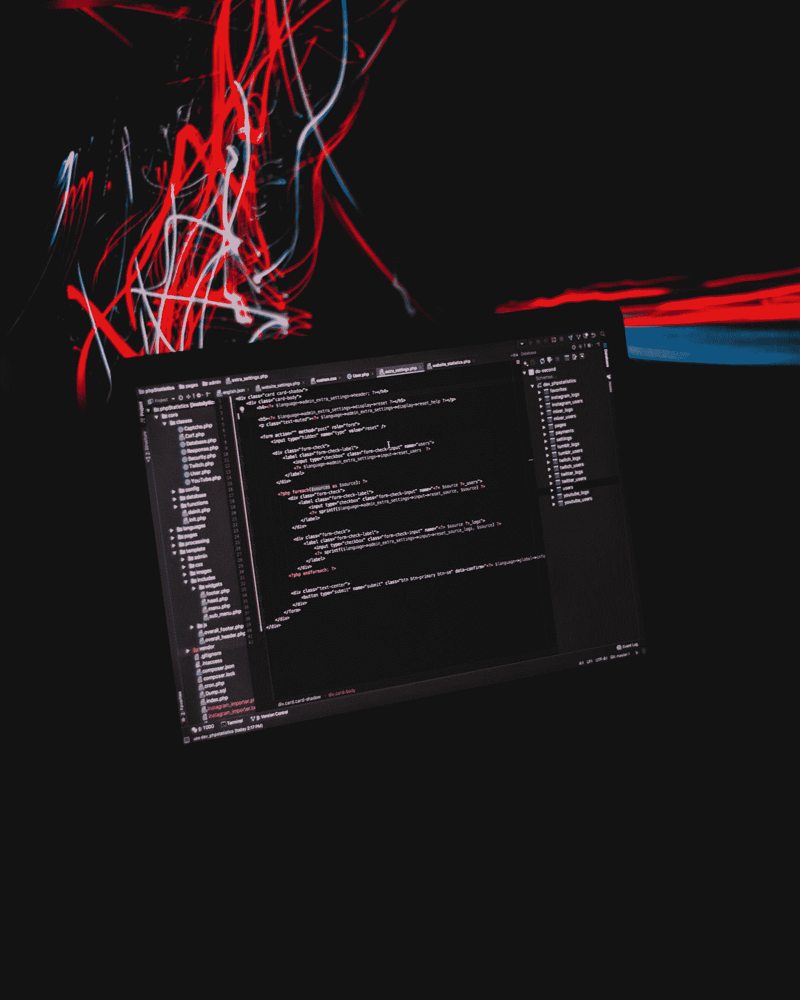

Photo by [AltumCode](https://unsplash.com/@altumcode?utm_source=medium&utm_medium=referral) on [Unsplash](https://unsplash.com?utm_source=medium&utm_medium=referral)

接下来是 React web 框架，它支持服务器端呈现和静态站点生成。因此，它建立在 React 之上，并为您提供了非常适合大型生产应用程序的额外功能。

**服务器端渲染**
与整个应用程序在客户端加载和渲染的传统 React 应用程序不同，Next.js 允许服务器渲染第一页的加载，这对于 SEO 和性能来说非常好。

**其他 Next.js 的好处**
这些是 Next.js 的一些其他好处:
1。简单的页面路由-不需要 react-router-dom
2。API 路由——创建类似节点的 API 路由。JS
3。开箱即用的 TypeScript 和 Sass-不需要特殊的软件包。
4。静态站点生成(下一次导出)-类似于 Gatsby。JS
5。易于部署——托管节点的任何服务。像 Netlify，Vercel 这样的 JS app

**设置和应用**
现在，要创建一个 Next.js 应用，我们需要在任何文件夹内使用如下所示的命令。与 React 应用程序一样，唯一的要求是 Node.js 和 npm 应该安装在机器上。

```
npx create-next-app next-crash-course
```

现在，按照说明切换到新创建的文件夹。我也用 VS 代码打开了这个项目。之后，运行 **npm run dev** 来启动项目。

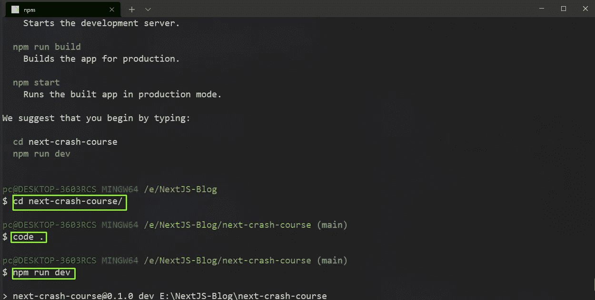

Installing

现在，就像 React 应用程序一样，Next.js 应用程序将在 [http://localhost:3000/](http://localhost:3000/) 上启动，我们将看到这个默认页面。

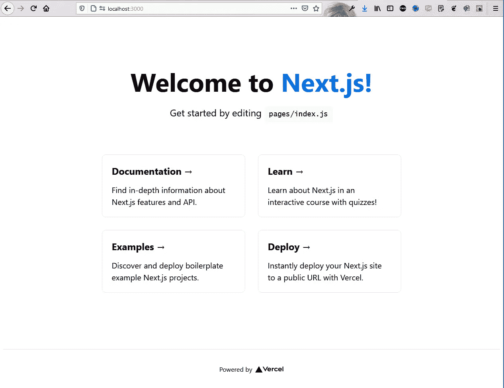

localhost

该页面来自 pages 文件夹中的 **index.js** 文件。删除那里的所有内容，把下面的内容放进去。这里，我们有一个包含标题和元文本的 Head 元素，之后是一个 h1。

```
import Head from 'next/head'export default function Home() {
  return (
    <div>
      <Head>
        <title>TheWebDev</title>
        <meta name='keywords' content='web-development, programming' />
      </Head>
      <h1>NextJS Crash Course</h1>
    </div>
  )
}
```

现在，在 localhost 中，只显示了我们的标题和 h1。此外，如果我们打开控制台，我们可以看到我们的元数据以及包含 h1 的主体，这在 React 应用程序中通常不是这样。所以，这意味着，它对搜索引擎优化很有帮助，因为谷歌爬虫可以阅读它。

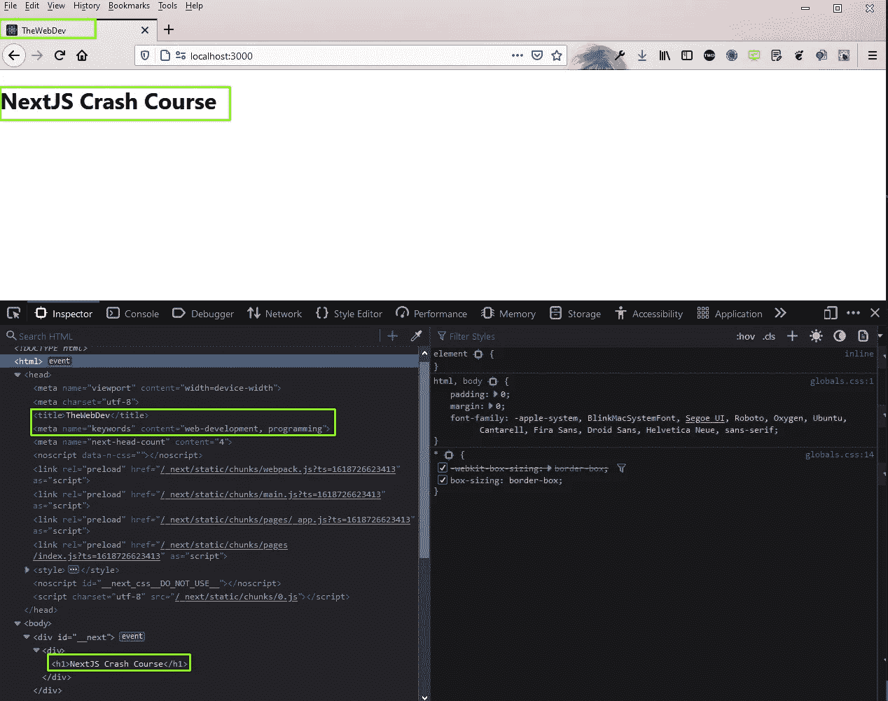

localhost

要在 Next.js 中创建新的路由，我们不必经历通过 react-router-dom 设置路由的麻烦。我们只需要在 pages 文件夹中创建一个新页面。

因此，在 pages 文件夹中创建一个文件 **about.js** ，并将下面的内容放入其中。

```
import Head from 'next/head'const about = () => {
    return (
        <div>
            <Head>
                <title>About</title>
            </Head>
            <h1>About Page</h1>
        </div>
    )
}export default about
```

现在只要进入[http://localhost:3000/about](http://localhost:3000/about)就可以看到页面的内容了。

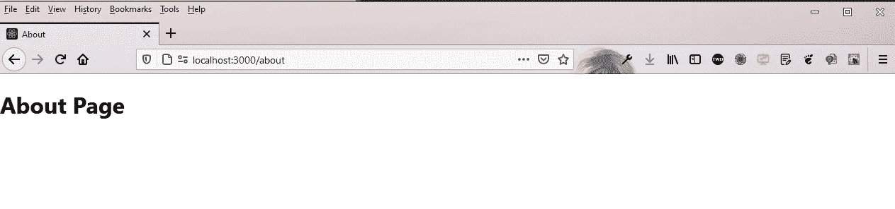

About Page

现在，有一个文件 **_app.js** 包装了我们所有的页面。因此，如果我们想在所有页面中实现一个通用布局，我们将使用它。

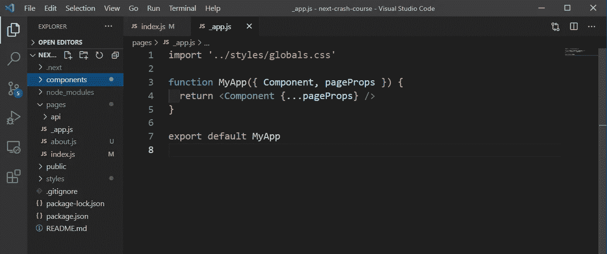

_app.js

因此，让我们创建我们的布局组件。为此，首先在**样式**文件夹中创建一个新的样式文件 **Layout.module.css** ，并将下面的内容放入其中。

```
.container {
  min-height: 100vh;
  padding: 0 0.5rem;
  display: flex;
  flex-direction: column;
  justify-content: flex-start;
  align-items: center;
}.main {
  padding: 5rem 0;
  flex: 1;
  display: flex;
  flex-direction: column;
  justify-content: flex-start;
  align-items: center;
  font-size: 1.25rem;
}
```

现在，在根目录下创建一个新的文件夹 **components** ，并在其中创建一个文件 **Layout.js** 。把下面的内容放进去。

```
import styles from '../styles/Layout.module.css'const Layout = ({ children }) => {
    return (
        <div className={styles.container}>
            <main className={styles.main}>
                {children}
            </main>
        </div>
    )
}export default Layout
```

回到 **_app.js，**我们将把组件包装在布局组件里面。

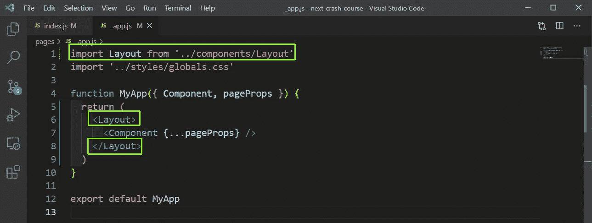

_app.js

现在，我们的本地主机在我们所有的页面上显示样式。

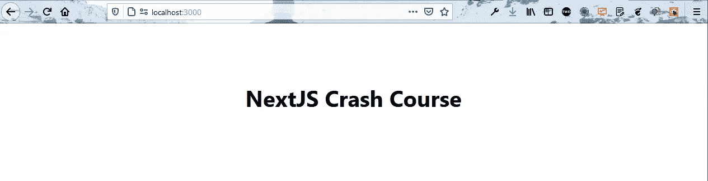

localhost

现在，我们将在导航条上工作并学习链接。因此，首先，在**样式**文件夹中创建一个文件 **Nav.module.css** 。把下面的内容放进去。

```
.nav {
    height: 50px;
    padding: 10px;
    background: #000;
    color: #fff;
    display: flex;
    align-items: center;
    justify-content: flex-start;
}.nav ul {
    display: flex;
    justify-content: center;
    align-items: center;
    list-style: none;
}.nav ul li a {
    margin: 5px 15px;
}
```

现在，在**组件**文件夹中创建一个文件 **Navbar.js** ，并将下面的内容放入其中。这里，我们使用 React 类型的链接来访问不同的路由。

```
import Link from 'next/link'
import navStyles from '../styles/Nav.module.css'const Navbar = () => {
    return (
        <nav className={navStyles.nav}>
            <ul>
                <li>
                    <Link href='/'>Home</Link>
                </li>
                <li>
                    <Link href='/about'>About</Link>
                </li>
            </ul>
        </nav>
    )
}export default Navbar
```

现在，我们将在 **Layout.js** 中添加导航条，这样它就会显示在所有页面上。

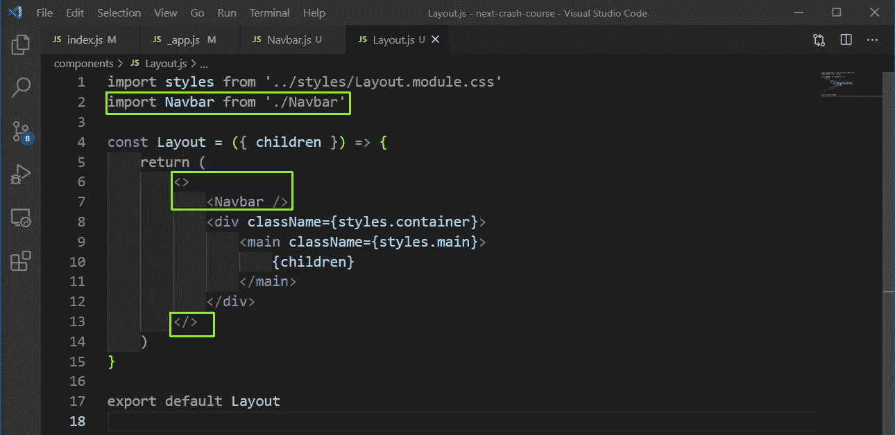

Layout.js

现在，在 localhost 中，我们将在所有页面中看到漂亮的导航条。

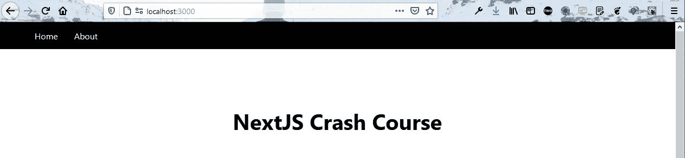

localhost

现在，我们将创建我们的头组件。因此，在**样式**文件夹中创建一个文件 **Header.module.css** ，并在其中添加下面的内容。

```
.title a,
.title span {
  color: #0070f3;
  text-decoration: none;
}.title a:hover,
.title a:focus,
.title a:active {
  text-decoration: underline;
}.title {
  margin: 0;
  line-height: 1.15;
  font-size: 4rem;
}.title,
.description {
  text-align: center;
}.description {
  line-height: 1.5;
  font-size: 1.5rem;
}
```

现在，在**组件**文件夹中创建一个文件 **Header.js** ，并将下面的内容放入其中。

```
import headerStyles from '../styles/Header.module.css'const Header = () => {
    return (
        <div>
            <h1 className={headerStyles.title}>
                <span>TheWebDev</span> News
            </h1>
            <p className={headerStyles.description}>
                Keep up to date with the latest web-development news
            </p>
        </div>
    )
}export default Header
```

现在，我们将它放在 **Layout.js** 中，这样我们就可以在每一页上都看到它。

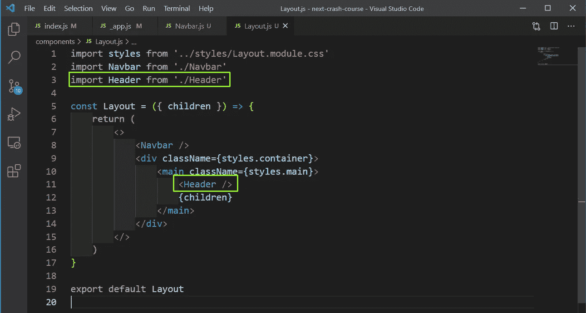

Layout.js

现在，我们将研究从我们的页面获取数据。有三种方法可以在 Next.js 应用程序中获取数据。

*   getStaticProps——允许我们在构建时获取数据。
*   getServerSideProps -它在每次请求时获取数据。
*   **getstatic paths**——这是基于我们正在获取的数据动态生成的路径。

现在，我们将在这个项目中使用 **getStaticProps** 。因此，打开 index.js 文件并添加 **getStaticProps** 方法，我们使用 fetch 从 API 端点获取数据。我们可以访问 Next.js 中的 props 中的数据，并进一步将其分配给文章。

现在，我们正在破坏我们家中的这些道具，并绘制地图，展示出来。

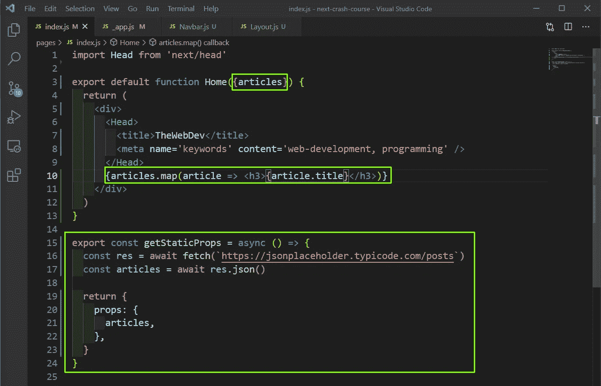

index.js

现在，在 localhost 中，我们可以看到所有这些帖子。

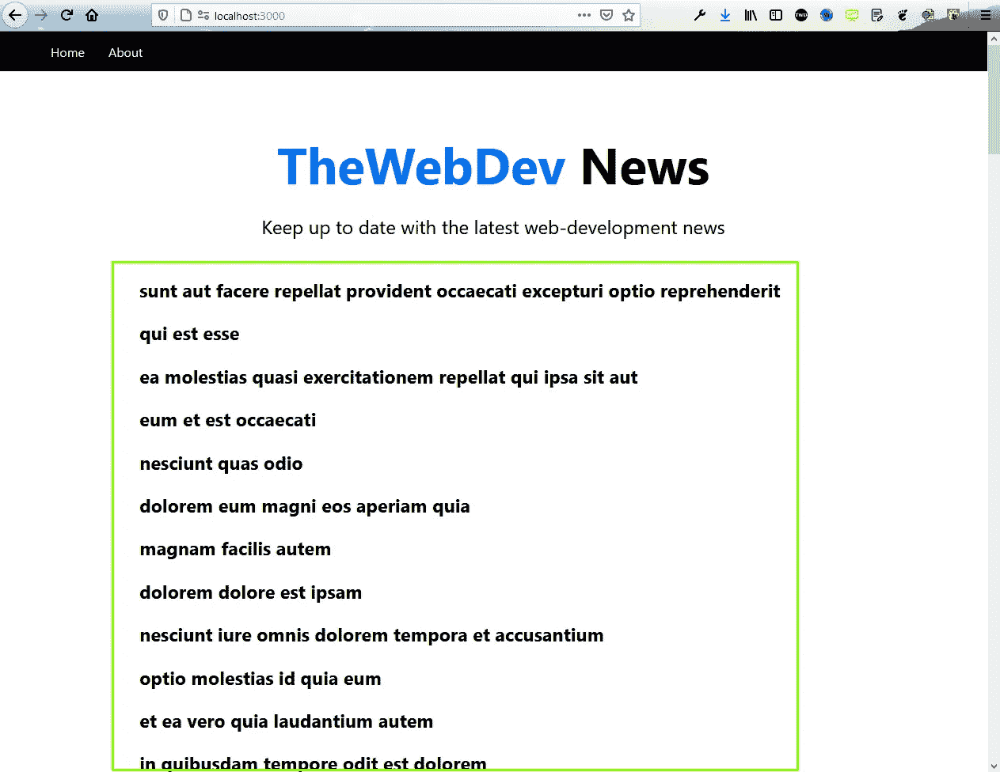

localhost

现在，我们将为这些文章创建单独的组件。所以，我们先在 **styles** 文件夹的 **Article.module.css** 文件中创建样式。

```
.grid {
    display: flex;
    align-items: center;
    justify-content: center;
    flex-wrap: wrap;
    max-width: 800px;
    margin-top: 3rem;
  }

  .card {
    margin: 1rem;
    flex-basis: 45%;
    padding: 1.5rem;
    text-align: left;
    color: inherit;
    text-decoration: none;
    border: 1px solid #eaeaea;
    border-radius: 10px;
    transition: color 0.15s ease, border-color 0.15s ease;
  }

  .card:hover,
  .card:focus,
  .card:active {
    color: #0070f3;
    border-color: #0070f3;
  }

  .card h3 {
    margin: 0 0 1rem 0;
    font-size: 1.5rem;
  }

  .card p {
    margin: 0;
    font-size: 1.25rem;
    line-height: 1.5;
  }

  .logo {
    height: 1em;
  }

  @media (max-width: 600px) {
    .grid {
      width: 100%;
      flex-direction: column;
    }
  }
```

现在，在**组件**文件夹中创建一个文件 **ArticleList.js** ，并将下面的内容放入其中。这里，我们只是映射文章并将其传递给一个 **ArticleItem** 组件。

```
import ArticleItem from './ArticleItem'
import articleStyles from '../styles/Article.module.css'const ArticleList = ({ articles }) => {
    return (
        <div className={articleStyles.grid}>
            {articles.map((article) => (
                <ArticleItem article={article} />
            ))}
        </div>
    )
}export default ArticleList
```

现在，在**组件**文件夹中创建一个文件 **ArticleItem.js** ，并将下面的内容放入其中。在里面，我们会显示每篇文章的标题和摘录。我们还用一个链接标签来包装所有内容，因为我们要实现一个逻辑来点击一篇文章。

```
import Link from 'next/link'
import articleStyles from '../styles/Article.module.css'const ArticleItem = ({ article }) => {
    return (
        <Link href={`/article/${article.id}`}>
            <a className={articleStyles.card}>
                <h3>{article.title} &rarr;</h3>
            </a>
        </Link>
    )
}export default ArticleItem
```

之后，我们需要在我们的 **index.js** 文件中添加**文章列表**组件。

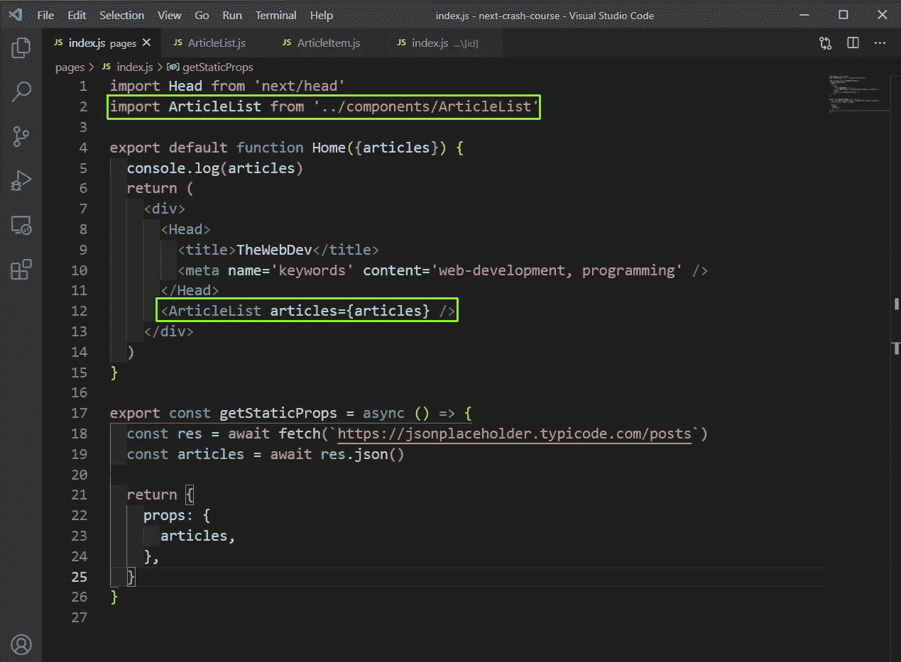

index.js

现在，我们将在 localhost 的一个漂亮的视图中看到所有的文章。

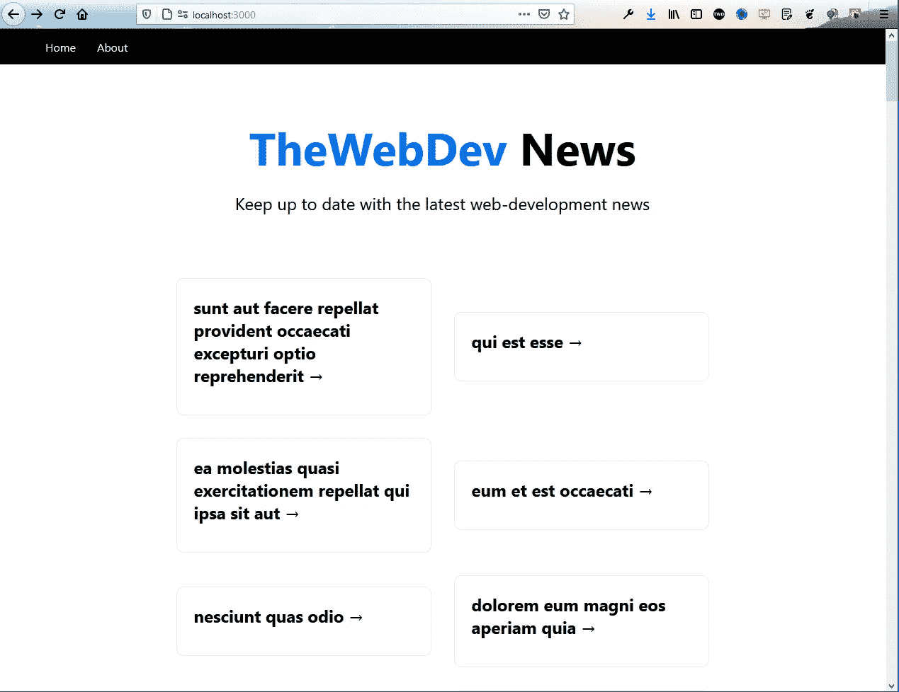

localhost

现在，当我们点击任何一篇文章，我们都会进入正确的路径，但我们得到的是 404。

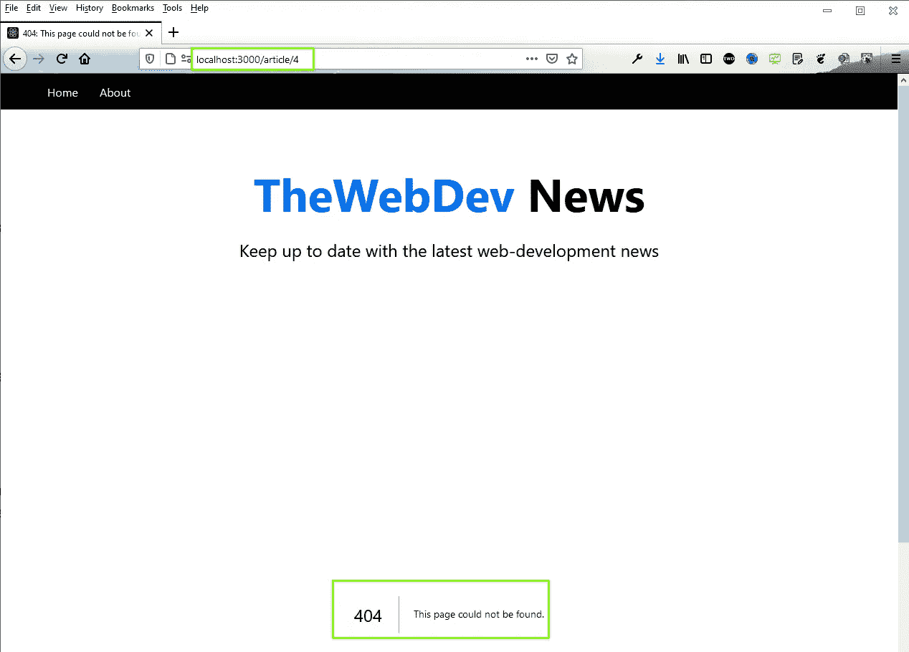

404

那么，让我们现在实现什么是单篇文章页面。在 Next.js 中，实现嵌套路由有点不同。这里，在**页面**文件夹中创建一个**文章**文件夹。

接下来，在文章文件夹中创建一个【T12【id】文件夹，然后在其中创建 **index.js** 。把下面的内容放进去。这里，我们使用 **getServerSideProps** 从端点获取数据，通过 context.params.id 访问 id。

```
import Link from 'next/link'const article = ({ article }) => {
    return (
        <>
            <h1>{article.title}</h1>
            <p>{article.body}</p>
            <br />
            <Link href='/'>Go Back</Link>
        </>
    )
}export const getServerSideProps = async (context) => {
    const res = await fetch(
        `https://jsonplaceholder.typicode.com/posts/${context.params.id}`
    )
    const article = await res.json()return {
        props: {
            article,
        },
    }
}export default article
```

现在，我们简单的 Next.js 应用程序已经完成，我们可以通过点击它并获得该帖子的标题和正文来访问任何路线。

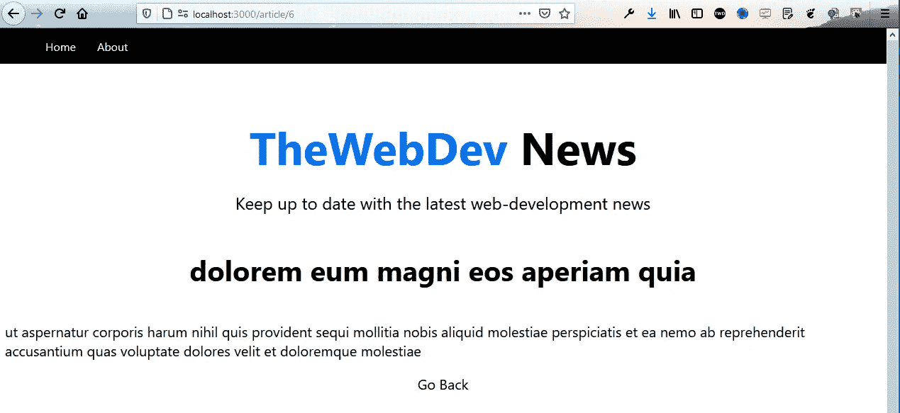

App complete

我们的速成班到此结束。你可以在[这个](https://github.com/nabendu82/next-crash-course) Github repo 中找到相同的代码。

你也可以在我的 YouTube 频道上找到这个视频格式的帖子。相同的链接在下面。

## 进一步阅读

[](/data-fetching-with-next-js-13s-bleeding-edge-features-a-primer-a60ddd3f7570) [## 使用 Next.js 13 的前沿特性获取数据——入门

### NextJS 13 中的数据获取使用了应用程序目录、流、暂挂以及混合服务器和客户端组件。

javascript.plainenglish.io](/data-fetching-with-next-js-13s-bleeding-edge-features-a-primer-a60ddd3f7570) 

*报名参加我们的* [***免费每周简讯***](http://newsletter.plainenglish.io/) *。关注我们关于*[***Twitter***](https://twitter.com/inPlainEngHQ)，[***LinkedIn***](https://www.linkedin.com/company/inplainenglish/)*，*[***YouTube***](https://www.youtube.com/channel/UCtipWUghju290NWcn8jhyAw)*，以及* [***不和***](https://discord.gg/GtDtUAvyhW) ***。***

***有兴趣规模化你的软件创业*** *？检查* [***电路***](https://circuit.ooo?utm=publication-post-cta) *。*