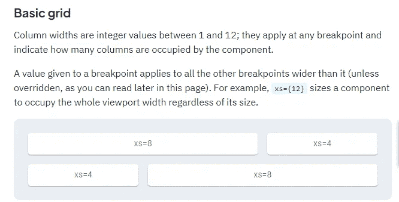

# Next.js Firebase v9:用材质设计细节-UI

> 原文：<https://javascript.plainenglish.io/nextjs-firebase-v9-part-12-styling-the-detail-with-material-ui-7d53d4d25c7c?source=collection_archive---------21----------------------->

## 第 12 部分:使用 Material-UI 创建卡片组件


观看[视频系列](https://www.youtube.com/watch?v=Sdv3bw2rIuQ&list=PLC5vixW_4xSKqwpgaPEcLj7O3SvUNqC9L)和[源代码](https://www.udemy.com/course/complete-nextjs-firebase-firestore-course/?referralCode=50C342DE4DD73B4428F4)

我们不只是显示值，而是使用卡片来显示标题、详细信息，还添加了一个返回主页的按钮

我们使用`<Grid item>`包装卡片，然后我们将它的列宽设置为 3 (xs=3)。我们将卡片的最小宽度设置为 275，并使用 boxshadow。将背景设置为浅灰色#FAFAFA。

卡片内容包括带有 h5 的标题和细节，颜色为`text.secondary`，为浅灰色。

最后，我们添加按钮，并使用 Next.js 的链接组件链接回主页。



```
<Gridcontainerspacing={0}direction="column"alignItems="center"justifyContent="center"style={{ minHeight: '100vh' }}><Grid item xs={3}><Card sx={{ minWidth: 275, boxShadow:3, }}style={{backgroundColor: '#fafafa'}}><CardContent><Typography variant="h5" component="div">{todo.title}</Typography><Typography sx={{ mb: 1.5 }} color="text.secondary">{todo.detail}</Typography></CardContent><CardActions><Link href="/"><Button size="small">Back to home</Button></Link></CardActions></Card></Grid></Grid>
```

# 关注我们: [YouTube](https://www.youtube.com/channel/UCu4-4FnutvSHVo9WHvq80Ww?sub_confirmation=1) ， [Medium](https://ckmobile.medium.com/) ， [Udemy](https://www.udemy.com/user/cyruschan2/) ， [Linkedin](https://www.linkedin.com/company/ckmobi/) ， [Twitter](https://twitter.com/ckmobilejavasc1) ， [Instagram](https://www.instagram.com/ckmobile8050) ， [Gumroad](https://app.gumroad.com/ckmobile)

*更多内容请看*[***plain English . io***](http://plainenglish.io/)