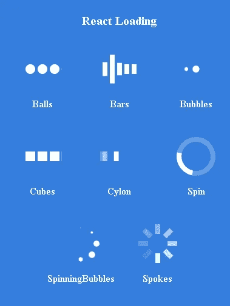
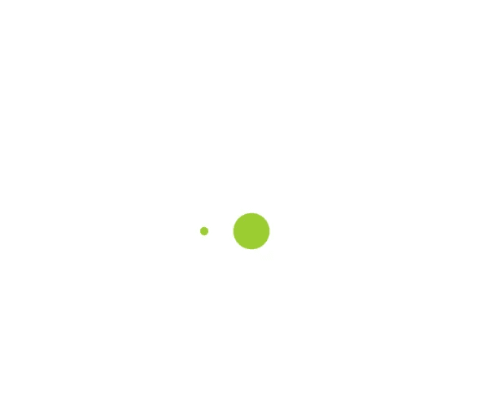

# Next.js Firebase v9:添加加载页面

> 原文：<https://javascript.plainenglish.io/nextjs-firebase-v9-part-13-add-a-loading-page-5ffad44f599f?source=collection_archive---------19----------------------->

## 第 13 部分:使用 react-loading npm 包创建加载页面

在本文中，我们将创建加载页面。[我们使用 react-loading 包来创建页面。](https://www.npmjs.com/package/react-loading)在接下来的文章中，我们将创建一个`<Loading>`和登录页面，因为我们开始做用户可以使用 Google 登录的认证部分。


观看[视频系列](https://www.youtube.com/watch?v=Sdv3bw2rIuQ&list=PLC5vixW_4xSKqwpgaPEcLj7O3SvUNqC9L)和[源代码](https://www.udemy.com/course/complete-nextjs-firebase-firestore-course/?referralCode=50C342DE4DD73B4428F4)

因此，我们复制下面的命令并将其粘贴到终端，然后按 enter 键安装软件包。

```
yarn add react-loading
```

在 components 文件夹下，添加一个 **Loading.js** 文件。同样，像详细页面一样，将`<ReactLoading>`组件放在`<Grid>`中。

```
import { Grid } from "@mui/material"import ReactLoading from 'react-loading';const Loading = ({ type, color }) => {return (<Gridcontainerspacing={0}direction="column"alignItems="center"justifyContent="center"style={{ minHeight: '100vh' }}><ReactLoading type={type} color={color} height={'20%'} width={'20%'} /></Grid>)}export default Loading
```

现在，我们已经创建了加载组件，我们可以尝试看看它是什么样子的。

在 **index.js** 中，我们在原始部分的顶部返回`<Loading>`，我们可以立即看到加载组件。

在这个例子中，我们将`<Loading>`组件设置为类型等于气泡，颜色等于黄绿色。

在文件中，它提到还有许多其他类型的装载机，如“球”或“立方体”。



```
import { Alert, Container, Snackbar } from '@mui/material'import { useState } from 'react';**import Loading from '../components/Loading';**import TodoForm from '../components/TodoForm'import TodoList from '../components/TodoList'import { TodoContext } from './TodoContext';export default function Home() {const [open, setOpen] = useState(false);const [alertType, setAlertType] = useState("success");const [alertMessage, setAlertMessage] = useState("");const [todo, setTodo] = useState({ title: '', detail: '' })const showAlert = (type, msg) => {setAlertType(type);setAlertMessage(msg);setOpen(true);}const handleClose = (event, reason) => {if (reason === 'clickaway') {return;}setOpen(false);};**return (<Loading type="bubbles" color="yellowgreen"/>)**return (<TodoContext.Provider value={{ showAlert, todo, setTodo }}><Container maxWidth="sm"><TodoForm /><SnackbaranchorOrigin={{ vertical: 'bottom', horizontal: 'center' }}open={open} autoHideDuration={3000} onClose={handleClose}><Alert onClose={handleClose} severity={alertType} sx={{ width: '100%' }}>{alertMes
```



the loader displayed at the web page

*更多内容看* [***说白了. io***](http://plainenglish.io/)