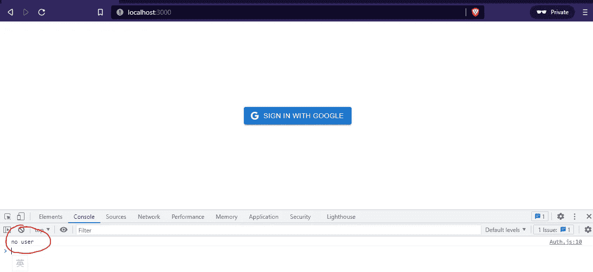

# Next.js Firebase v9:使用 Next.js Nookies 创建 AuthProvider

> 原文：<https://javascript.plainenglish.io/nextjs-firebase-v9-part-15-create-authprovider-with-next-js-nookies-6b80779bb551?source=collection_archive---------11----------------------->

## 第 15 部分:在 React/Next.js 应用程序中使用 Firestore 处理用户身份验证


观看[视频系列](https://www.youtube.com/watch?v=Sdv3bw2rIuQ&list=PLC5vixW_4xSKqwpgaPEcLj7O3SvUNqC9L)和[源代码](https://www.udemy.com/course/complete-nextjs-firebase-firestore-course/?referralCode=50C342DE4DD73B4428F4)

在根文件夹下，创建 **Auth.js** 。

然后进入 **Auth.js** 里面。首先，我们需要导入`useEffect`、`createContext`、`getAuth`和`nookies`。

```
import { useEffect,createContext } from "react";import { getAuth } from 'firebase/auth';import nookies from 'nookies';
```

然后我们创造了`AuthContext`。在`useEffect`内部，我们将检查用户是否存在。如果没有，我们将`console.log('no user')`并清除 cookies。

如果有用户，我们将获取令牌，然后将令牌存储在 cookies 中。

```
const AuthContext = createContext({});export const AuthProvider = ({children})=>{useEffect(() => {const auth = getAuth()return auth.onIdTokenChanged(async(user)=>{if (!user) {console.log('no user');return;}const token = await user.getIdToken();console.log('token', token);console.log('user', user);})}, [])return (<AuthContext.Provider value={{}}>{children}</AuthContext.Provider>)}export const useAuth = () =>useContext(AuthContext)
```

稍后，我们会将用户值传递给`Provider`，这样我们就可以通过使用`useAuth`来获取它。

```
export const useAuth = () =>useContext(AuthContext)
```

## 测试身份验证提供者

转到 _app.js，导入`AuthProvider`，然后用`<AuthProvider>`包装组件。

```
import { AuthProvider } from '../Auth'import '../styles/globals.css'function MyApp({ Component, pageProps }) {return (<AuthProvider><Component {...pageProps} /></AuthProvider>)}export default MyApp
```

现在，如果我们重新加载页面，我们可以看到“no user”出现在控制台上。



*更多内容看* [***说白了***](http://plainenglish.io/)