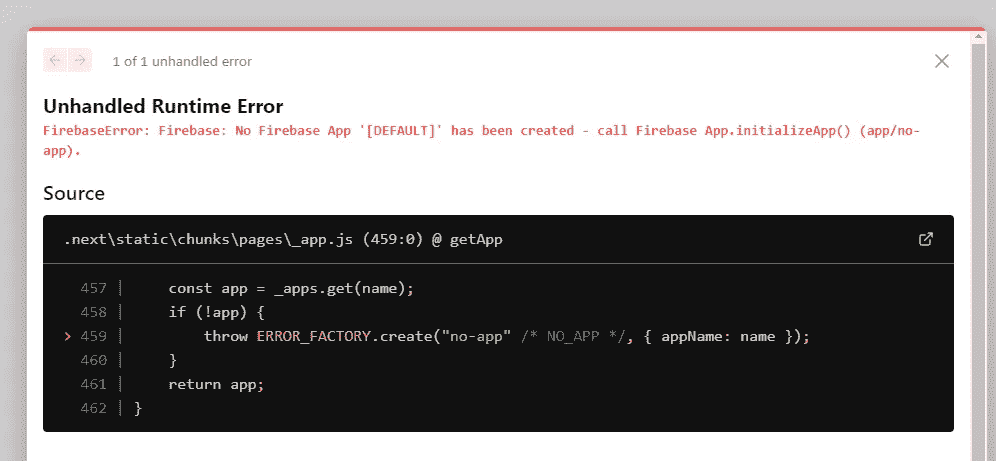
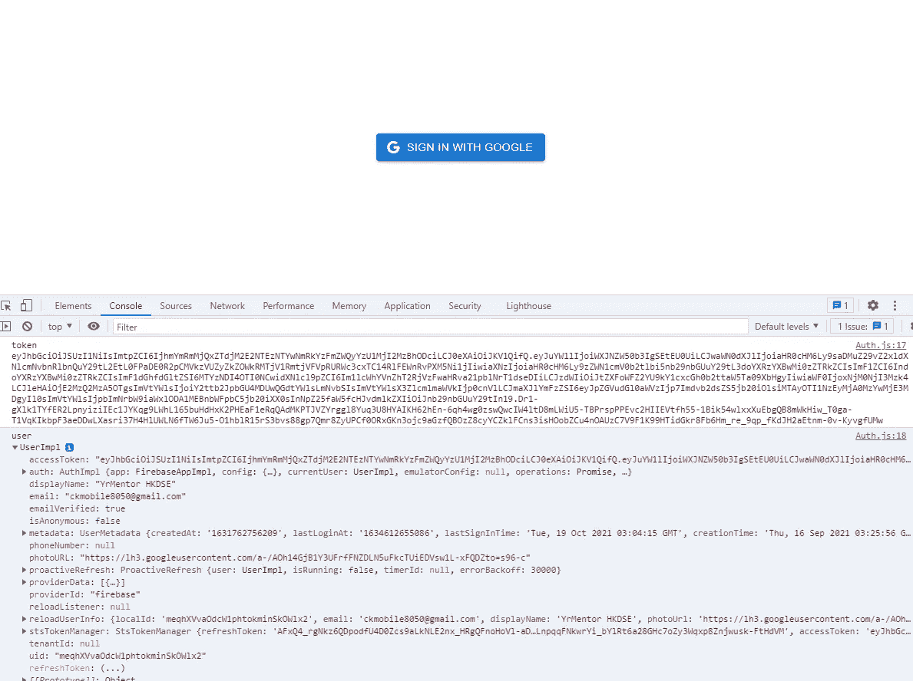

# Next.js Firebase v9:登录谷歌

> 原文：<https://javascript.plainenglish.io/nextjs-firebase-v9-part-16-sign-in-with-google-a24310b080db?source=collection_archive---------6----------------------->

## 第 16 部分:使用 GoogleAuthProvider 登录

为了使应用程序能够使用 Google 帐户登录，我们需要返回到 **firebase.js** (配置文件)。从 firebase auth 导入`getAuth`、`GoogleAuthProvider`。


观看[视频系列](https://www.youtube.com/watch?v=Sdv3bw2rIuQ&list=PLC5vixW_4xSKqwpgaPEcLj7O3SvUNqC9L)和[源代码](https://www.udemy.com/course/complete-nextjs-firebase-firestore-course/?referralCode=50C342DE4DD73B4428F4)

通过使用`getAuth`创建常量 auth，通过`GoogleAuthProvider`创建提供者。

```
// Import the functions you need from the SDKs you needimport { initializeApp } from "firebase/app";// TODO: Add SDKs for Firebase products that you want to use// https://firebase.google.com/docs/web/setup#available-librariesimport { getFirestore } from "firebase/firestore";**import { getAuth, GoogleAuthProvider } from 'firebase/auth';**const firebaseConfig = {apiKey: "",authDomain: "",projectId: ",storageBucket: "wm",messagingSenderId: "",appId: ""};const app = initializeApp(firebaseConfig);const db = getFirestore()**const auth = getAuth();****const provider = new GoogleAuthProvider();**export { db, auth, provider}
```

**备注:**记住，我们需要把 auth 和 provider 放在`intiializeApp`后面，否则，你会得到下面的错误。



## 创建登录功能

转到 **login.js** ，从 firebase auth 导入`signInwithPopup`，从 firebase 配置文件导入`auth`和`provider`。

```
import { signInWithPopup } from 'firebase/auth';import { auth, provider } from '../firebase'
```

创建 loginwithGoogle 函数。

```
<Buttonvariant="contained"startIcon={<GoogleIcon />}onClick={loginWithGoogle}>Login with Google</Button>
```

## 测试登录

现在我们可以尝试登录，看看令牌和用户是否出现。



您可以看到，我们在控制台获得了令牌和用户信息。

# 关注我们: [YouTube](https://www.youtube.com/channel/UCu4-4FnutvSHVo9WHvq80Ww?sub_confirmation=1) ， [Medium](https://ckmobile.medium.com/) ， [Udemy](https://www.udemy.com/user/cyruschan2/) ， [Linkedin](https://www.linkedin.com/company/ckmobi/) ， [Twitter](https://twitter.com/ckmobilejavasc1) ， [Instagram](https://www.instagram.com/ckmobile8050) ， [Gumroad](https://app.gumroad.com/ckmobile)

*更多内容请看**[***plain English . io***](http://plainenglish.io/)*