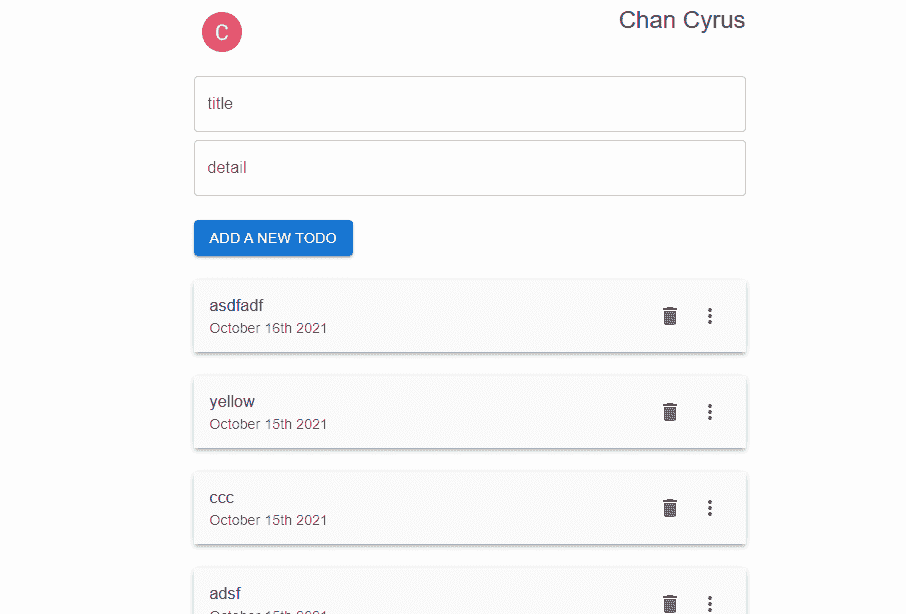

# Next.js Firebase v9:注销

> 原文：<https://javascript.plainenglish.io/nextjs-firebase-v9-part-18-signout-67755ff8a297?source=collection_archive---------13----------------------->

## 第 18 部分:获取谷歌账户的信息

我们已经有了用户的信息。因此，让我们尝试显示信息并添加登出功能。


观看[视频系列](https://www.youtube.com/watch?v=Sdv3bw2rIuQ&list=PLC5vixW_4xSKqwpgaPEcLj7O3SvUNqC9L)和[源代码](https://www.udemy.com/course/complete-nextjs-firebase-firestore-course/?referralCode=50C342DE4DD73B4428F4)

回到 **index.js** ，使用`useAuth`获取用户。

```
const { currentUser } = useAuth()
```

在`<TodoForm>`的顶部，加一个`<Box>`包裹住`<Avatar>`和`<Typography>`。用`<Avatar>`输出个人资料照片，并将用户名放在`<Typography>`。

```
<Box sx={{ display: 'flex', justifyContent: 'space-between' }} ><Avatar src={currentUser.photoURL} onClick={() => auth.signOut()} /><Typography variant="h5">{currentUser.displayName}</Typography></Box><TodoForm />
```

我们还需要从 firebase 配置文件中导入`auth`。

```
import { auth } from '../firebase';
```

然后将登出功能绑定到头像。

```
<IconButton onClick={() => auth.signOut()}><Avatar src={currentUser?.photoURL}  /></IconButton>
```



# 关注我们: [YouTube](https://www.youtube.com/channel/UCu4-4FnutvSHVo9WHvq80Ww?sub_confirmation=1) ， [Medium](https://ckmobile.medium.com/) ， [Udemy](https://www.udemy.com/user/cyruschan2/) ， [Linkedin](https://www.linkedin.com/company/ckmobi/) ， [Twitter](https://twitter.com/ckmobilejavasc1) ， [Instagram](https://www.instagram.com/ckmobile8050) ， [Gumroad](https://app.gumroad.com/ckmobile)

*更多内容请看*[***plain English . io***](http://plainenglish.io/)