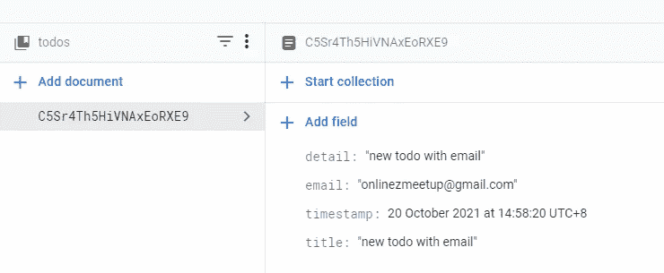
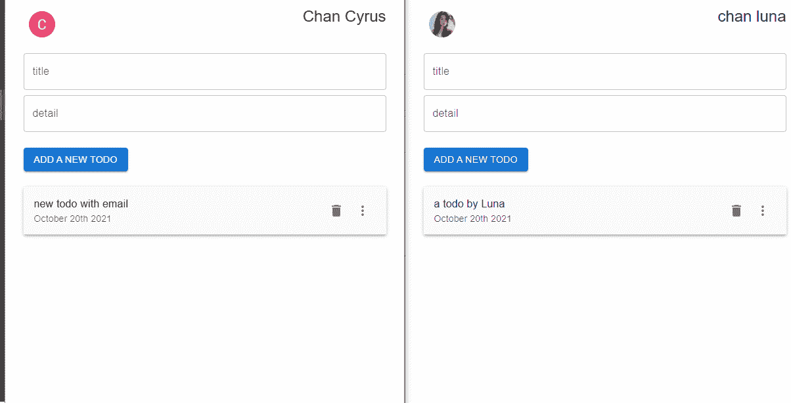

# Next.js Firebase v9:添加个人待办事项

> 原文：<https://javascript.plainenglish.io/nextjs-firebase-v9-part-19-add-personal-todo-bf9c9770a244?source=collection_archive---------18----------------------->

## 第 19 部分:将带有电子邮件属性的文档添加到 Firestore

现在我们已经可以登录和退出，我们可以张贴用户电子邮件的待办事项。所以以后，用户可以获取他们自己的待办事项，而不是所有用户的待办事项。


观看[视频系列](https://www.youtube.com/watch?v=Sdv3bw2rIuQ&list=PLC5vixW_4xSKqwpgaPEcLj7O3SvUNqC9L)和[源代码](https://www.udemy.com/course/complete-nextjs-firebase-firestore-course/?referralCode=50C342DE4DD73B4428F4)

为此，回到 **TodoForm.js** ，导入`useAuth`。

```
import { useAuth } from "../Auth"
```

使用`useAuth`得到`currentUser`。

```
const {currentUser} = useAuth();
```

## 添加待办事项

向 Firestore 添加新文档时添加电子邮件信息。

```
const TodoForm = () => {const inputAreaRef = useRef();const { showAlert, todo, setTodo } = useContext(TodoContext);const {currentUser} = useAuth();const onSubmit = async () => {if (todo?.hasOwnProperty('timestamp')) {//update the todoconst docRef = doc(db, "todos", todo.id);const todoUpdated = { ...todo, timestamp: serverTimestamp() }updateDoc(docRef, todoUpdated)setTodo({ title: '', detail: '' });showAlert('info', `Todo with id ${todo.id} updated successfully`)} else {const collectionRef = collection(db, "todos")**const docRef = await addDoc(collectionRef, { ...todo, timestamp: serverTimestamp(), email:currentUser.email })**setTodo({ title: '', detail: '' })showAlert('success', `Todo with id ${docRef.id} is added successfully`)}}
```

现在，如果您再次添加新的待办事项，我们可以看到电子邮件信息也附在文档中。



## 提取待办事项

获取用户的待办事项。

```
useEffect(() => {const collectionRef = collection(db, "todos")const q = query(collectionRef, where("email", "==", currentUser?.email), orderBy("timestamp", "desc"));const unsubscribe = onSnapshot(q, (querySnapshot) => {setTodos(querySnapshot.docs.map(doc => ({ ...doc.data(), id: doc.id, timestamp: doc.data().timestamp?.toDate().getTime() })))});return unsubscribe;}, [])
```



Two todo lists will not affect others

你可以看到这两个待办事项不会相互影响。

# 关注我们: [YouTube](https://www.youtube.com/channel/UCu4-4FnutvSHVo9WHvq80Ww?sub_confirmation=1) ， [Medium](https://ckmobile.medium.com/) ， [Udemy](https://www.udemy.com/user/cyruschan2/) ， [Linkedin](https://www.linkedin.com/company/ckmobi/) ， [Twitter](https://twitter.com/ckmobilejavasc1) ， [Instagram](https://www.instagram.com/ckmobile8050) ， [Gumroad](https://app.gumroad.com/ckmobile)

*更多内容请看*[***plain English . io***](http://plainenglish.io/)