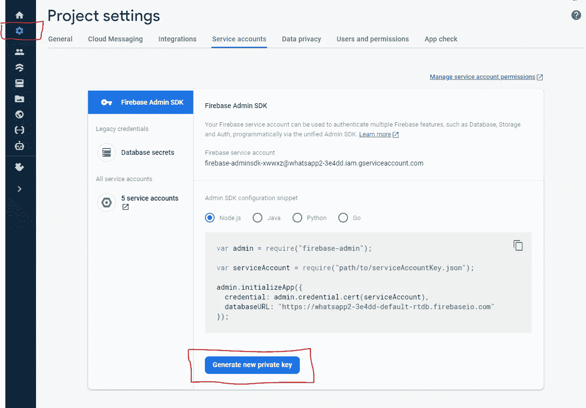

# Next.js Firebase v9:使用 Firebase Admin SDK 进行身份验证

> 原文：<https://javascript.plainenglish.io/nextjs-firebase-v9-part-20-authentication-with-firebase-admin-sdk-2ad57db8e4c1?source=collection_archive---------3----------------------->

## 第 20 部分:添加 Firebase Admin SDK


Photo by [Tudor Baciu](https://unsplash.com/@baciutudor?utm_source=medium&utm_medium=referral) on [Unsplash](https://unsplash.com?utm_source=medium&utm_medium=referral)

在这一部分，我们准备待办事项的服务器端呈现。但是对于渲染，我们必须在构建时进行认证。

因此，我们需要将 Firebase admin SDK 添加到我们的应用程序中。

## 在 firebase 网站生成私钥

第一步是从 Firebase 网站生成一个私钥。



点击项目设置，点击"生成新私钥"。它将生成 JSON 文件。

```
yarn add firebase-admin
```

## 添加 firebase 管理文件

在根文件夹中，创建“firebaseAdmin.js”。

```
const admin = require("firebase-admin");const serviceAccount = require("./secrets.json");export const verifyIdToken = (token) => {if (!admin.apps.length) {admin.initializeApp({credential: admin.credential.cert(serviceAccount),});}return admin.auth().verifyIdToken(token).catch((error) => {throw error;});};
```

它验证是 JWT 的令牌。如果成功了，就不会有什么不好的事情发生；否则，它会捕获错误。

稍后我们将使用这个函数来验证令牌。

# 关注我们: [YouTube](https://www.youtube.com/channel/UCu4-4FnutvSHVo9WHvq80Ww?sub_confirmation=1) ， [Medium](https://ckmobile.medium.com/) ， [Udemy](https://www.udemy.com/user/cyruschan2/) ， [Linkedin](https://www.linkedin.com/company/ckmobi/) ， [Twitter](https://twitter.com/ckmobilejavasc1) ， [Instagram](https://www.instagram.com/ckmobile8050) ， [Gumroad](https://app.gumroad.com/ckmobile)

*更多内容看**[***说白了. io***](http://plainenglish.io/)*