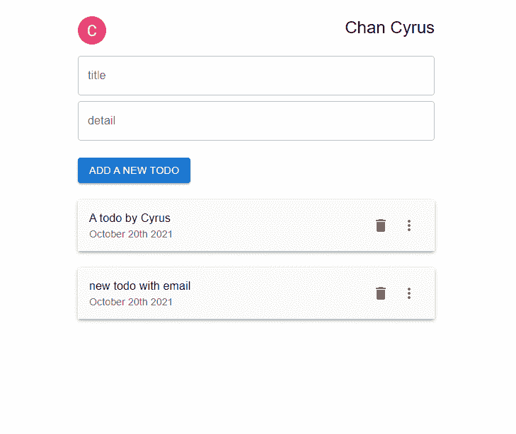

# Next.js Firebase v9:呈现待办事项服务器端

> 原文：<https://javascript.plainenglish.io/nextjs-firebase-v9-part-21-server-side-rendering-the-todos-97c2f519d42a?source=collection_archive---------7----------------------->

## 第 21 部分:使用 Next.js getServerSideProps 预构建待办事项。


观看[视频系列](https://www.youtube.com/watch?v=Sdv3bw2rIuQ&list=PLC5vixW_4xSKqwpgaPEcLj7O3SvUNqC9L)和[源代码](https://www.udemy.com/course/complete-nextjs-firebase-firestore-course/?referralCode=50C342DE4DD73B4428F4)

为了在预构建时获取数据，我们需要使用`getServerSideProps`，还需要导入几个包。

```
import nookies from 'nookies'import { verifyIdToken } from '../firebaseAdmin';
```

转到 **index.js** 的底部，使用`nookies`获取 cookies。

使用`firebaseAdmin`中的`verifyIdToken`获得令牌。

从令牌获取电子邮件地址。既然我们现在有了电子邮件，我们可以获取电子邮件等于用户电子邮件的文档。

获取所有待办事项，创建`todosProps`。

```
export async function getServerSideProps(context) {try {const cookies = nookies.get(context);const token = await verifyIdToken(cookies.token);const { email } = token;const collectionRef = collection(db, "todos")const q = query(collectionRef, where("email", "==", email), orderBy("timestamp", "desc"));const querySnapshot = await getDocs(q);let todos = [];querySnapshot.forEach((doc) => {todos.push({ ...doc.data(), id: doc.id, timestamp: doc.data().timestamp.toDate().getTime() });});return {props: {todosProps: JSON.stringify(todos) || [],}// props: { session: `Your email is ${email} and your UID is ${uid}.` },};} catch (error) {return { props: {} };}}
```

之后，将这个`todosProps`绑定到`<TodoList>`上。

```
<TodoList todosProps={todosProps}/>
```

## 托多利斯特

在`<TodoList>`处，在解析字符串化的 JSON 之后，使用`useEffect`将`todoProps`设置为 todos。

```
const TodoList = ({ todosProps }) => {const [todos, setTodos] = useState([])const { currentUser } = useAuth()useEffect(() => {setTodos(JSON.parse(todosProps))}, [todosProps])
```



todo list with using getServerSideProps


without using getServerSideProps

您可以看到服务器端呈现和没有服务器端呈现之间的差异。

网站建成后，待办事项列表就已经显示出来了。

# 关注我们: [YouTube](https://www.youtube.com/channel/UCu4-4FnutvSHVo9WHvq80Ww?sub_confirmation=1) ， [Medium](https://ckmobile.medium.com/) ， [Udemy](https://www.udemy.com/user/cyruschan2/) ， [Linkedin](https://www.linkedin.com/company/ckmobi/) ， [Twitter](https://twitter.com/ckmobilejavasc1) ， [Instagram](https://www.instagram.com/ckmobile8050) ， [Gumroad](https://app.gumroad.com/ckmobile)

*更多内容请看*[***plain English . io***](http://plainenglish.io/)