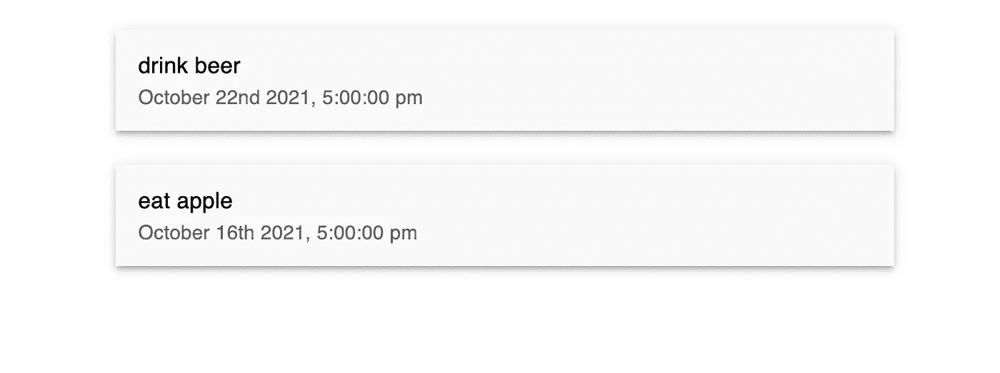
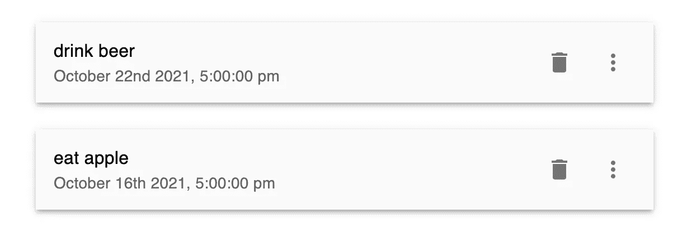

# Next.js Firebase v9:样式化待办事项列表

> 原文：<https://javascript.plainenglish.io/nextjs-firebase-v9-part-3-styling-the-todolist-d73f41b15ab5?source=collection_archive---------12----------------------->

## 第 3 部分:使用 Material-UI 和 Moment.js 制作更好的列表

在这一部分，我们将借助“时刻”包来显示时间。因此，在终端内部，我们将通过键入以下命令来安装 Moment.js:

```
yarn add moment
```


[视频教程](https://youtu.be/A-Ce4YyHMGk)和[源代码](https://www.udemy.com/course/complete-nextjs-firebase-firestore-course/?couponCode=FREESOURCE)

## 更改容器的宽度

转到 **index.js** ，将 maxWidth= "sm "添加到<容器>中。

```
export default function Home() {return (<Container maxWidth="sm"><TodoList /></Container>)}
```

## 创建待办事项组件

要创建 ToDo 组件，请转到“组件”文件夹，创建 **Todo.js** 。

在 Todo.js 中，我们计划在 props 中获取 id、时间戳、标题和细节。

导入 ListItem 并添加 3 个单位的 margin-top，boxShadow 也是 3 个单位。添加非常浅的灰色作为背景色。

导入 ListItemText，将标题设置为 primary，并将时间戳添加为 ListItemText 的 secondary。

```
import { ListItem, ListItemText } from "@mui/material";import moment from 'moment';const Todo = ({ id, timestamp, title, detail }) => {return (<ListItemsx={{ mt: 3, boxShadow: 3 }}style={{ backgroundColor: '#FAFAFA' }}><ListItemText primary={title} secondary={moment(timestamp).format("MMMM Do YYYY, h:mm:ss a")} /></ListItem>)}export default Todo
```



## 添加图标

添加图标作为辅助操作。所以导入 DeleteIcon 和 MoreVertIcon。稍后，一个图标用于删除待办事项，另一个图标用于查看待办事项的详细信息。

我们还在第一个图标上添加了边距 1。因此这两个图标不会相互重叠。

```
import { IconButton, ListItem, ListItemText } from "@mui/material";import moment from 'moment';**import DeleteIcon from '@mui/icons-material/Delete';****import MoreVertIcon from '@mui/icons-material/MoreVert';**const Todo = ({ id, timestamp, title, detail }) => {return (<ListItemsx={{ mt: 3, boxShadow: 3 }}style={{ backgroundColor: '#FAFAFA' }}**secondaryAction={****<>****<IconButton sx={{ m: 1 }} >****<DeleteIcon />****</IconButton>****<IconButton>****<MoreVertIcon />****</IconButton>****</>**}><ListItemText primary={title} secondary={moment(timestamp).format("MMMM Do YYYY, h:mm:ss a")} /></ListItem>)}export default Todo
```



# 关注我们: [YouTube](https://www.youtube.com/channel/UCu4-4FnutvSHVo9WHvq80Ww?sub_confirmation=1) ， [Medium](https://ckmobile.medium.com/) ， [Udemy](https://www.udemy.com/user/cyruschan2/) ， [Linkedin](https://www.linkedin.com/company/ckmobi/) ， [Twitter](https://twitter.com/ckmobilejavasc1) ， [Instagram](https://www.instagram.com/ckmobile8050) ， [Gumroad](https://app.gumroad.com/ckmobile)

*更多内容请看*[***plain English . io***](http://plainenglish.io/)