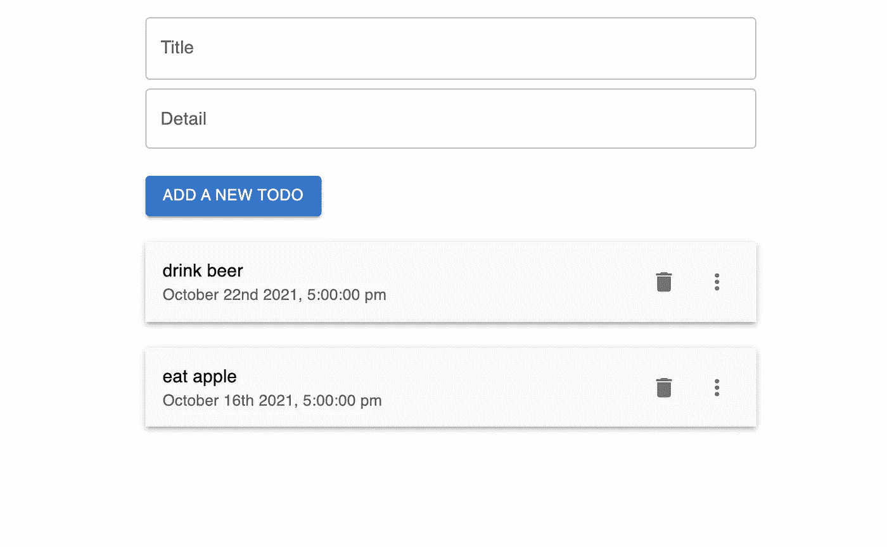

# Next.js Firebase v9:创建一个输入表单

> 原文：<https://javascript.plainenglish.io/nextjs-firebase-v9-part-4-create-an-input-form-39e5820942b?source=collection_archive---------13----------------------->

## 第 4 部分:用 Material-UI 创建输入表单

在本文中，我们将为创建新的 ToDo 创建输入表单。


[视频教程](https://youtu.be/A-Ce4YyHMGk)和[源代码](https://www.udemy.com/course/complete-nextjs-firebase-firestore-course/?couponCode=FREESOURCE)

在“组件”文件夹下，创建 **TodoForm.js** 。

TodoForm 主要包含两个输入字段，一个用于输入标题，另一个用于输入细节。

这两个字段是全角的，第二个输入字段是多行的。最后是一个按钮，给这个按钮添加边距，在它和输入框之间留出一些空间。

```
import { Button, TextField } from "@mui/material"const TodoForm = () => {return (<div><TextFieldfullWidthlabel="Title"margin="normal"/><TextFieldfullWidthlabel="Detail"multilinemaxRows={4}/><Button sx={{ mt: 3 }} variant="contained">Add a new Todo</Button></div>)}export default TodoForm
```

## 导入到索引页

转到 index.js，导入<todoform>并将该组件放在<todolist>之上。</todolist></todoform>

```
import { Container } from '@mui/material'import TodoForm from '../components/TodoForm'import TodoList from '../components/TodoList'export default function Home() {return (<Container maxWidth="sm"><TodoForm /><TodoList /></Container>)}
```

现在，用户界面应该是这样的:



# 关注我们: [YouTube](https://www.youtube.com/channel/UCu4-4FnutvSHVo9WHvq80Ww?sub_confirmation=1) ， [Medium](https://ckmobile.medium.com/) ， [Udemy](https://www.udemy.com/user/cyruschan2/) ， [Linkedin](https://www.linkedin.com/company/ckmobi/) ， [Twitter](https://twitter.com/ckmobilejavasc1) ， [Instagram](https://www.instagram.com/ckmobile8050) ， [Gumroad](https://app.gumroad.com/ckmobile)

*更多内容请看*[***plain English . io***](http://plainenglish.io/)