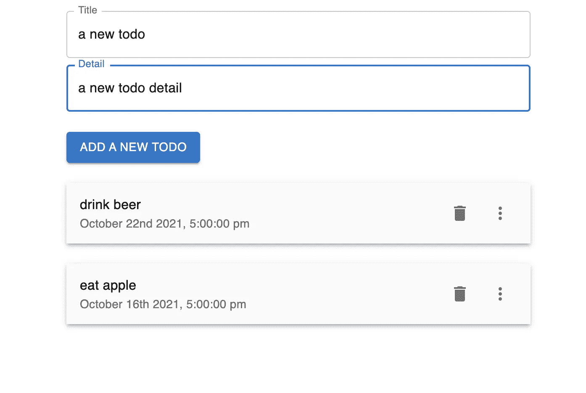
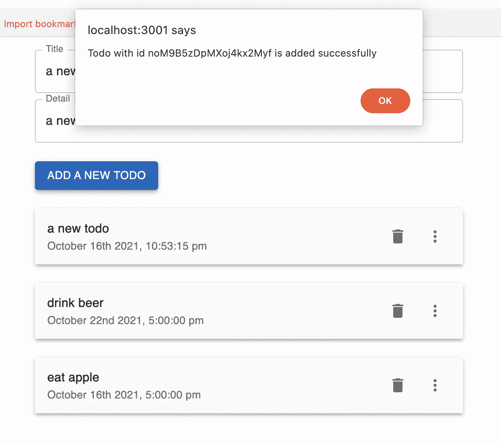

# Next.js Firebase v9:添加新的待办事项

> 原文：<https://javascript.plainenglish.io/nextjs-firebase-v9-part-5-add-a-new-todo-a45de9cc5418?source=collection_archive---------17----------------------->

## 第 5 部分:创建一个提交函数来添加新的待办事项

在本文中，我们将添加提交功能来提交新的待办事项。


[视频教程](https://youtu.be/A-Ce4YyHMGk)和[源代码](https://www.udemy.com/course/complete-nextjs-firebase-firestore-course/?couponCode=FREESOURCE)

首先，我们需要创建状态“todo”。我们将默认值设置为空标题和空细节。

```
import { useState } from "react";const [todo, setTodo] = useState({ title: '', detail: '' })
```

我们将待办事项的值绑定到两个输入字段。设置 onChange 将使用新值设置 todo 如果这是设置标题，它将展开原来的 todo 并合并新的标题值。

```
<TextFieldfullWidthlabel="Title"margin="normal"**value={todo.title}****onChange={e => setTodo({ ...todo, title: e.target.value })}**/><TextFieldfullWidthlabel="Detail"multilinemaxRows={4}**value={todo.detail}****onChange={e => setTodo({ ...todo, detail: e.target.value })}
/>**
```

现在我们得到用户输入的待办事项。是时候创建 onSubmit 函数了，从我们的 firebase 配置文件导入数据库(db)。

```
import { db } from "../firebase";
```

我们指定集合“todo ”,然后我们添加新的 to-do，当前时间戳到该集合。

如果待办事项添加成功，它会提示一条带有文档 id 的消息。

```
const onSubmit = async () => {const collectionRef = collection(db, "todos")const docRef = await addDoc(collectionRef, { ...todo, timestamp: serverTimestamp())
setTodo({ title: '', detail: '' })alert(`Todo with id ${docRef.id} is added successfully`)}
```

最后，我们将 onSubmit 函数绑定到按钮上。

```
<Button sx={{ mt: 3 }} variant="contained"onClick={onSubmit}>Add a new Todo</Button>
```



An alert appears if added successfully

# 关注我们: [YouTube](https://www.youtube.com/channel/UCu4-4FnutvSHVo9WHvq80Ww?sub_confirmation=1) ， [Medium](https://ckmobile.medium.com/) ， [Udemy](https://www.udemy.com/user/cyruschan2/) ， [Linkedin](https://www.linkedin.com/company/ckmobi/) ， [Twitter](https://twitter.com/ckmobilejavasc1) ， [Instagram](https://www.instagram.com/ckmobile8050) ， [Gumroad](https://app.gumroad.com/ckmobile)

*更多内容请看*[***plain English . io***](http://plainenglish.io/)