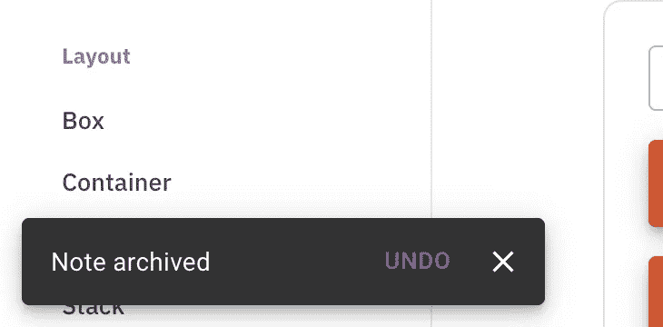

# Next.js Firebase v9:添加警告消息

> 原文：<https://javascript.plainenglish.io/nextjs-firebase-v9-part-6-add-an-alert-message-21a87471c6e2?source=collection_archive---------9----------------------->

## 第 6 部分:使用材质 UI Snackbar 和 Alert 创建警告消息。

在本文中，我们将创建`<Snackbar>`，用于显示消息。当用户创建、上传或删除时，它会显示消息并告诉用户哪个文档正在被修改。每次操作都会显示不同的颜色。


[视频教程](https://youtu.be/A-Ce4YyHMGk)和[源代码](https://www.udemy.com/course/complete-nextjs-firebase-firestore-course/?couponCode=FREESOURCE)

`<Snackbar>`就像安卓里的吐司一样，会弹出几秒然后隐藏。



为了让它被`<TodoList>`和`<TodoForm>`或其他组件触发，我们将使用 React 上下文。

## 创建 TodoContext

在根文件夹中创建 TodoContext.js。

```
import { createContext } from 'react';export const TodoContext = createContext(null);
```

## 创建带警报的 Snackbar

我们可以[用 alert 创建](https://mui.com/components/snackbars/) Snackbar。在添加组件之前，我们需要添加三种状态

```
const [open, setOpen] = useState(false)const [alertType, setAlertType] = useState("success")const [alertMessage, setAlertMessage] = useState("")
```

`alertType`用于设置颜色，`alertMessage`用于决定在警告框中显示什么信息。

然后我们可以创建`showAlert`函数:

```
const showAlert = (type, msg) => {setAlertType(type)setOpen(true)setAlertMessage(msg)}
```

然后我们将`showAlert`传递给`TodoContext.Provider`:

```
return (**<TodoContext.Provider value={{ showAlert}}>**<Container maxWidth="sm"><Box style={{ backgroundColor: 'white' }}p={3}mt={3}><TodoForm /><Snackbar anchorOrigin={{ vertical: 'bottom', horizontal: 'center' }}open={open} autoHideDuration={3000} onClose={handleClose} ><Alert onClose={handleClose} severity={alertType}>{alertMessage}</Alert></Snackbar><TodoList /></Box></ Container></TodoContext.Provider >)}
```

## 在 TodoForm 触发

使用`useContext`导入`showAlert`功能:

```
const { showAlert } = useContext(TodoContext);
```

将报警功能替换为`showAlert`:

```
showAlert('success', `Todo with id ${docRef.id} is added successfully`);
```

# 关注我们: [YouTube](https://www.youtube.com/channel/UCu4-4FnutvSHVo9WHvq80Ww?sub_confirmation=1) ， [Medium](https://ckmobile.medium.com/) ， [Udemy](https://www.udemy.com/user/cyruschan2/) ， [Linkedin](https://www.linkedin.com/company/ckmobi/) ， [Twitter](https://twitter.com/ckmobilejavasc1) ， [Instagram](https://www.instagram.com/ckmobile8050) ， [Gumroad](https://app.gumroad.com/ckmobile)

*更多内容请看*[***plain English . io***](http://plainenglish.io/)