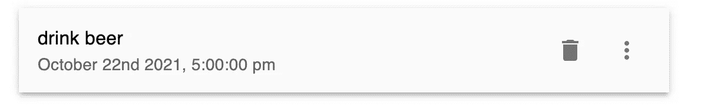

# Next.js Firebase v9:删除待办事项

> 原文：<https://javascript.plainenglish.io/nextjs-firebase-v9-part-7-delete-a-todo-614a722147cf?source=collection_archive---------7----------------------->

## 第 7 部分:用 Firebase Firestore 添加材质 UI 图标和删除功能。

在这一部分，我们将在应用程序中添加删除功能。并且在我们添加删除功能之前，我们必须添加`<DeleteIcon />`和`<MoreVertIcon />`。


[视频教程](https://youtu.be/A-Ce4YyHMGk)和[源代码](https://www.udemy.com/course/complete-nextjs-firebase-firestore-course/?couponCode=FREESOURCE)

所以先回到 **Todo.js** 。

进口`<DeleteIcon />`和`<MoreVertIcon />`。

```
import DeleteIcon from '@mui/icons-material/Delete';import MoreVertIcon from '@mui/icons-material/MoreVert';<ListItemsx={{ mt: 3, boxShadow: 3 }}style={{ backgroundColor: '#FAFAFA' }}secondaryAction={<><IconButton sx={{ m: 1 }} ><DeleteIcon /></IconButton><IconButton><MoreVertIcon /></IconButton></>}>
```



Todo with Delete Icon

## 创建删除功能

因为我们需要将 id 传递给删除函数，所以我们也需要从`<TodoList>`传递这个信息。所以，在 **TodoList.js** 中，记得加 id={todo.id}。

```
<div>{todos.map(todo => <Todo key={todo.id}**id={todo.id}**title={todo.title}detail={todo.detail}timestamp={todo.timestamp}/>)}</div>
```

在 **Todo.js** 中，创建`deleteTodo`函数，它会将 id 和事件传递给该函数。

我们必须使用`stopPropagation`方法，因为`<DeleteIcon />`位于 todo 项的顶部。

我们通过 id 指定哪个文档，然后删除那个文档，显示警报。

要使用`doc`和`deleteDoc`功能，我们必须从 Firebase firestore 导入它们。另外，从 firebase 配置文件中导入`db`。

```
import { doc, deleteDoc } from “firebase/firestore”;
import { db } from "../firebase";
```

要使用`showAlert`功能，我们还必须通过使用`useContext(TodoContext`在顶部导入它。

```
const { showAlert } = useContext(TodoContext);const deleteTodo = async (id, e) => {e.stopPropagation();const docRef = doc(db, "todos", id);await deleteDoc(docRef)showAlert('error', `Todo with id ${id} is deleted successfully`)}
```

## 将函数绑定到删除图标

最后，我们将`deleteTodo`函数绑定到`IconButton`上。

```
<><IconButton sx={{ m: 1 }}onClick={(e) => deleteTodo(id, e)}><DeleteIcon /></IconButton><IconButton><MoreVertIcon /></IconButton></>
```

# 关注我们: [YouTube](https://www.youtube.com/channel/UCu4-4FnutvSHVo9WHvq80Ww?sub_confirmation=1) ， [Medium](https://ckmobile.medium.com/) ， [Udemy](https://www.udemy.com/user/cyruschan2/) ， [Linkedin](https://www.linkedin.com/company/ckmobi/) ， [Twitter](https://twitter.com/ckmobilejavasc1) ， [Instagram](https://www.instagram.com/ckmobile8050) ， [Gumroad](https://app.gumroad.com/ckmobile)

*更多内容看*[***plain English . io***](http://plainenglish.io/)