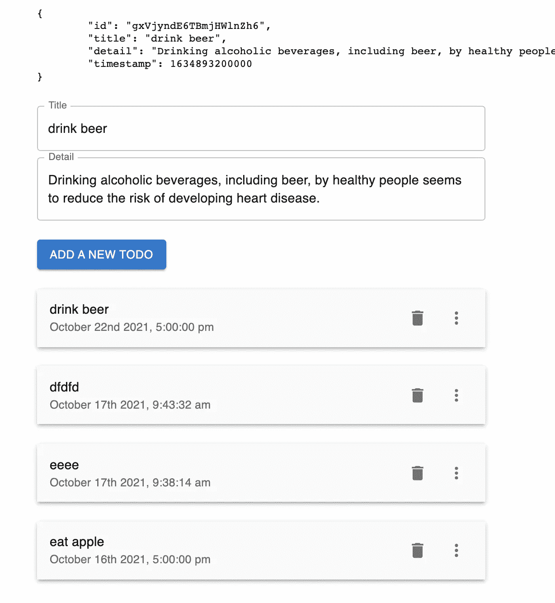
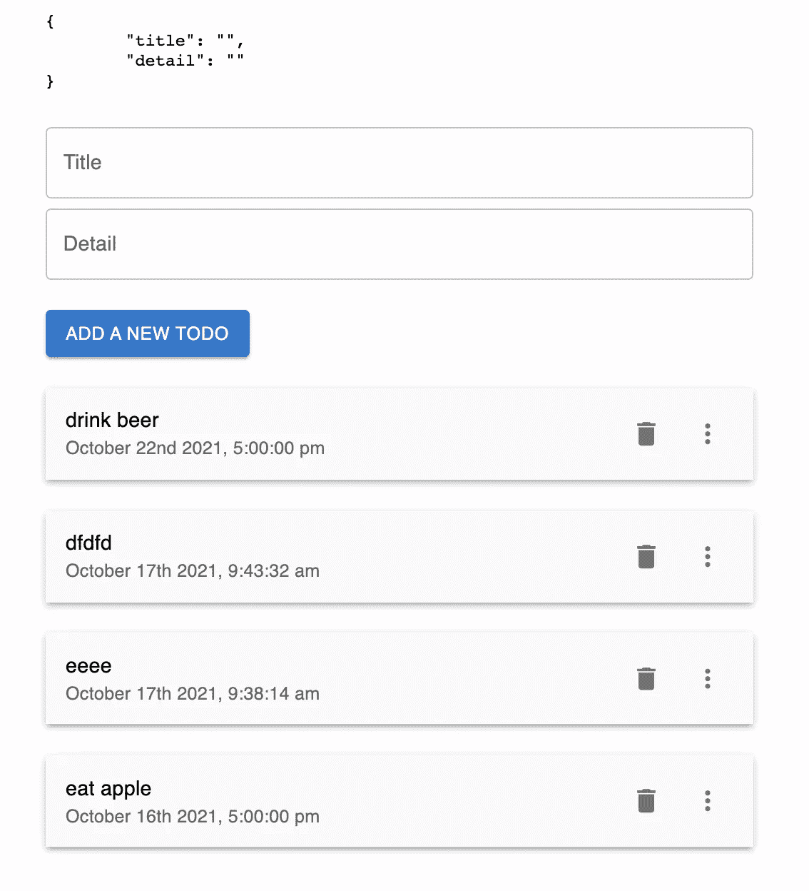

# Next.js Firebase v9:检测输入区域

> 原文：<https://javascript.plainenglish.io/nextjs-firebase-v9-part-8-detect-input-area-e3d93222b50?source=collection_archive---------4----------------------->

## 第 8 部分:使用 React useRef 检查用户是否想要更新或添加新的待办事项。


[视频教程](https://youtu.be/A-Ce4YyHMGk)和[源代码](https://www.udemy.com/course/complete-nextjs-firebase-firestore-course/?couponCode=FREESOURCE)

为了确定用户是否点击了输入区域，我们必须使用`useRef`，所以我们导入它。

```
import { useContext, useEffect, useRef, useState } from "react";const inputAreaRef = useRef();
```

我们将`inputAreaRef`绑定到输入表单。

```
<div ref={inputAreaRef}><TextFieldfullWidthlabel="Title"margin="normal"value={todo.title}onChange={e => setTodo({ ...todo, title: e.target.value })}
```

然后我们添加下面的`useEffect`来检测用户是否点击了输入区域。如果用户在输入区域之外点击，它将清除待办事项的标题和细节，而没有时间戳。

```
useEffect(() => {const checkIfClickedOutside = e => {if (!inputAreaRef.current.contains(e.target)) {console.log('Outside input area');setTodo({ title: '', detail: '' })} else {console.log('Inside input area');}}document.addEventListener("mousedown", checkIfClickedOutside)return () => {document.removeEventListener("mousedown", checkIfClickedOutside)}}, [])
```

## 点击待办事宜

我们已经有一个可以清除待办事项的场景，我们还想选取现有待办事项的值，这样用户就可以更新该待办事项。

所以我们需要回到`<Todo>`。转到列表项，添加`onClick`，将待办事项值设置为当前待办事项值。

```
<ListItem onClick={() => setTodo({ id, title, detail, timestamp })}
```

但是你可能已经注意到我们在`<Todo>`组件上没有`setTodo`功能。它只是出现在`<TodoForm>`上。

## 提取状态并将其放入 ContextProvider 中

所以我们需要把它从`<TodoForm>`中拿出来，放在 **index.js** 里面。

我们将值`todo`和`setTodo`传递给`Provider`。

```
<TodoContext.Provider value={{ showAlert, todo, setTodo }}><Container maxWidth="sm"><TodoForm />
```

## 在<todoform>和<todo>处将待办事项设置回原位</todo></todoform>

转到 **TodoForm.js** 。

```
const { showAlert, todo, setTodo } = useContext(TodoContext)
```

转到 **Todo.js** 。

```
const { showAlert, setTodo } = useContext(TodoContext);
```

为了看看它是否工作，我们转到`<TodoForm>`，添加`JSON.stringify`来显示待办状态。

```
<div ref={inputAreaRef}><pre>{JSON.stringify(todo, null, '\t')}</pre><TextField
```

如果我们点击其中一个待办事项，它会显示带有时间戳的待办事项。

该值也会添加到输入框中。



# 关注我们: [YouTube](https://www.youtube.com/channel/UCu4-4FnutvSHVo9WHvq80Ww?sub_confirmation=1) ， [Medium](https://ckmobile.medium.com/) ， [Udemy](https://www.udemy.com/user/cyruschan2/) ， [Linkedin](https://www.linkedin.com/company/ckmobi/) ， [Twitter](https://twitter.com/ckmobilejavasc1) ， [Instagram](https://www.instagram.com/ckmobile8050) ， [Gumroad](https://app.gumroad.com/ckmobile)

*更多内容看* [***说白了. io***](http://plainenglish.io/)