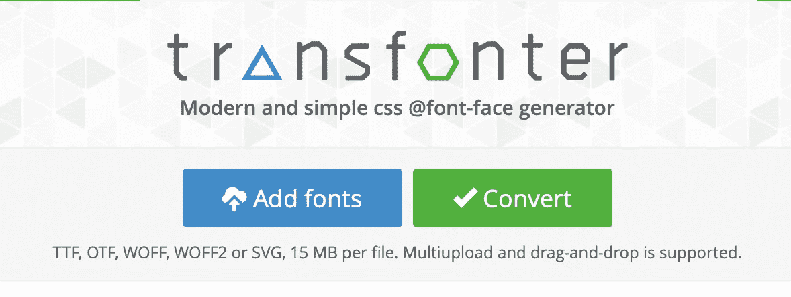
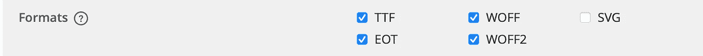
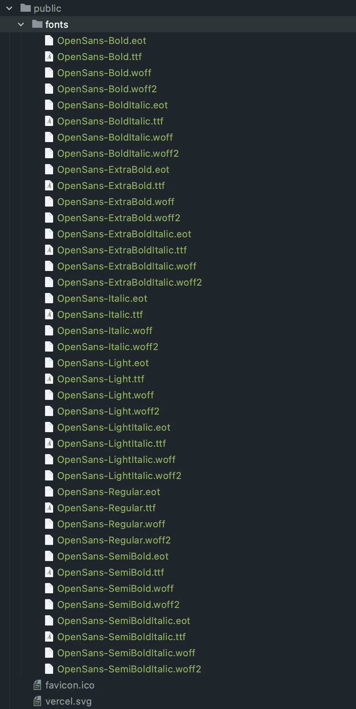
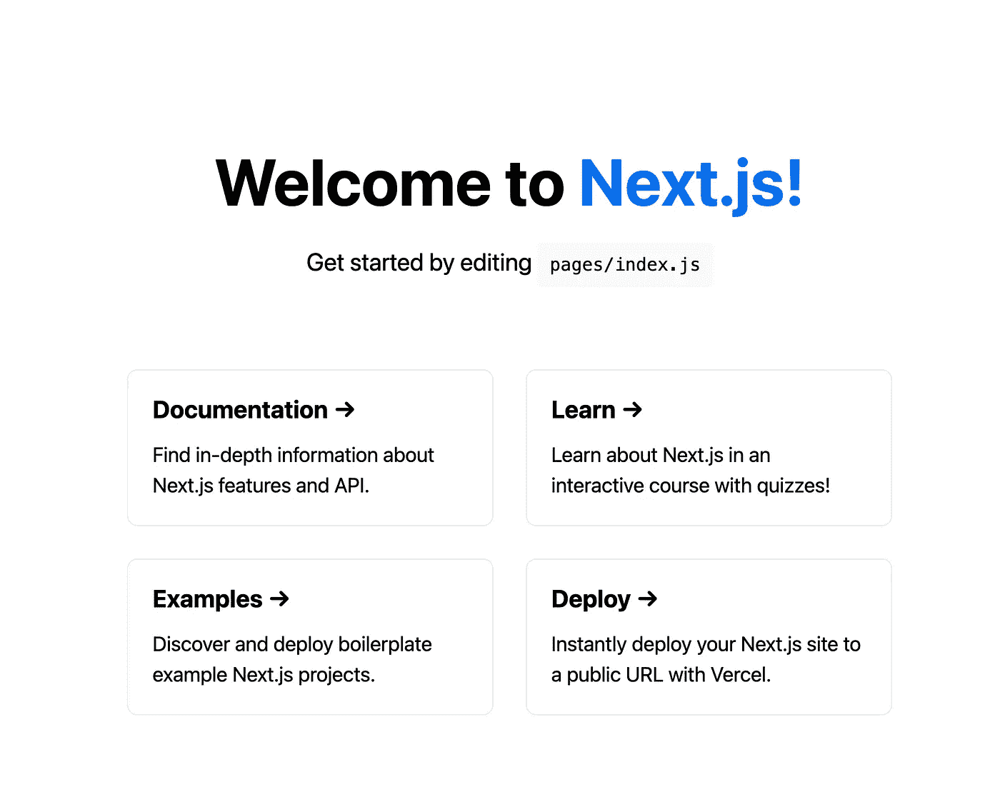
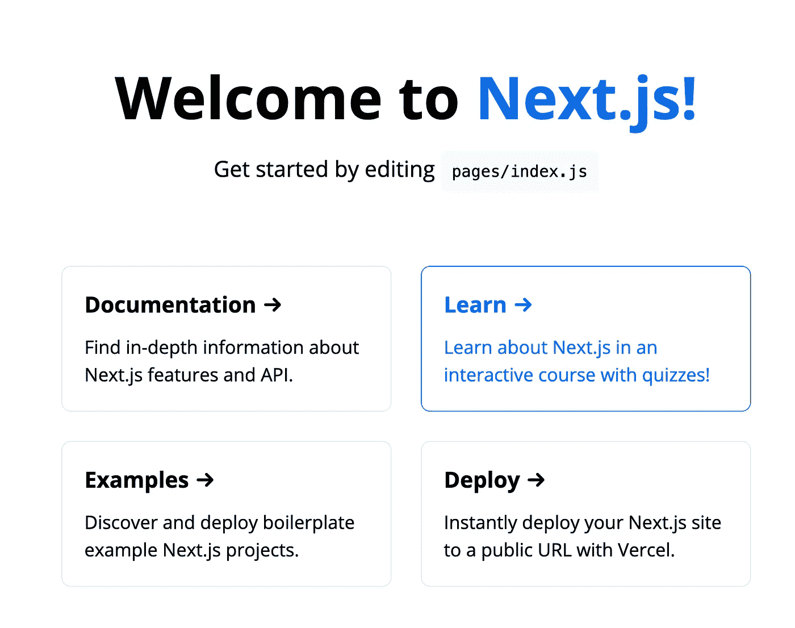

# 如何将自托管字体添加到 Next.js 应用程序

> 原文：<https://javascript.plainenglish.io/nextjs-with-self-hosted-fonts-for-all-browsers-673f497d11c4?source=collection_archive---------5----------------------->


Photo by [Bruno Martins](https://unsplash.com/@brunus?utm_source=medium&utm_medium=referral) on [Unsplash](https://unsplash.com?utm_source=medium&utm_medium=referral)

## 如何在 Next.js 中使用自托管字体？

字体是 web 开发中非常重要的资产。让我们看看如何在 Next.js 中使用自定义字体或自托管字体。

如果你已经在 Next.js 中创建了你的应用程序，你可以继续阅读，否则我会建议你阅读我的另一篇关于如何在 Next.js 中开始开发的文章

**[](https://melih193.medium.com/next-js-start-web-development-with-next-js-create-next-app-4042ca071dcb) [## Next.js —使用 Next.js & create-next-app 开始 web 开发

### 使用 Next.js 在几秒钟内开始开发

melih193.medium.com](https://melih193.medium.com/next-js-start-web-development-with-next-js-create-next-app-4042ca071dcb) 

## 选择正确的字体

你可以为你的项目选择任何你想要的字体，但是我会选择 **Open Sans** 作为教程。

可以 [**从 google fonts**](https://fonts.google.com/specimen/Open+Sans?preview.text_type=custom) 下载 open sans 或者随意选择其他字体。

## 将字体转换为 ttf、eot、woff、woff2

为了能够支持所有的浏览器，我们需要将我们的字体转换成这些类型。

有一个在线工具可以将你所有的字体转换成这些字体类型，在你转换完字体后，它会为你创建 **@font-faces** 。

[](https://transfonter.org) [## 在线@font-face 生成器

### TTF，OTF，WOFF，WOFF2 或 SVG，每个文件 15 MB。支持多上传和拖放。@font-face CSS 规则…

transfonter.org](https://transfonter.org) 

添加所有要转换的字体后，您可以选择除 svg 之外的所有字体格式。



成功转换所有字体后，会出现下载按钮，您可以下载不同格式的所有字体。

当你下载这个文件夹时，你会发现有一个 **stylesheet.css** 文件为你创建所有的字体。

```
*@font-face* {
    font-family: 'Open Sans';
    src: url('OpenSans-ExtraBoldItalic.eot');
    src: url('OpenSans-ExtraBoldItalic.eot?#iefix') format('embedded-opentype'),
        url('OpenSans-ExtraBoldItalic.woff2') format('woff2'),
        url('OpenSans-ExtraBoldItalic.woff') format('woff'),
        url('OpenSans-ExtraBoldItalic.ttf') format('truetype');
    font-weight: 800;
    font-style: italic;
    font-display: swap;
}

*@font-face* {
    font-family: 'Open Sans';
    src: url('OpenSans-Italic.eot');
    src: url('OpenSans-Italic.eot?#iefix') format('embedded-opentype'),
        url('OpenSans-Italic.woff2') format('woff2'),
        url('OpenSans-Italic.woff') format('woff'),
        url('OpenSans-Italic.ttf') format('truetype');
    font-weight: normal;
    font-style: italic;
    font-display: swap;
}

*@font-face* {
    font-family: 'Open Sans';
    src: url('OpenSans-Light.eot');
    src: url('OpenSans-Light.eot?#iefix') format('embedded-opentype'),
        url('OpenSans-Light.woff2') format('woff2'),
        url('OpenSans-Light.woff') format('woff'),
        url('OpenSans-Light.ttf') format('truetype');
    font-weight: 300;
    font-style: normal;
    font-display: swap;
}

*@font-face* {
    font-family: 'Open Sans';
    src: url('OpenSans-ExtraBold.eot');
    src: url('OpenSans-ExtraBold.eot?#iefix') format('embedded-opentype'),
        url('OpenSans-ExtraBold.woff2') format('woff2'),
        url('OpenSans-ExtraBold.woff') format('woff'),
        url('OpenSans-ExtraBold.ttf') format('truetype');
    font-weight: 800;
    font-style: normal;
    font-display: swap;
}

*@font-face* {
    font-family: 'Open Sans';
    src: url('OpenSans-Bold.eot');
    src: url('OpenSans-Bold.eot?#iefix') format('embedded-opentype'),
        url('OpenSans-Bold.woff2') format('woff2'),
        url('OpenSans-Bold.woff') format('woff'),
        url('OpenSans-Bold.ttf') format('truetype');
    font-weight: bold;
    font-style: normal;
    font-display: swap;
}

*@font-face* {
    font-family: 'Open Sans';
    src: url('OpenSans-BoldItalic.eot');
    src: url('OpenSans-BoldItalic.eot?#iefix') format('embedded-opentype'),
        url('OpenSans-BoldItalic.woff2') format('woff2'),
        url('OpenSans-BoldItalic.woff') format('woff'),
        url('OpenSans-BoldItalic.ttf') format('truetype');
    font-weight: bold;
    font-style: italic;
    font-display: swap;
}

*@font-face* {
    font-family: 'Open Sans';
    src: url('OpenSans-Regular.eot');
    src: url('OpenSans-Regular.eot?#iefix') format('embedded-opentype'),
        url('OpenSans-Regular.woff2') format('woff2'),
        url('OpenSans-Regular.woff') format('woff'),
        url('OpenSans-Regular.ttf') format('truetype');
    font-weight: normal;
    font-style: normal;
    font-display: swap;
}

*@font-face* {
    font-family: 'Open Sans';
    src: url('OpenSans-SemiBoldItalic.eot');
    src: url('OpenSans-SemiBoldItalic.eot?#iefix') format('embedded-opentype'),
        url('OpenSans-SemiBoldItalic.woff2') format('woff2'),
        url('OpenSans-SemiBoldItalic.woff') format('woff'),
        url('OpenSans-SemiBoldItalic.ttf') format('truetype');
    font-weight: 600;
    font-style: italic;
    font-display: swap;
}

*@font-face* {
    font-family: 'Open Sans';
    src: url('OpenSans-LightItalic.eot');
    src: url('OpenSans-LightItalic.eot?#iefix') format('embedded-opentype'),
        url('OpenSans-LightItalic.woff2') format('woff2'),
        url('OpenSans-LightItalic.woff') format('woff'),
        url('OpenSans-LightItalic.ttf') format('truetype');
    font-weight: 300;
    font-style: italic;
    font-display: swap;
}

*@font-face* {
    font-family: 'Open Sans';
    src: url('OpenSans-SemiBold.eot');
    src: url('OpenSans-SemiBold.eot?#iefix') format('embedded-opentype'),
        url('OpenSans-SemiBold.woff2') format('woff2'),
        url('OpenSans-SemiBold.woff') format('woff'),
        url('OpenSans-SemiBold.ttf') format('truetype');
    font-weight: 600;
    font-style: normal;
    font-display: swap;
}
```

## 将字体添加到公共文件夹

成功转换并下载不同的字体格式后，我们可以复制 **public/fonts** 文件夹中的所有字体。



## 向 styles/global.css 添加字体

为了能够在我们的项目中使用这些字体，我们需要将所有这些字体添加到我们的 **styles/global.css** 文件中。在我们复制并粘贴了所有这些字体后，我们需要指定我们在应用程序中构建的字体 URL。

正如你将在下面看到的，我们在正文中改变了**字体系列**样式，并且从`'../public/fonts/<font_file>'`开始改变了字体源 URL

**styles/global.css** 文件

```
html,
body {
  padding: 0;
  margin: 0;
  font-family: 'Open Sans', -apple-system, BlinkMacSystemFont, Segoe UI, Roboto, Oxygen,
    Ubuntu, Cantarell, Fira Sans, Droid Sans, Helvetica Neue, sans-serif;
}

a {
  color: inherit;
  text-decoration: none;
}

* {
  box-sizing: border-box;
}

*@font-face* {
  font-family: 'Open Sans';
  src: url('../public/fonts/OpenSans-ExtraBoldItalic.eot');
  src: url('../public/fonts/OpenSans-ExtraBoldItalic.eot?#iefix') format('embedded-opentype'),
  url('../public/fonts/OpenSans-ExtraBoldItalic.woff2') format('woff2'),
  url('../public/fonts/OpenSans-ExtraBoldItalic.woff') format('woff'),
  url('../public/fonts/OpenSans-ExtraBoldItalic.ttf') format('truetype');
  font-weight: 800;
  font-style: italic;
  font-display: swap;
}

*@font-face* {
  font-family: 'Open Sans';
  src: url('../public/fonts/OpenSans-Italic.eot');
  src: url('../public/fonts/OpenSans-Italic.eot?#iefix') format('embedded-opentype'),
  url('../public/fonts/OpenSans-Italic.woff2') format('woff2'),
  url('../public/fonts/OpenSans-Italic.woff') format('woff'),
  url('../public/fonts/OpenSans-Italic.ttf') format('truetype');
  font-weight: normal;
  font-style: italic;
  font-display: swap;
}

*@font-face* {
  font-family: 'Open Sans';
  src: url('../public/fonts/OpenSans-Light.eot');
  src: url('../public/fonts/OpenSans-Light.eot?#iefix') format('embedded-opentype'),
  url('../public/fonts/OpenSans-Light.woff2') format('woff2'),
  url('../public/fonts/OpenSans-Light.woff') format('woff'),
  url('../public/fonts/OpenSans-Light.ttf') format('truetype');
  font-weight: 300;
  font-style: normal;
  font-display: swap;
}

*@font-face* {
  font-family: 'Open Sans';
  src: url('../public/fonts/OpenSans-ExtraBold.eot');
  src: url('../public/fonts/OpenSans-ExtraBold.eot?#iefix') format('embedded-opentype'),
  url('../public/fonts/OpenSans-ExtraBold.woff2') format('woff2'),
  url('../public/fonts/OpenSans-ExtraBold.woff') format('woff'),
  url('../public/fonts/OpenSans-ExtraBold.ttf') format('truetype');
  font-weight: 800;
  font-style: normal;
  font-display: swap;
}

*@font-face* {
  font-family: 'Open Sans';
  src: url('../public/fonts/OpenSans-Bold.eot');
  src: url('../public/fonts/OpenSans-Bold.eot?#iefix') format('embedded-opentype'),
  url('../public/fonts/OpenSans-Bold.woff2') format('woff2'),
  url('../public/fonts/OpenSans-Bold.woff') format('woff'),
  url('../public/fonts/OpenSans-Bold.ttf') format('truetype');
  font-weight: bold;
  font-style: normal;
  font-display: swap;
}

*@font-face* {
  font-family: 'Open Sans';
  src: url('../public/fonts/OpenSans-BoldItalic.eot');
  src: url('../public/fonts/OpenSans-BoldItalic.eot?#iefix') format('embedded-opentype'),
  url('../public/fonts/OpenSans-BoldItalic.woff2') format('woff2'),
  url('../public/fonts/OpenSans-BoldItalic.woff') format('woff'),
  url('../public/fonts/OpenSans-BoldItalic.ttf') format('truetype');
  font-weight: bold;
  font-style: italic;
  font-display: swap;
}

*@font-face* {
  font-family: 'Open Sans';
  src: url('../public/fonts/OpenSans-Regular.eot');
  src: url('../public/fonts/OpenSans-Regular.eot?#iefix') format('embedded-opentype'),
  url('../public/fonts/OpenSans-Regular.woff2') format('woff2'),
  url('../public/fonts/OpenSans-Regular.woff') format('woff'),
  url('../public/fonts/OpenSans-Regular.ttf') format('truetype');
  font-weight: normal;
  font-style: normal;
  font-display: swap;
}

*@font-face* {
  font-family: 'Open Sans';
  src: url('../public/fonts/OpenSans-SemiBoldItalic.eot');
  src: url('../public/fonts/OpenSans-SemiBoldItalic.eot?#iefix') format('embedded-opentype'),
  url('../public/fonts/OpenSans-SemiBoldItalic.woff2') format('woff2'),
  url('../public/fonts/OpenSans-SemiBoldItalic.woff') format('woff'),
  url('../public/fonts/OpenSans-SemiBoldItalic.ttf') format('truetype');
  font-weight: 600;
  font-style: italic;
  font-display: swap;
}

*@font-face* {
  font-family: 'Open Sans';
  src: url('../public/fonts/OpenSans-LightItalic.eot');
  src: url('../public/fonts/OpenSans-LightItalic.eot?#iefix') format('embedded-opentype'),
  url('../public/fonts/OpenSans-LightItalic.woff2') format('woff2'),
  url('../public/fonts/OpenSans-LightItalic.woff') format('woff'),
  url('../public/fonts/OpenSans-LightItalic.ttf') format('truetype');
  font-weight: 300;
  font-style: italic;
  font-display: swap;
}

*@font-face* {
  font-family: 'Open Sans';
  src: url('../public/fonts/OpenSans-SemiBold.eot');
  src: url('../public/fonts/OpenSans-SemiBold.eot?#iefix') format('embedded-opentype'),
  url('../public/fonts/OpenSans-SemiBold.woff2') format('woff2'),
  url('../public/fonts/OpenSans-SemiBold.woff') format('woff'),
  url('../public/fonts/OpenSans-SemiBold.ttf') format('truetype');
  font-weight: 600;
  font-style: normal;
  font-display: swap;
}
```

## 之后测试更改

初始应用视图



Default font

打开 Sans 字体视图



Open Sans font

如你所见，我们的应用程序的字体如我们所愿地改变了。

## 结论

我们采取的步骤是

1.寻找合适的字体

2.转换字体所有字体格式

3.将所有这些字体添加到我们的**公共/字体**文件夹

4.给我们的 **styles/global.css** 文件添加字体

5.在主体 css 选择器中将使用的字体系列更改为我们的字体名称

仅此而已！

如果您在学习本教程或您的成功案例时有任何问题，以及您使用了哪些字体，请在下面发表评论！

*如果你觉得这篇文章很有帮助，你* [***可以通过使用我的推荐链接注册一个***](https://medium.com/@melihyumak) **[***中级会员来访问类似的文章***](https://melihyumak.medium.com/membership) *。***

***跟我上*** [**推特**](https://twitter.com/hadnazzar)


Subscribe for more on [Youtube](https://www.youtube.com/c/TechnologyandSoftware?sub_confirmation=1)

# 编码快乐！

梅利赫**