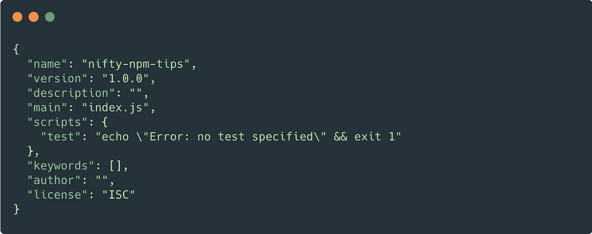
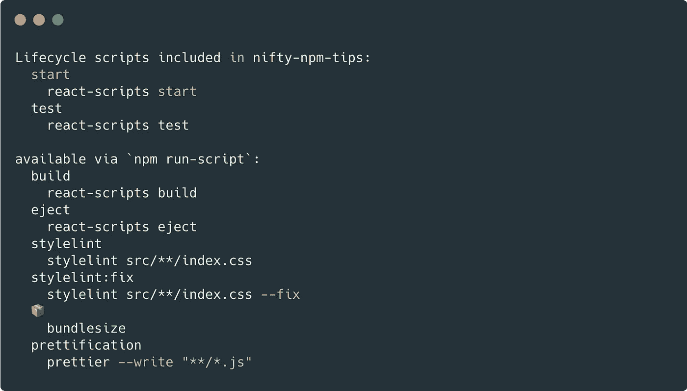
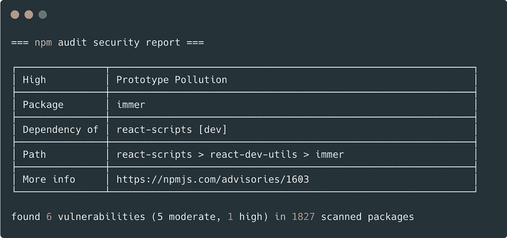

# 节省时间的漂亮的 npm 技巧和资源

> 原文：<https://javascript.plainenglish.io/nifty-npm-tips-and-resources-to-save-time-9ed8dc94f7a4?source=collection_archive---------18----------------------->

## *节省更多时间的 NPM 小贴士⏱️*


**先决条件** —您需要在您的机器上安装 Node 来运行这些命令。

当提到下面使用的命令时，我将引用这个样例 package.json👇

# npm 初始化-y

这个命令将在任何目录中初始化您的包。该命令使用默认值，并且不会提示任何选项。这是一个救生命令开始一个项目的默认选项，以后你可以添加，编辑或更新任何选项。

命令— `npm init -y`

**输出**



# npm 运行

该命令将给出 package.json 中列出的可用脚本列表。例如，如果在 package.json 所在的终端上运行`npm run`命令。

命令— `npm run`

**输出**



# 前/后脚本

`pre*` & `post*`脚本在`package.json`的`scripts`部分定义。您可以将它用于任何脚本。对于任何脚本，以此为前缀。为了前任。`build`脚本有`prebuild` & `postbuild`。

```
"scripts": {
  "prebuild": "do before build..",
  "build": "react-scripts build",
  "postbuild": "do after build.."
}
```

# npm 生命周期脚本

npm 有内置的生命周期脚本，这些是仅在特定情况下发生的一些特殊的生命周期脚本。这些脚本是对前<event>、后<event>和<event>脚本的补充。例如— `preinstall` `postinstall` `prepublish` `prepublishOnly` `prepack` `postpack`</event></event></event>

# npm 缓存清理

npm 将缓存数据存储在名为`_cacache`的已配置缓存内的不透明目录中。该命令将删除缓存文件夹中的所有数据。npm，使用缓存访问包，无需再次下载。只有在磁盘空间不足时才这样做

# npm 安装—生产

当您在生产环境中设置项目时，使用`--production`标志。当您使用此标志时，`devDependencies`将不会安装在该服务器上。

# npm 审计

`npm audit`是一个内置的安全功能，这个命令扫描你的应用程序的任何漏洞。它检查软件包在公共 npm 注册表中是否有任何已知的漏洞或安全问题。这个命令生成一个表格格式的输出，我们也可以生成一个 JSON 格式的输出`npm audit –json`

命令— `npm audit`

**示例输出**



要修复审计报告中的漏洞，请运行`npm audit fix –f`命令来修复所有漏洞&安全问题。如果有一个主要的版本更新，`-f`标志是必要的。否则，您可以手动修复问题，即更新每个软件包。

> *我在每个交替的 sprint 中或者一个月一次，虔诚地遵循这个运行* `*npm audit*` *的过程，我检查是否需要任何更新，并做必要的代码修复。*

# npm 已过时

*   该命令将针对您的`package.json`运行。它将检查 npm 注册表，看看是否有任何您已安装的软件包是过时的。
*   这个命令将打印出一个包的列表，以及当前的、过期的和想要的版本

命令— `npm outdated`

**输出**

```
Package              Current   Wanted  Latest  Location  
react                16.13.1  16.14.0  17.0.2  nifty-npm-tips 
react-dom            16.13.1  16.14.0  17.0.2  nifty-npm-tips
```

# npm 编辑

如果您想调试或浏览项目中任何已安装的包的代码。此命令将在 cli 中打开包含文件和文件夹的包的目录。可选地，您也可以在任何编辑器中打开包内容，确保您的环境中设置了`$EDITOR`。

# npm ls

该命令将列出所有已安装的软件包，该命令将输出已安装软件包及其依赖项的树形结构。

# 人手短缺和旗帜

```
npm i   for install 
npm t   for test 
npm it  for install & run tests 
npm ci  for clean-install 
npm cit for clean-install and run tests
```

# 有用的 npm 库

# [ntl](https://www.npmjs.com/package/ntl)

这是一个非常好的交互式 CLI 工具。

**如何安装**

`npm install -g ntl`

**运行该命令**

`ntl`

**输出**

```
$ ntl 
⬢ Node Task List 
? Select a task to run: (Use arrow keys) 
❯ start   
  build   
  test   
  eject
```

# [npkill](https://www.npmjs.com/package/npkill)

该工具允许您列出系统中的任何`node_modules`目录。您可以选择要删除的`node_modules`以释放系统空间。这是删除`node_modules`最简单的方法

**如何安装**

你不需要安装它来使用它，只需运行`npx npkill`

# [再见](https://www.npmjs.com/package/adio)

adio (all-dependencies-in-order)这是一个小的库，可以检查源代码中没有列出的依赖项。您可以使用它来清理 package.json 依赖项。

*更多内容尽在*[***plain English . io***](http://plainenglish.io/)