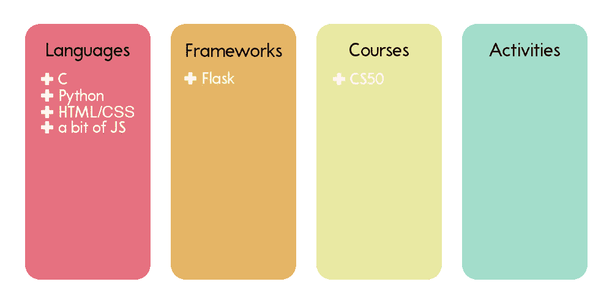
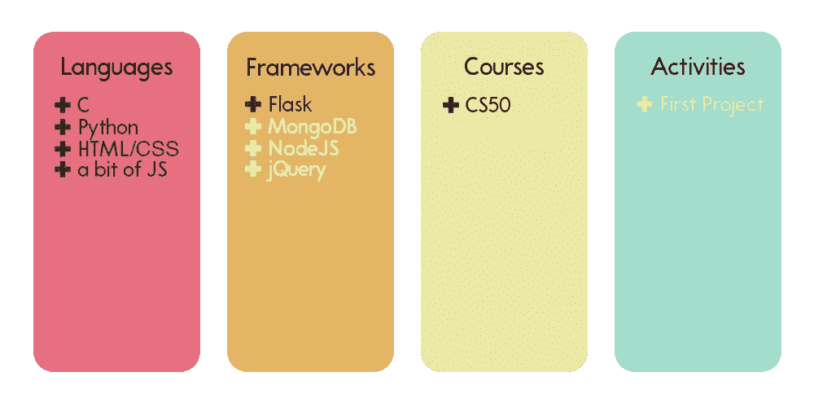
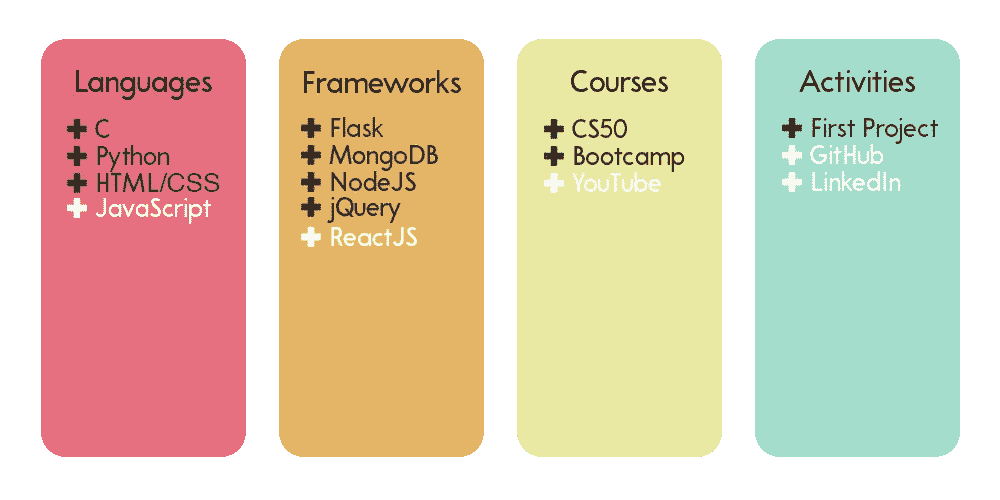
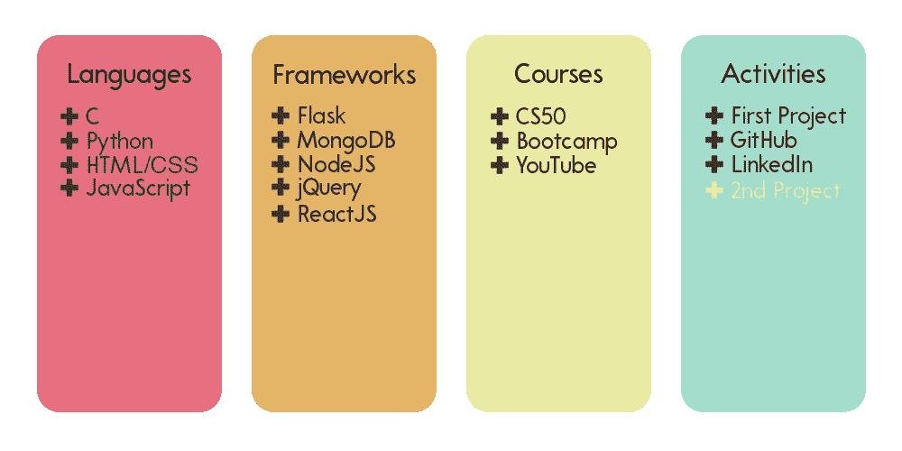
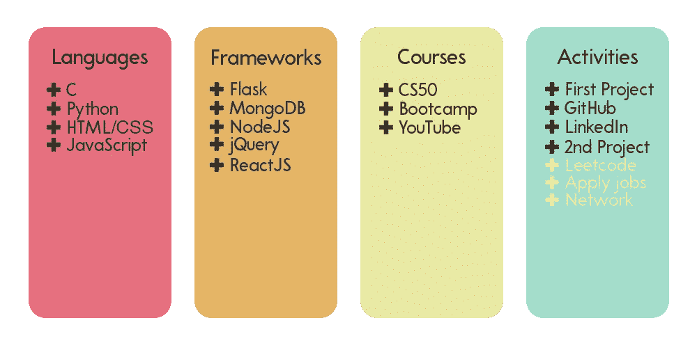
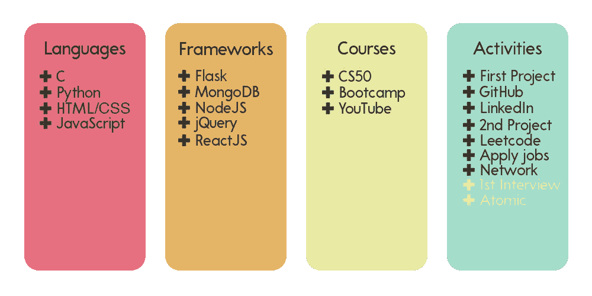
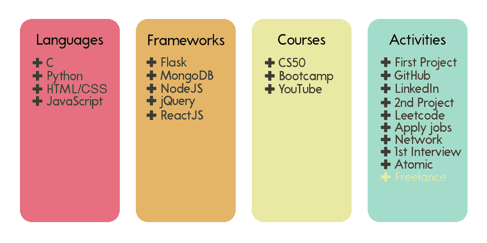
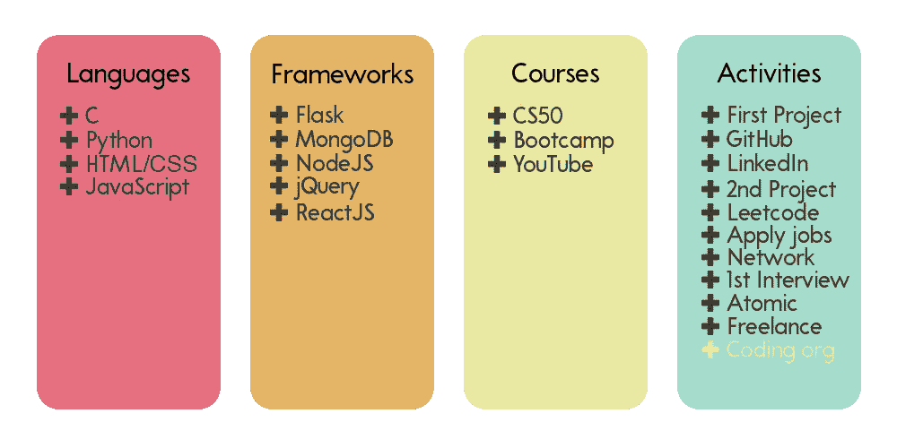
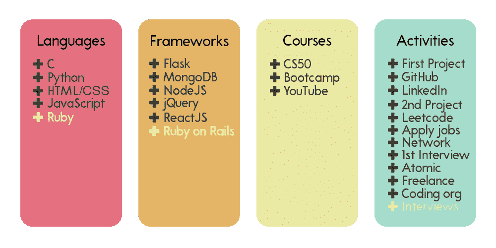

# 没有学位？没问题！我成为软件工程师的自学之旅

> 原文：<https://javascript.plainenglish.io/no-degree-no-problem-my-self-taught-journey-to-becoming-a-software-engineer-a995e286c8e4?source=collection_archive---------4----------------------->

一年前，我拿起一本名为《十亿美元应用程序》的书，读了两章，认为我可以开始编写应用程序，并用我的“杀手级想法”赚大钱。

在与 React Native 和 Swift 教程斗争了数周后，我最终放弃了，并意识到我对编程一无所知，更不用说如何开发移动应用了。就在那一刻，我向自己承诺，我会不择手段成为一名软件工程师。

这篇文章对那些努力工作的人来说是一种激励，他们花额外的时间调试他们的投资组合应用程序，重新整理他们的简历，并不时刷新他们的电子邮件。这证明了一个事实，那就是纯粹通过自学成为一名软件工程师确实是可能的。

提醒你，这是*最难走的*路。

我不会粉饰它，说它会很容易，因为它真的不容易。

有时候(非常经常)，你会被打败，倒在地上。

> 你将面临拒绝
> 
> 你将面临失望
> 
> 你将面临挣扎
> 
> 你将面临不确定的时刻

就背景而言，我的道路不仅艰难，而且似乎几乎不可能，因为我是一个外国人，没有公关身份，没有任何学位，在疫情期间寻找一份开发工作。

但是我写这封信并不是要告诉你 T4 不能做什么。相反，我写信告诉你你能做什么。所以事不宜迟，让我们开始吧！

# **月 0 日**

我从哈佛 edX 的 CS50 课程开始了我的谦卑之旅。这是一个非常具有挑战性的课程，但它的结构非常好，经过深思熟虑。不要太担心，因为我实际上很难完成这门课程，但经过几周的努力，我还是完成了。就我个人而言，我会把这门课作为第一门课推荐给任何人，因为它确实为学习代码打下了良好的基础。

正如满评帖中提到的，它真的教会了你“如何学习”(我知道..陈词滥调)，但我认为这绝对是每个程序员必备的技能。

同时，我也开始了 freeCodeCamp 的响应式网页设计课程。一周后，我意识到我无法真正平衡兼顾 CS50 和 FCC，所以我把它移到了我自学旅程的后期。

我会保留一个*视觉标签*给你，让你在每个月之后看到我的工具带由什么组成，所以你可能会粗略估计你在每个级别应该拥有什么技能，但是当然，每个人都是不同的，并且 *YMMV* 很大程度上。

# **月 1 日**

在完成 CS50 的最后一个项目后，它给了我一个很好的感觉，让我知道应该在哪个编程领域工作。当然，我选择了 web 开发路线，这也是最值得推荐的路线，因为当今的编程世界 80%是 web 开发。很自然地，我去了另一个非常受欢迎的 Udemy 网站开发课程，这是柯尔特·斯蒂尔的网站开发训练营。

如果你计划今天开始课程，这可能与我的经历非常不同，因为斯蒂尔在 2021 年修改了整个课程。这是一个非常好的训练营，让我对全栈 web 开发生态系统有了足够的了解:前端、后端、构建 API 和数据库。

最后的项目，我用 MongoDB，Express/Node.js 做了一个全栈 [app](https://bellboy.herokuapp.com/) ，是一个酒店点评 app，回头看代码是垃圾。它有可怕的格式，关注点的分离，低效的功能，在同一时间什么都做，什么都不做。

然而，在那个时候，通过编码来学习是一个很好的学习经历，可以从整体上理解 web 开发的基本概念。我强烈推荐这门课程给任何想要建立一个坚实的 web 开发基础和其中的核心概念的人。

# **第二个月**

经过整整两个月的编程，我终于放心地告诉朋友和同事，我实际上正在努力找一份自学成才的开发人员的工作。幸运的是，我有一个同事朋友(嗨，K！)，他在经历了一个训练营后过渡到了开发领域，感谢他，他指出我实际上在没有 R(代表 React)的情况下学习了 MERN 堆栈。知道我的无限憔悴号*上缺少一块无限宝石后，我马上开始工作。*

最初，我四处搜索 React 教程，发现了一堆 40-50 小时的训练营，其中也包括 Redux/Relay/Context-Provider。这本书太长太啰嗦了，要写完太难了。

相反，在 YouTube 上浏览大量的教程最终会更有效率地学习 React 的工作原理。我最喜欢的实际上是来自 Scrimba/Traversy Media (YouTube)，实际上是在阅读 React 官方文档(写得真好，去看看吧！).React 是一个深潜，但最终，我也捡起来了。

我的朋友 K 也很好心地看了我的简历，他告诉我在申请工作时，一个好的 Github/LinkedIn 个人资料的重要性，这两个我都有真正未经修饰的版本。

回过头来看，这是为我的成功铺平道路的极其重要的一步——在开始找工作之前，尽早建立你的 Github/Linkedin。在招聘人员开始淹没你的收件箱之前，LinkedIn 算法需要时间来发挥作用。

# **第三个月**

第四个月，我因为一周 7 天不停地写代码而有点停滞不前，所以我休息了整整第一周和第二周。我艰难地认识到，当涉及到保持和提高你的生产力时，适当的休息是必不可少的(看看我是如何在仅仅三个月后就精疲力尽的)。

休息之后，我决定在 React 中重构我为 CS50 做的最终项目，以便更好地理解 React 是如何工作的。这个项目在学习方面非常有益，因为我从头开始写所有的东西。

从*读书*学习&从*做事*学习是截然相反和完全不同的另一回事。后者给你在特定框架中构建调试的第一手经验。它还让我更好地理解了 API 是如何工作的，并理解了 web 开发作为一个整体是如何工作的。

# **第四个月**

从这个月开始，是时候开始申请工作了(记得在你准备好之前申请*方式*)。每天早上，我花时间解决 1 个 Leetcode 简单问题，在 LinkedIn/本地求职网站上申请 20 份工作，每天下午润色我的两个兼职项目。前两个星期非常艰难，我在解决 Leetcode 问题时遇到了麻烦，最终有几天花了整个下午来解决一个问题，正因为如此，我申请的工作得到回复的成功率非常低。

我后退一步，试图找出问题所在。

> 是因为资历(或缺乏资历)吗？
> 
> 是饱和的就业市场吗？
> 
> 是我糟糕的面试技巧吗？
> 
> 是我所知道的不再需要的框架/语言吗？

感谢我的另一个朋友 J，他指出我的技能似乎更倾向于前端职位，与申请后端工作相比，我的机会会大大增加。然而，这并不是说我应该从现在开始做纯粹的前端工作，并把自己束之高阁，而是在以后的某个时间做更多的工作。

相反，这意味着，如果我把自己的作品集设计得更漂亮、更友好，让面试官在收到我的申请时能快速瞥一眼，给他们留下深刻印象，我就有更大的机会申请前端工作。

经过几个不眠之夜和发人深省的夜晚，我设法重新思考我自己的个人品牌，如何向面试官和招聘人员推销自己，如何在就业市场上从其他更合格的人中脱颖而出。不出所料，考虑到这个建议&“重塑品牌”,我设法获得了一家小型科技公司的第一次面试机会。

# **第五个月**

在得到我的第一个回复后，我被要求接受电话采访。这很伤脑筋，但最终我还是通过了。几周后，他们回复了我，让我加入销售团队。我锁定了自己的目标，决心不要忘记自己的实际目标，所以我拒绝了这个提议。为了保持这篇文章的合理长度，我会在以后的时间里写更多的内容。

第一次面试后，我对自己在编码知识(主要是 JavaScript)方面的优势和劣势有了更好的认识。我对 async/await、call stack/event loop/queue 和 recursions 等概念的理解仍然没有达到标准，所以我冒昧地观看了 YouTube 视频和 Reddit 文章的 enigma 版本，以正确理解这些概念，直到我准备好进行下一步。

顺便说一句，我女朋友还送了我一本叫做《原子习惯》的书，我看了三遍后强烈推荐。这本书谈到了每天建立小的好习惯的核心原则，这些习惯将会错开并在长期积累，产生指数级的回报。这套原则非常适合自学如何编码。

# **第六个月**

接下来的一个月进展缓慢，因为我没有得到太多的回复，尽管我仍然每天都在申请工作。

我不再过多关注发送 LinkedIn 简历，而是将注意力转移到为真正的客户建立真正的项目上。

通过口口相传和社交媒体，我以低于平均水平的价格宣传自己的网站建设服务，令人惊讶的是，两天内就收到了一位朋友的回复，他拥有一家需要简单登录页面的艺术公司。我毫不犹豫地开始工作，并使用 HTML/CSS/JavaScript 构建了一个简单的原型，向他们展示后，他们很高兴，并对我竖起大拇指，让我继续构建网页的其余部分。

事实上，他们对结果(和价格)非常满意，把我推荐给了他们的隔壁邻居。类似地，我继续构建一个原型，并再次向他们展示。这位客户还提出每月支付我一笔维护费来更新/维护他们的网页，这太棒了！

尽管我还不是正式的开发人员，但这两个项目在我的简历中占据了很大的比重，因为它们显示出我拥有与实际客户和商业项目打交道的第一手经验。总的来说，这是一个很有收获的月份，我在简历上做了很多，还赚了一些外快。

# **第七个月**

如果你读过我以前的帖子，我提到过人际关系网是多么的强大，因为它会产生连锁反应，产生指数级的冲击波，这个月就是一个很好的例子。第二个客户(付钱让我维护他们的网页的人)把我介绍给他的姐夫，他是一家银行公司的高级软件工程师。我们见了面，喝了几杯酒，最后他邀请我加入一个志愿编码组织。

在一个编码组织中很棒，因为

> 1)网络、网络和网络
> 
> 2)我在协作工作(学习 Git/React)和我感兴趣的任何其他语言/框架方面获得了第一手经验。

在结对编程会议后仅仅 2 周，我的反应技能就有了显著的提高，并实际尝试在那个特定的框架中构建一个特性。绝对推荐任何一个走这条路的人去寻找本地的编码聚会。

我的 Leetcode 也越来越好，设法解决了大多数简单的问题，没有太多的麻烦，这当然是一个很大的信心助推器。

# **第八个月**

新的一年，新的我。对吗？开个玩笑，大部分时间都是新年，我还是老样子。然而，随着我的两个自由职业项目和编码组织经验现在新加入到我的新武器库中，我开始接到招聘人员的大量电话(可能也是新的日历年开始招聘，LinkedIn 算法开始工作)。我参加了第二次、第三次和第四次面试。所有这些都进行得很顺利，但最终没有报价。

事实上，我甚至参加面试对我来说是一件赏心悦目的事。我满怀希望，知道以这种速度我最终一定会找到工作。我用这个月剩下的时间润色了我的投资组合项目，我的 GitHub 和 LinkedIn 看起来越来越精致了。

由于不知道 Ruby on Rails 会让我受益匪浅(见下个月)，我也尝试学习了一点 Ruby on Rails，因为我的大多数朋友和 Reddit 都高度赞扬了它。

# **第九个月**

就像之前的几个月一样，继续着这种折磨，我忘记了这将是“这个月”的事实(这也是原子习惯中解释的另一个重要概念)。这是一个艰难的月份，我得到了更多的面试机会，但也有更多的拒绝。我曾认真考虑过放弃自学路线，咬紧牙关，参加一个大学计算机科学项目，这在精神上对我产生了影响。

但是，上天干预，又给了我一次面试的机会。这是一次相当冷淡的电话面试，但我确信我不会通过，因为面试官告诉我，他们实际上在寻找一个后端的家伙，而我迎合了我的整个“*推销*”来展示我的前端技能。但就像我说的，上帝已经决定了我的命运，当一切似乎都失去了，我的希望破灭了，他们给了我这份工作。

# **关闭思路**

这是一次长途旅行，

> 无数次拒绝。
> 
> 无数的失望。
> 
> 无数放弃的瞬间。

但是 334 天后，我正式成为了一名软件工程师。

感谢你阅读我的故事，我希望它能以某种方式激励你。请不要放弃，这似乎很难，但我向你保证这是值得的。这里还有一些我学到的东西，你可能会觉得有帮助。

## 我的建议

1.阅读原子习惯

2.在你准备好之前就面试。

3.网络是关键，它会产生指数增长的连锁反应。

4.经常休息以避免精疲力尽，旅途漫长而艰难。

5.利用你的技能解决现实生活中的问题(例如，为我的朋友建立登陆页面)。

6.简历/GitHub/LinkedIn 不是一次性的清单项目，你需要不断完善和更新。

*更多内容尽在*[*plain English . io*](http://plainenglish.io/)