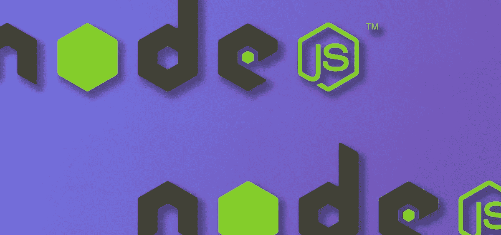
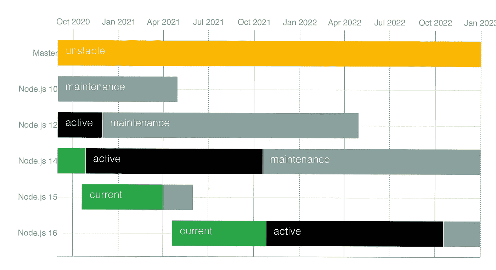

# Node.js 16 有什么新功能？

> 原文：<https://javascript.plainenglish.io/node-16-now-available-6bdc1ef5849d?source=collection_archive---------0----------------------->

Photo Illustration by David Fekke

Node.js 基金会刚刚发布了 Node v16.0.0 的第一个版本。Node.js 维护多个版本，包括当前版本和长期支持(LTS)版本。目前的 v16 版本将在 2021 年 10 月的某个时候成为 LTS 版本。这是 Node 的正常发布[计划](https://github.com/nodejs/Release#release-schedule)。

去年 11 月，苹果发布了一种基于 ARM64 的新 CPU 架构。这些是使用苹果公司 M1 芯片的苹果电脑。虽然 Node.js 确实在这些较新的机器上运行，但它是通过苹果的 Rosetta 技术运行的。Rosetta 允许 x86_64 代码在较新的芯片上运行。虽然这是稳定的，但并不理想。

Photo courtesy of gadgetmatch.com

您现在可以通过节点基础作为`.pkg`文件或通过节点版本管理器下载该版本。这是苹果硅二进制文件的第一个版本。`.pkg`安装程序将安装一个通用的二进制程序，该程序将在苹果硅处理器或基于英特尔的苹果电脑上运行。

节点. js 的 JavaScript 引擎 V8 版本已经升级到 9.0 版本。之前在 Node 版本 15 中，他们使用的是 V8 8.6。

V8 新版本的一部分包括新的正则表达式功能，用于捕获字符串的开始和结束索引。当您使用`/d`标志并访问`.indices`数组属性时，这是可用的。

# 稳定计时器承诺应用编程接口

稳定计时器之前在 Node v15 中处于实验状态。他们现在被认为是一个稳定的特征。

# 实验性网络加密应用编程接口

Web 加密 API 是针对 JavaScript 的加密库的较新的、定义较好的版本。所有新的网络加密方法都可以在`subtle`界面上找到。许多浏览器使用了一个叫做`Crypto`的界面，但是没有特定的规格。网络加密应用编程接口为`Crypto`库增加了一个标准。

# 节点-API 版本 8

节点 API 提供了一个接口，用于将本机 C++加载项编写为节点模块。第 8 版的 Node-API 为以下方法添加了本机方法；

*   [皮娜 _ add _ async _ clean _ hook](https://nodejs.org/dist/latest-v16.x/docs/api/n-api.html#n_api_napi_add_async_cleanup_hook)
*   [皮娜 _ 物体 _ 冻结](https://nodejs.org/dist/latest-v16.x/docs/api/n-api.html#n_api_napi_object_freeze)
*   [皮娜 _ 物 _ 印](https://nodejs.org/dist/latest-v16.x/docs/api/n-api.html#n_api_napi_object_seal)
*   [皮娜 _ 类型 _ 标签 _ 对象](https://nodejs.org/dist/latest-v16.x/docs/api/n-api.html#n_api_napi_type_tag_object)
*   [皮娜 _ 检查 _ 对象 _ 类型 _ 标签](https://nodejs.org/dist/latest-v16.x/docs/api/n-api.html#n_api_napi_check_object_type_tag)
*   [皮娜 _ 类型 _ 标签](https://nodejs.org/dist/latest-v16.x/docs/api/n-api.html#n_api_napi_type_tag)

# AbortController API

AbortController Web API 提供了一个全局 API，可用于取消选择基于承诺的 API。事件监听器应该使用`{ once: true }`选项确保事件监听器被删除。下面是一个与事件侦听器一起使用的 AbortController 的示例；

# **添加了缓冲液‘atob’和‘btoa’方法**

这些方法用于将数据转换成 base64 编码的字符串，然后再转换回来，以支持传统的 web 平台 API。**这不是首选方式，也不应该在新代码中使用。**

将数据转换成 base64 编码字符串的首选方式是使用`Buffer.from(data, 'base64')`方法或`buf.toString('base64')`将缓冲区转换成“base64”字符串。

# 其他功能

*   npm 版本 7.10.0
*   源地图 v3
*   process.binding()已被否决

# 结论

Node.js 升级通常是增量升级。由于 V8 运行时升级了新特性，Node 在新版本的 V8 中获得了这些特性。我期待着 10 月份 LTS 的发布。

*原发布于*[*https://fek . io*](https://fek.io/blog/node-16-now-available/)*。*