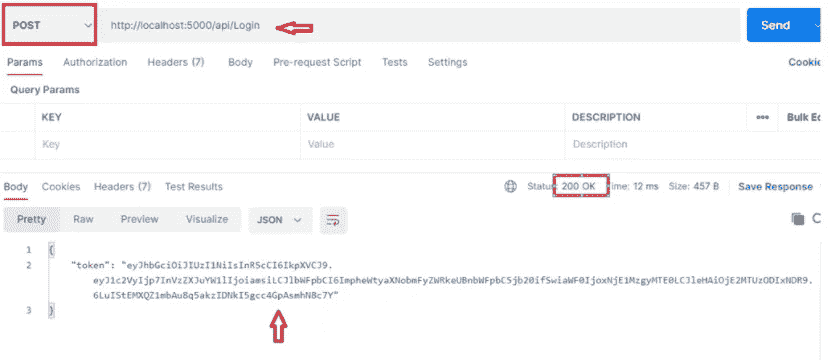

# 使用 JSON Web 令牌的 Node.js API 身份验证

> 原文：<https://javascript.plainenglish.io/node-js-api-authentication-with-json-web-tokens-bb511f603723?source=collection_archive---------4----------------------->

Node-API-Auth

在本文中，我们将介绍如何访问 JSON web 令牌(JWT ),以及如何通过 JSON web 令牌保护我们的路由。

你有没有想过认证的过程？抽象和复杂的层面下隐藏着什么？没什么异常。这是一种加密数据并生成独一无二的令牌的方法，用户可以使用该令牌来标识自己。您的身份已通过此令牌验证。它将验证您的身份，并允许您使用各种服务。如果你不认识这些单词，不要担心，我会在下面解释一切。

# 设置

在我们开始之前，我们应该在我们的机器上安装一些东西。

*   Visual Studio 代码-> [VS 代码](https://code.visualstudio.com/)
*   Node.js -> [Node.js](https://nodejs.org/en/download/)

**先决条件&依赖条件**

用项目名(NodeAuthAPI)创建一个新文件夹，并在 Visual Studio 代码(VS 代码)中打开同一个文件夹

运行以下命令来初始化我们的 package.json 文件。

> npm 初始化—是

安装我们所有剩余的依赖项

> npm 安装快速 jsonwebtoken
> 
> npm install -g nodemon

# 为什么会有这些依赖？

[express](https://www.npmjs.com/package/express) —运行在服务器上(端口号)

[jsonwebtoken](https://www.npmjs.com/package/jsonwebtoken) —这将用于签署和验证 JSON web 令牌。

[nodemon](https://www.npmjs.com/package/nodemon) —每当我们对文件进行更改时，将使用它自动重启我们的服务器。

在项目中创建一个名为 index.js 的文件。

**项目结构**

project-structure

让我们导入 index.js 文件中的包

> **const**express = require(" express ")；
> 
> **const**jwt = require(" jsonwebtoken ")；

现在用 express 初始化 app 变量

> **const**app = express()；

设置我们的服务器要处理的端口号

> app.listen(5000，()=>console.log('监听端口 5000 '))；

让我们运行并测试我们的应用程序是否在上面提到的相同端口号下运行。

在 terminal-node mon 中运行命令来检查输出

Console output

创建一个简单的 get 方法来检查 Postman 中的输出。

**索引. js**

**邮递员**

Final Output — API

因此，我们的 get 方法被确认为按预期工作，现在配置 jwt 设置以检查实际的认证机制。用模拟用户名和电子邮件创建一个 post API 登录方法，我也用同样的方法设置了令牌过期秒数。

**邮递员**

Post endpoint

令牌是用基本凭证生成的，现在我们需要用这个令牌验证另一个 API 来访问凭证。

创建一个函数并验证将作为头传递的令牌

授权样本:持票人

让我们创建一个 API 来验证这个令牌

**测试邮递员**

Validate token

如果你试图在不传递令牌的情况下访问 validate API，它会给出 403 Forbidden，因为未经授权的访问。

现在，让我们首先通过访问登录 API 来获取令牌，然后在 Validate API 中传递与头相同的令牌来获取访问和结果。

Final output

**注**

30 秒后令牌将过期，因为我们在代码中定义了过期时间，我们需要通过访问登录 API 再次获取令牌

 [## JayKrishnareddy/nodeautapi

### 为 Node.js 中的 API 设置基于 JWT 令牌的身份验证- JayKrishnareddy/NodeAuthAPI

github.com](https://github.com/JayKrishnareddy/NodeAuthAPI) 

感谢您阅读本文，希望您在理解 Node.js API 与 JWT 的认证时有一个清晰的印象。

*支持我*

继续学习！

*更多内容请看*[*plain English . io*](http://plainenglish.io/)