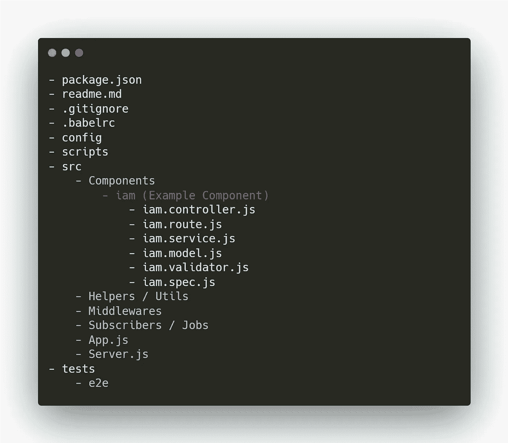
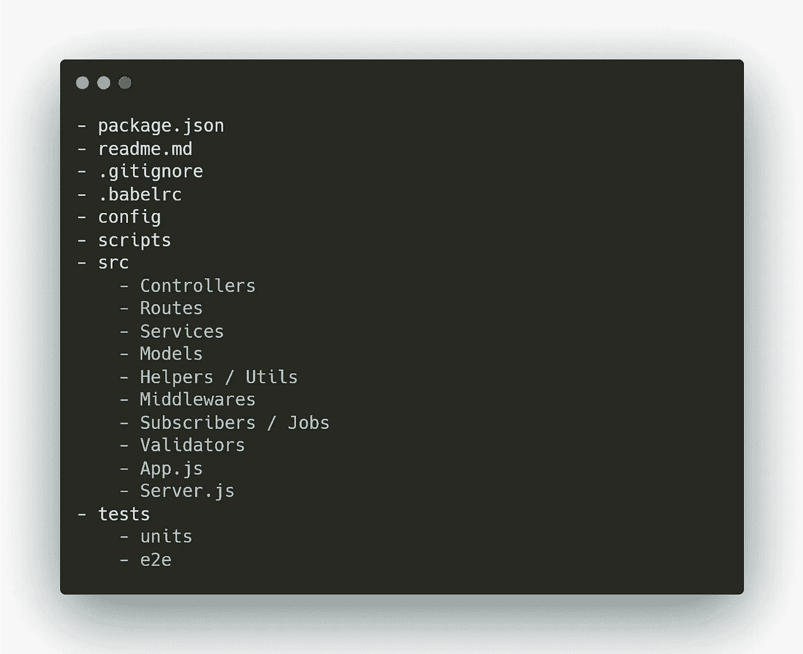

# Node.js 初学者和高级用户的最佳实践

> 原文：<https://javascript.plainenglish.io/node-js-backend-engineers-best-practices-overview-for-beginner-to-advance-caae74b53df?source=collection_archive---------1----------------------->

学习写代码很容易。学习编写高质量的代码是事情开始变得复杂的地方，即使你是一个中级开发人员。

当谈到高质量代码的指导方针时，没有一种尺寸适合，我试图涵盖许多在我看来很棒的技巧/指导方针。

本文向您概述了如何在 Node.js 中编写高质量代码的知识。如果您想了解更多，将来会有更多的文章详细介绍每个子主题。

## 生活技能

*   正确阅读您正在使用的技术的文档
*   找一个导师或对 Node.js 有更深了解的人，这样你可以从他们那里得到建议/帮助。
*   改善沟通
*   每月参加聚会/会议/网络研讨会
*   至少每周阅读文章
*   查看类似的开源产品以获取灵感

## 编程语言、概念和工具

*   数据结构和算法
*   饭桶
*   不变
*   事件驱动系统
*   Java Script 语言
*   节点. js
*   Docker 和 Kubernetes
*   VS 代码(插件、代码片段、快捷键、命令)
*   像自动气象站这样的云(尤其是 EC2、S3、Lambda)
*   API / REST
*   不同的设计模式
*   网络包
*   Cypress |测试
*   吉拉|项目管理

## **策划**

*   了解你的需求
*   了解并预测您未来的需求
*   准备用户流程和主要功能文档
*   在任务/项目管理系统中有一个任务和时间表(像吉拉)
*   要使用的库和编写定制代码(Express、Loadash 等)之间的平衡

## **文件夹结构**

文件夹结构也需要根据项目需求进行更改，通常，我们可以使用以下两种结构:

**这可用于大型项目**

**这可用于小型项目**

## **代码质量，文档化，**错误处理 **&日志记录**

*   恰当地评论一切
*   林挺，并遵循像| Airbnb | Google | Custom 这样的指南
*   遵循 ES6+准则
*   用户日志库，如 Winston，而不是 console.log
*   将 swagger 用于 API 文档
*   使用 JSdoc 编写代码文档
*   通过 API 的适当响应和请求结构

## **执行/部署**

随着开发人员的角色变得越来越灵活，您必须至少了解云、服务器和部署相关事物的基础知识，这样您就可以处理自己的大部分事情

*   像 AWS 一样使用云
*   设置配置项或配置项/CD
*   自述文件中关于构建、启动、停止和测试的步骤
*   在部署期间，使用 PM2 这样的流程管理器进行自动重启
*   使用 Nodemon 之类的进程管理器进行热重装
*   使用 APM 监控应用程序
*   使用环境变量来存储凭证和其他数据

## **测试**

虽然有很多不同的方法和不同的东西可以测试，但是我们通常应该根据项目和需求把重点放在重要的测试上。

*   单元测试
*   使用 postman 或 cypress 进行 E2E / API 测试
*   依赖注入设计概念
*   测试覆盖率
*   使用 faker.js 这样的测试库

## 表演

*   将 Gzip 和 SSL 之类的东西委托给反向代理，如果可能的话，比如 Nginx
*   从 S3、CDN 或反向代理而非节点服务前端资产
*   使用像 Redis 这样的缓存机制
*   使用 Redis 或 RabbitMQ 的排队机制
*   尽量避免在 Node.js 中使用 CPU 密集型任务
*   使用适当的数据结构和有效的算法
*   实现像分页这样的概念，只发送需要的内容
*   使用更好的基础设施来运行你的程序
*   拥抱并了解更多关于异步
*   运行多个节点实例
*   拥抱微服务架构
*   使用合适的框架，避免沉重的库
*   编写高效的数据库查询
*   了解有关 Node.js 工作线程的更多信息
*   了解有关 Node.js 集群的更多信息

## **安全**

甚至做一些基本的安全措施也能对你的应用程序有很大的帮助。

*   包检查(snyl.io)
*   将凭证存储在环境变量中，而不是代码中
*   CORS 和 CSRF
*   头盔套装
*   输入和显示验证(表单、转义 HTML、JavaScript)
*   安全测试
*   关闭端口
*   速率限制和有限的登录尝试
*   使用加密等安全库对密码、健康数据等敏感数据进行加密
*   为 DDOS 使用 Cloudflare 等服务
*   保证 Cookie 的安全
*   使用 Redis 等服务阻止 JWT 的能力

## 排除故障

如果您没有遵循正确的系统化方法来调试代码，有时发现问题会比重写代码花费更多的时间。

*   学习节点调试器
*   学习邮递员
*   了解铬检查元素
*   像哨兵一样使用 APM

## 聪明工作

*   为重复和最常用的代码设置代码段
*   不要重新发明轮子，使用节点库来节省时间和成本
*   设置最需要/最流行的 VSCode 扩展，如括号对着色程序
*   设置路径别名以使代码更加健壮/简单/清晰

## 要避免的常见错误

*   尽可能避免回调(回调地狱)
*   没有应用系统和过程来学习以上所有的东西
*   从第一天开始编写代码，而不是适当地计划
*   不向高级工程师寻求帮助/建议/审核
*   只阅读一次上面的文章，而不是每周阅读两次，持续 2-3 周
*   甚至不学，一点点前端
*   不是每周阅读文章来保持更新
*   不使用智能路径
*   ***想着一完成项目就写测试的，哈哈哈哈哈哈***

如果你试图一次完成所有这些，可能会让人不知所措、厌烦和艰难。试着每天涵盖每个子主题，这样你就能恰当地吸收所有的东西。

虽然有许多其他的技巧和指导方针需要保持代码的高质量(可能与本文不同或相矛盾)，但上面的概述是一个良好的开端，可以让你脱颖而出，成为一名更好的开发人员。

请记住，尽管有很多小事情要处理，但几乎所有事情的学习曲线都很低，只要付出适当的努力就可以学会。

请让我们知道这篇文章是否对您有所帮助，或者您是否认为有所欠缺，以便我们能够改进并更好地帮助他人。

我们祝你在开发者之旅中好运。

编码快乐，干杯！

*更多内容看*[***plain English . io***](http://plainenglish.io/)