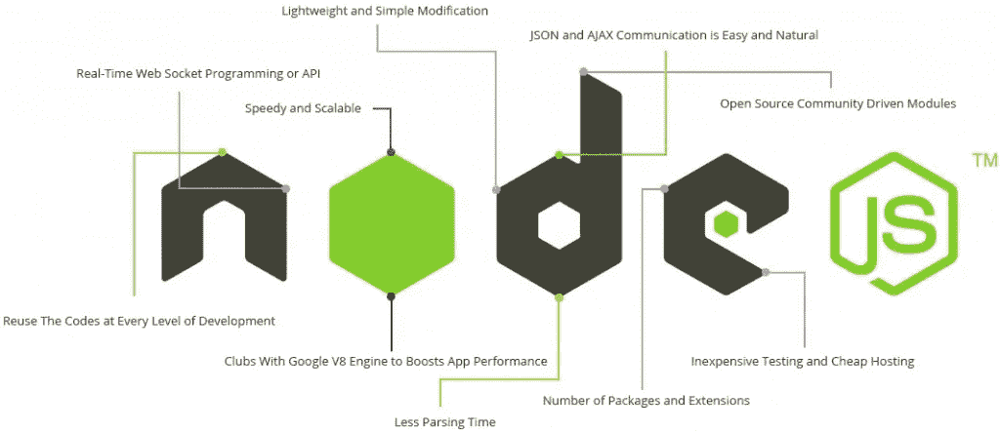

# Node.js 最佳实践:性能和可靠性

> 原文：<https://javascript.plainenglish.io/node-js-best-practices-performance-and-reliability-c737de2ef418?source=collection_archive---------8----------------------->


Photo by [Mark Chan](https://unsplash.com/@markcjn?utm_source=unsplash&utm_medium=referral&utm_content=creditCopyText) on [Unsplash](https://unsplash.com/?utm_source=unsplash&utm_medium=referral&utm_content=creditCopyText)

## Node.js 应用程序的最佳实践

这将是一个 2 篇文章的系列，我们将看到如何提高我们的应用程序的性能。在本文中，我们将讨论，我们可以在**代码级别做些什么来提高性能**。第二篇文章将介绍 **OPs(环境/设置)部分**。

我正在研究与我从事的 Express 应用程序相关的东西。我们也可以在各种各样的 web 应用程序中使用这些方法，尽管有所改变。



# 使用 gzip 压缩

使用 Gzip 压缩可以大大减小响应体的大小，从而提高 web 应用程序的速度。在 Express app 中使用[压缩](https://www.npmjs.com/package/compression)中间件进行 gzip 压缩，如下所示:

```
var compression = require('compression')
var express = require('express')
var app = express()
app.use(compression())
```

# 对同步功能说不

同步函数和方法在执行过程返回之前会一直占用执行过程。对同步函数的单个调用可能会在几微秒或几毫秒内返回，但是，在高流量的网站中，这些调用累积起来会降低应用程序的性能。避免在生产中使用它。

尽管 Node 和许多模块都提供了同步和异步版本的函数，但在生产中总是使用异步版本。同步功能唯一可以调整的时间是初始启动时。

如果我们正在使用 Node.js 4.0+或 io.js 2.1.0+，我们可以在应用程序使用同步 API 时使用`--trace-sync-io`命令行标志来打印警告和堆栈跟踪。当然，我们不希望在生产中使用它，而是希望确保我们的代码已经为生产做好了准备。

# 正确记录

一般来说，从我们的应用程序进行日志记录有两个原因:用于**调试**和用于**日志记录应用程序**活动(本质上，其他一切)。使用`console.log()`或`console.error()`将日志消息打印到终端是开发中的常见做法。但是[当目的地是一个终端或一个文件时，这些函数是同步的](https://nodejs.org/api/console.html#console_console_1)，所以它们不适合生产，除非我们通过管道将输出传递给另一个程序。

## 用于调试

如果我们记录日志是为了调试，那么不要使用`console.log()`，而是使用一个特殊的调试模块，比如 [debug](https://www.npmjs.com/package/debug) 。这个模块使我们能够使用 DEBUG 环境变量来控制发送给`console.error()`的调试消息(如果有的话)。为了保持我们的应用程序完全异步，我们仍然希望将`console.error()`通过管道传输到另一个程序。但是，我们不会真的在生产中调试，对吗？

## 对于应用程序活动

如果我们正在记录应用程序活动(例如，跟踪流量或 API 调用)，我们可以使用像 [Winston](https://www.npmjs.com/package/winston) 或 [Bunyan](https://www.npmjs.com/package/bunyan) 这样的日志库，而不是使用`console.log()`。

# 使用验证参数

用 node.js 编写的没有处理异常的应用程序可能会崩溃——在一些无效的输入参数的情况下，例如无效的类型转换、过长的字符串等。这意味着我们的应用程序动作的中断。

很多时候，这些无效参数通过 API 函数传递给数据库，这可能会导致异常和错误消息。

> **rest API 中的任何函数在将输入参数发送到数据库或其他函数之前，必须在开始时检查输入参数的正确性。**

有许多现成的软件包可以用于此目的。其中一个是[**express-validator**](https://www.npmjs.com/package/express-validator)，非常适合生产。使用这个模块我们可以验证主体、查询和标题数据。

**如何使用—** 下面只是其中一种使用方法。我们可以根据我们的需要和要求来改变它。

1.首先将模块放在 server node.js 的主文件中，例如 index.js 或 server.js

```
var util = require('util'),
    bodyParser = require('body-parser'),
    express = require('express'),
    expressValidator = require('express-validator'),
    app = express();app.use(bodyParser.json());// this line must be immediately after any of the bodyParser middlewares!
app.use(expressValidator({
      errorFormatter: function(param, msg, value) {
     var namespace = param.split('.')
        ,root = namespace.shift()
        ,formParam = root;
    while(namespace.length) {
           formParam += '[' + namespace.shift() + ']';
    }
    return {
            param : formParam,
            msg : msg,
           value : value
          };
 }
}));app.listen(8888);
```

2.把下面这段代码放到一个新文件中，比如说 validator.js。它将用于我们应用程序的许多文件的验证

```
module.exports = function(request,response,schema)
{
   request.checkBody(schema); var errors = request.validationErrors();
  if (errors) {
       console.error({Error: errors});
       response.status(422).send({Error: {Validator: errors}});
       return true;
   }
   else return false;}
```

3.在单独的文件中声明用于输入参数验证的模式。

```
module.exports = {
    'sensor_device_id': { isInt:{
             errorMessage: 'sensor_device_id - Integer expected'
        },
        errorMessage: 'sensor_device_id is required' },
    'active': { notEmpty: true,
        errorMessage: 'Active Validation error' },
   'organisation': { isInt:{
            errorMessage: 'Organisation - Integer expected'
        },
        errorMessage: 'Organisation is required' }
}
```

3.为模式的每个动作放置指令。我们需要用定义的模式放置正确的文件名。

```
if(validator(request,response,schema)) return next();
```

比如说-

```
const validator = require('../schema/validator.js');
const schema_sensorActive = require('../schema/sensorActive.js');app.post('/sensor', function (request, response, next) { if(validator(request,response,schema_sensorActive)) return next(); const mssql = request.service.mssql; 
 const params = request.body;
 const {
        organisation=null,
        sensor_device_id=null,
        active=1
    } = params; const sqlQuery = 'EXEC [AppCenter].[Sensor_Active_UPDATE] ?, ?, ?, ?';
    const sqlParams = [request.auth.UserID, organisation, sensor_device_id, active]; mssql.query(sqlQuery, sqlParams, {
        success(res) { try{
                   return response.status(200).send(res); } catch(err) {  return response.status(201).send({Error: res}); }
        },
        error: handleSqlError(response, sqlQuery, sqlParams)
    });
}
```

每次，当验证器检测到一个错误，那么关于它的信息将被发送到前端客户端应用程序。同样，我们也可以对输出参数进行验证，比如从数据库、设备等执行数据之后。

# 正确的异常处理

任何应用程序在遇到未捕获的异常时都会崩溃。不处理异常和采取适当的行动将使我们的应用程序崩溃和离线。有一种 ops 方法，我们可以在崩溃时自动启动应用程序(我将在第二部分讨论)，幸运的是，Express 应用程序通常启动时间很短。

然而，我们首先要避免崩溃，为此，我们需要正确处理异常。

为了确保我们处理所有异常，请使用以下技巧:

*   **使用试抓**
*   **使用承诺**

在深入这些主题之前，我们应该对节点/表达式错误处理有一个基本的了解:使用错误优先回调，以及在中间件中传播错误。Node 使用“错误优先回调”约定从异步函数返回错误，其中回调函数的第一个参数是 error 对象，后面是后续参数中的结果数据。若要指示没有错误，请将 null 作为第一个参数传递。回调函数必须相应地遵循错误优先的回调惯例，以有意义地处理错误。在 Express 中，最佳实践是使用 next()函数通过中间件链传播错误。

## 不要做什么

我们应该 ***而不是*** 做的一件事是监听`uncaughtException`事件，当一个异常一路冒泡回到事件循环时发出该事件。为`uncaughtException`添加事件监听器将会改变遇到异常的流程的默认行为；尽管出现异常，该进程仍将继续运行。这听起来可能是防止我们的应用程序崩溃的好方法，但在未捕获到异常后继续运行应用程序是一种危险的做法，不推荐这样做，因为进程的状态变得不可靠和不可预测。

另外，使用`uncaughtException`是官方认可的[粗](https://nodejs.org/api/process.html#process_event_uncaughtexception)。所以监听`uncaughtException`只是个馊主意。我也不建议使用[域名](https://nodejs.org/api/domain.html)。它通常不能解决问题，并且是一个不推荐使用的模块。

## 使用试抓

Try-catch 是一种 JavaScript 语言结构，我们可以用它来捕获同步代码中的异常。例如，使用 try-catch 处理 JSON 解析错误，如下所示。

使用诸如 [JSHint](http://jshint.com/) 或 [JSLint](http://www.jslint.com/) 之类的工具来帮助我们找到隐式异常，比如未定义变量上的[引用错误。](http://www.jshint.com/docs/options/#undef)

下面是一个使用 try-catch 处理潜在的进程崩溃异常的示例。这个中间件函数接受一个名为“params”的查询字段参数，它是一个 JSON 对象。

```
app.get('/search', function (req, res) {
  // Simulating async operation
  setImmediate(function () {
    var jsonStr = req.query.params
    try {
      var jsonObj = JSON.parse(jsonStr)
      res.send('Success')
    } catch (e) {
      res.status(400).send('Invalid JSON string')
    }
  })
})
```

然而，try-catch 只适用于同步代码。因为节点平台主要是异步的(特别是在生产环境中)，所以 try-catch 不会捕获很多异常。

## 使用承诺

Promises 将处理使用`then()`的异步代码块中的任何异常(显式和隐式)。只需将`.catch(next)`添加到承诺链的末尾。例如:

```
app.get('/', function (req, res, next) {
  // do some sync stuff
  queryDb()
    .then(function (data) {
      // handle data
      return makeCsv(data)
    })
    .then(function (csv) {
      // handle csv
    })
    .catch(next)
})app.use(function (err, req, res, next) {
  // handle error
})
```

现在，所有异步和同步错误都传播到了错误中间件。

**然而，有两个警告:**

1.  我们所有的异步代码都必须返回承诺(发射器除外)。如果一个特定的库没有返回承诺，通过使用一个类似于[blue bird . promisifyall()](http://bluebirdjs.com/docs/api/promise.promisifyall.html)的帮助函数来转换基本对象。
2.  事件发射器(如流)仍然会导致无法捕获的异常。因此，请确保我们正确处理了错误事件；例如:

```
const wrap = fn => (...args) => fn(...args).catch(args[2])app.get('/', wrap(async (req, res, next) => {
  const company = await getCompanyById(req.query.id)
  const stream = getLogoStreamById(company.id)
  stream.on('error', next).pipe(res)
}))
```

`wrap()`函数是一个包装器，它捕捉被拒绝的承诺并以错误作为第一个参数调用`next()`。

# 数据库查询优化

最后一个非常重要的问题:当来自 DB 服务器的响应需要几秒钟的时间(这转化为我们的 Rest API 的时间响应)时，即使 node.js 中的超级代码也会运行缓慢。

第二件重要的事情是在 DB 的 TSQL 端使用更多的数据处理，而不是在 node.js 端。

*更多内容请看*[*plain English . io*](http://plainenglish.io/)