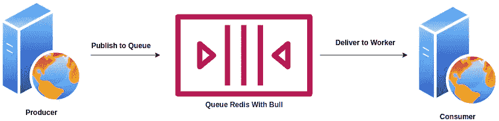
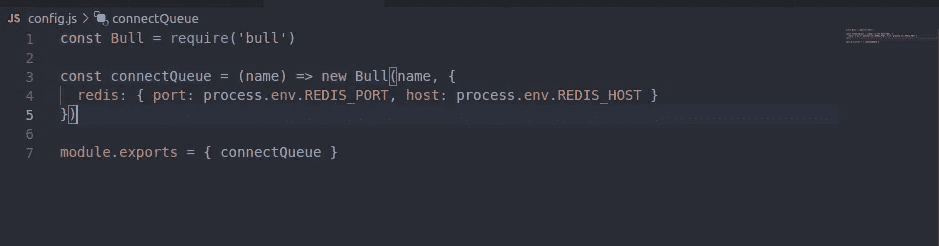
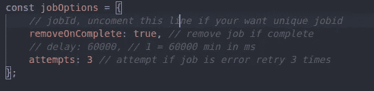

# Node.js:使用 Bull 和 Redis 创建作业队列

> 原文：<https://javascript.plainenglish.io/node-js-create-job-queue-using-bull-and-redis-20fabcee60c5?source=collection_archive---------0----------------------->



***Examples of architectural drawings***

# 介绍

队列可以以一种有趣的方式解决许多不同的问题，通过将繁重的进程分散到其他服务器来减少一台服务器上的进程负载。在 Nodejs 中，有一些很好的库可以用于排队过程，比如 ***、蜜蜂队列*** 、 ***公牛*** 等等。在本练习中，我们将使用一只 ***公牛*** 进行尝试。简单的案例研究用户想要下载数据，这里我将给出一个带有少量虚拟数据的例子。

在这里，我们将创建两个具有不同角色的应用程序，如下所示:

*   **Producer** :添加任务到队列的节点程序
*   **消费者**:定义流程功能的节点程序，以及要做的工作

# 创建应用程序

首先，创建一个文件夹，并在终端中使用以下命令初始化我们的应用程序，指向之前创建的文件夹:

```
$ npm init
```

初始化完成后，我们将安装 ***bull*** 和 ***dotenv*** 包，在终端中使用以下命令:

```
$ npm install bull dotenv
```

然后创建一个名为 ***config.js*** 的文件，输入如下所示的代码，对于 ***REDIS_HOST*** 和 ***REDIS_PORT*** 变量，填写它们拥有的 REDIS 主机和端口。



**config.js**

然后创建一个名为 ***handler.js，consumer.js*** 和 ***produer.js*** 的文件，如下所示:

***handler.js***

**producer.js**

**consumer.js**

现在让我们测试应用程序，首先，我们使用 1 分钟的延迟测试应用程序，打开两个终端，导航到我们的文件夹，并按照下面的视频运行它:

如果您不希望队列中有任何延迟，那么您可以在本节 producer.js 的 delay 部分注释代码。



# 结论

队列有 ***先进先出*** 的概念，可以将同时(异步)进行的订单映射为依次(同步)进行。

在一个真实的案例中，我使用 queue with bull 将超过 100 万个数据导出为 ***xlsx*** 格式。它不会降低服务器速度，导出时也很流畅。

完整源代码的链接在这里。

 [## GitHub-firmanJS/生产者-消费者-示例

### 在 GitHub 上创建一个帐户，为 firmanJS/生产者-消费者示例开发做出贡献。

github.com](https://github.com/firmanJS/producer-consumer-example) 

感谢您的阅读！

*更多内容请看*[***plain English . io***](http://plainenglish.io/)