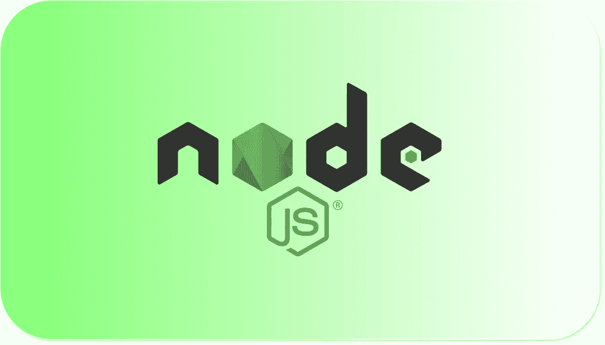
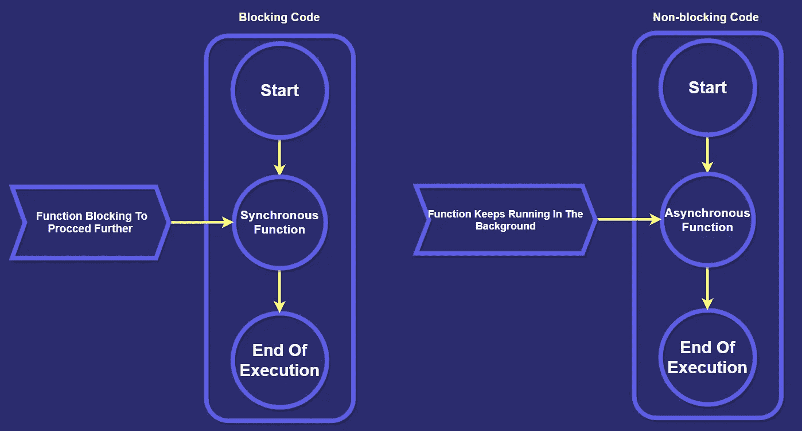
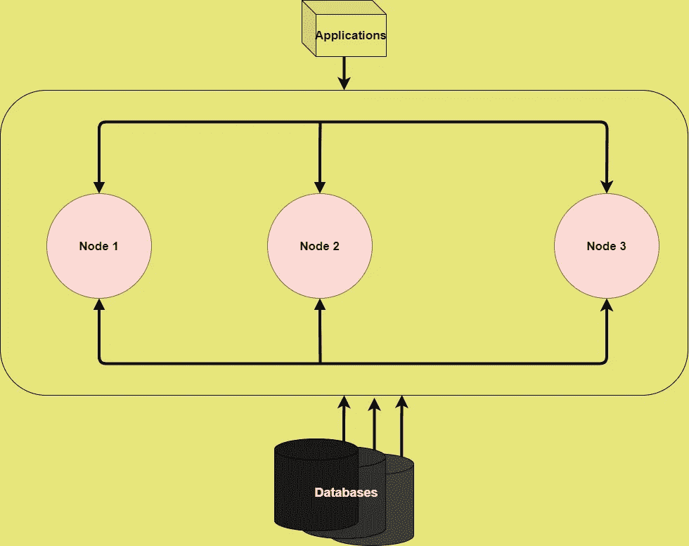

# Node.js 年开发者路线图

> 原文：<https://javascript.plainenglish.io/node-js-developer-roadmap-for-2021-2ae9c057bff4?source=collection_archive---------0----------------------->

## 成为 Node.js 开发人员的路线图

Node.js 自发布以来一直是最大的游戏规则改变者之一，像**优步、Medium、PayPal** & **沃尔玛**这样的大公司将他们的技术栈转移到**Node.js。**你可以用 node . js 开发真正强大的应用程序，如实时跟踪应用程序、视频和文本聊天引擎、社交媒体应用程序等。学习 Node.js 正成为开发人员最热门的技能之一，我准备的路线图是基于我自己的经验和技巧。在深入研究这个 Node.js 路线图之前，请确保您有一个明确的*&***简明的*** 您想要用 Node.js 构建的目标，否则您将像我一样在学习路径之间放弃。保持一个目标将帮助你专注于学习最重要的技能，而不是弄清楚你是否需要学习它们。*

# *先决条件*

## ***1。JavaScript***

*如果您是一名前端开发人员，希望掌握一些后端技能，那么在开始构建 Node.js 应用程序之前，您不必花费大量时间学习 JavaScript。但是，如果您是一个完全的初学者，希望在尽可能短的时间内掌握 Node.js，那么在深入 Node.js 环境之前，您必须学习以下概念。*

*   *箭头功能*
*   *类型*
*   *公式*
*   *功能*
*   *词汇结构*
*   *这*
*   *循环和范围*
*   *数组*
*   *模板文字*
*   *严格模式*
*   *ES6/ES7*

*在 Node.js 中，你将会处理大量的异步编程，为此，建议学习以下概念。*

*   *定时器*
*   *承诺*
*   *关闭*
*   *事件循环*
*   *异步编程和回调*

## *2.NPM*

*节点包管理器是世界上最大的**软件注册中心**，拥有超过 800，000 个代码包。当我们开发需要大量依赖项的应用程序时，正确地使用 NPM 和 T21 会有很大的帮助，因为用 NPM 管理软件包会变得非常方便。*

*NPM 由三个不同的部分组成*

*   *命令行界面(CLI): 它运行在机器的终端环境中，也是大多数开发人员与 NPM 交互的方式*
*   ***注册表:**JavaScript 软件和元信息的大型公共数据库。*
*   *网站:你可以发现新的软件包，并管理你的 npm 体验的其他方面。*

*NPM 用于管理多个版本的代码和代码依赖，不下载就运行包 ***(使用 npx)*** ，等等。*

## *3.Node.js 基础知识*

***事件发射器:**它们是 **Node.js** 中的对象，通过发送消息来触发事件，以表示一个动作已经完成。我们也可以编写自己的代码来监听来自事件发射器的事件。*比如*，如果你做过一些前端工作，那么你大概知道我们的应用程序中需要处理多少交互，比如**鼠标点击、键盘按键、**等鼠标移动。类似地，在 Node.js 的后端环境中，我们可以使用 events 模块构建一个类似的系统，该模块提供了用于处理事件的 **EventEmitter** 类。*

***回调:**这些是任务完成时调用的函数，它防止任何类型的阻塞，同时允许其余代码同时运行。因为我们必须在 Node.js 中处理大量异步任务，所以我们到处都需要它们来创建无缝且更快的应用程序。**例如，***

**

***Buffers:**node . js 中一个名为 Buffer 的类被设计用来处理原始的二进制数据。它们对应于在 **V8** 之外分配的一些原始内存。缓冲区是一个不能调整大小的整数数组，有一大堆专门用于二进制数据的方法。例如，buffer 中的整数表示从 **0** 到 **255** 的有限值的字节，如果您***console . log()***打印一个 Buffer 实例，将会收到一串十六进制的值。*

***模块系统:**作为 Node.js 生态系统的一部分，您将使用 Node.js 提供的模块来实现复杂的功能，这些 JavaScript 文件包含所有有组织的复杂功能，任何人都可以通过 Node.js 应用程序重用这些功能。*

# *发展技能*

***版本控制系统(Git，GitHub):** 你不会想在代码中弄乱一些东西，却不知道如何恢复的情况下。使用像 **Git** 这样的 VCS，你可以管理大型项目&如果你已经非常熟悉使用 VCS，那么确保你有版本控制系统的坚实基础。*

***HTTP/HTTPS 协议:**关于如何使用传输协议传输数据的基础知识将使你成为一名更好的 Node.js 开发人员，对 HTTP 和 HTTPS 如何工作的良好理解是每个后端开发人员都应该充分理解的。HTTPS 使用一种被称为传输层安全 **(TLS)** 的加密协议来加密通信。在后端环境中有很多东西需要学习，如果你不知道 web 是如何工作的，可能会有点糊涂，有 4 种请求方法负责 web 上的任何基本通信:*

*   ***GET:** 用于检索资源的表示*
*   ***POST:** 用于创建新的资源*
*   ***PUT:** 用于更新功能*
*   ***补丁:**用于修改功能*
*   ***删除:**用于删除由 URL 标识的资源*
*   ***选项:**为给定的 URL 或服务器请求允许的通信选项*

# *Web 框架*

****注意:*** *所有这些 web 框架都是值得了解的，如果你正在用 Node.js 构建一个个人项目，那么建议坚持使用单一框架，否则学习的道路会很宽。**

***Express.js:** 提供了构建我们的应用程序所需的非常简单的接口和工具，使用起来非常灵活，并且在 **npm** 上提供了许多可以直接插入 Express 的模块。*

***Meteor.js:** 一个制作 JavaScript 应用程序的优秀框架，内置了支持 **GraphQL 的 **MongoDB** 处理程序。**当你运行“meteor create myapp”并运行它时，一个**HTML**/**JavaScript**网页被提供了一个 MongoDB 后端。您可以使用 Meteor.js 作为您的框架列表中的一个有效的替代方案，帮助您减少开发时间并简化维护。否则，如果你正在构建一个简单的 web 应用程序，我会推荐坚持使用 **Express** 。*

***Sails.js:** 一个 **MVC** 框架可以让你快速构建 REST APIs、单页应用、实时应用。如果你希望掌握一些重要的技能，那么强烈推荐 Sails.js，因为它有很多好处，比如 WebSockets 的实时支持，它使用“约定胜于配置”的方法。*

*如果你正在寻找构建健壮的、经得起未来考验的、易于维护的应用程序，那么 Koa.js 是一个不错的选择。一个 **Koa** 应用程序是一个包含一些中间件功能的数组的对象，这些功能稍后以堆栈的方式执行。*

***Nest.js:** 受 Angular 启发，用 **TypeScript** 构建，在引擎盖下使用 Express.js，这使得它可以兼容大多数 Express 中间件。您可以使用 Nest.js 构建高效且可伸缩的应用程序，因为它为将代码组织到单独的模块中提供了一个很好的模块化结构。*

# *数据库管理*

*在学习 Node.js 的过程中，你将会接触到大量的背景知识。你将会清楚而简明地了解我们如何设计后端系统，超越 SQL 或 MySQL 取决于具体情况，当你处理新类型的项目时，你可能需要学习其他后端的东西。*

****注:*** *我们大部分时间都在使用* ***关系数据库。*** *例如，我们对模型数据像* **产品、类别、** *标签等使用表格。表格包含列和行，类似于电子表格。**

***SQL Server:** 微软开发的关系数据库管理系统，支持 **ANSI SQL** (一种标准的 SQL 语言)。然而，SQL 有它自己的实现。*

*MySQL: 另一个伟大的数据库管理系统，允许你创建关系数据库。Oracle 开发的开源后端软件，MySQL 也让我们获得了选择的灵活性，因为我们可以根据需要更改源代码。与 **Oracle 数据库** & **微软 SQL server 相比，MySQL 是一个相当容易的替代方案。***

*PostgreSQL: 由全球开发团队开发，因为它是开源的。它可以在所有主流操作系统上运行，包括 Linux、UNIX & Windows。PostgreSQL 支持 SQL 标准的很大一部分，同时提供了一些很棒的特性，如**复杂 SQL 查询、外键、触发器、事务、多版本并发控制(MVCC)、可伸缩复制器等。***

*   *MySQL 的一个改进版本，它内置了各种强大的特性、安全性和性能改进，这些都是 MySQL 所没有的。对于大型应用程序，您应该选择 MariaDB 而不是 MySQL，这有几个原因。例如，MariaDB 有一个较大的连接池，支持多达 200，000 多个连接，而 MySQL 有一个较小的连接池。*总之，* ***MariaDB*** *比****MySQL****快。**

## ***云数据库服务***

***Azure CosmosDB:** 一种全球分布的数据库服务，你可以远程管理你的数据，使用云数据库给了你许多优势，因为使用你可以用来扩展和分发的工具，扩展和管理大型应用程序变得有点容易，所有这些都是由**微软 Azure** 提供的。此外，它支持使用一个后端的多个数据模型，这意味着它可以用于文档、键值、关系图模型。由于它不依赖于任何模式，你可以称之为 **NoSQL** 数据库，但它确实支持查询语言和*事务支持。**

****Amazon DynamoDB:** 据我所知 **Amazon DynamoDB** 是一个很好的选择，如果你已经有一些 SQL 的经验，它是一个完全托管的 NoSQL 数据库服务，提供更快和可预测的性能，具有惊人的可伸缩性。您可以创建数据库表来存储和检索任意数量的数据，并为任意级别的请求流量提供服务**

## **2.NoSQL 数据库**

****MongoDB:** 一个面向文档的 NoSQL 数据库，专门用于大容量数据存储，因为我们在其他关系数据库中有表和行，MongoDB 使用集合和文档。文档由键-值对组成，这些键-值对是 MongoDB &集合中的基本数据单元，包含文档和函数的集合，相当于关系数据库表**

**使用 Redis，我们可以处理数据库、缓存和消息代理。它使用像**字符串、哈希、列表、集合、位图、超级日志** & **地理空间索引**这样的数据结构来以键值对的形式存储数据。如果你对我们在哪里使用 Redix 感到困惑，这里有一个例子。**

**假设在我们的应用程序中，我们必须处理被授权在应用程序中执行不同操作的用户，每次我们对用户进行身份验证时，我们都必须获得他们对应用程序中控制访问的授权。这种方法没有任何问题，因为我们有像 **JOSE** 这样的好标准，同时保持我们的**密钥材料安全**，但是如果我们的应用程序有多个授权，那么这种情况就变得很难扩展。我们可以将用户的授权存储在某种形式的数据库中，并向用户提供一个**键值**(称为令牌)，而不是将授权列表发送给用户。**

## ****阿帕奇卡珊德拉****

**一个高度可扩展的高性能分布式数据库，旨在处理许多服务器上的大量数据，没有单点故障。它创建于脸书，不同于其他关系数据库管理系统。分布式设计基于亚马逊的 DynamoDB 和谷歌的 BigTable 的数据模型。**

## ****LiteDB****

**一款非常轻便快速的**。NoSQL 嵌入式数据库，带有无服务器文档存储。您可以在小型桌面应用程序和小型 web 应用程序中使用 *LiteDB* ，这些应用程序为每个用户的每个帐户存储使用一个数据库。****

## **3.搜索引擎**

*****注:*** *如果你在想我们为什么需要一个搜索引擎，那么这里有一个例子，我们使用谷歌作为搜索引擎，但它本身就是一个基于网络的应用程序。****Solr****和****elastic search****是后端框架，如果提供了任何类型的数据集，它会在其上创建一个索引，同时使该数据可供在服务器上搜索。你可以用 Solr 作为搜索引擎来维护一个拥有数百万用户的网站。***

## ****弹性搜索****

**一个基于 Apache Lucene 和 Java 开发的搜索和分析引擎。使用 ElasticSearch，您可以实时存储和分析大量数据。因为它搜索索引而不是搜索文本，所以在弹性搜索中也实现了很好的搜索性能。其核心是，它使用基于结构的文档，而不是带有大量***REST API***的表和模式来存储和搜索数据。你可以把 ElasticSearch 想象成一个处理 ***JSON*** 请求并给你返回 JSON 数据的服务器。**

## ****Solr****

**它提供了非常先进的实时搜索功能，如字段搜索，布尔查询，阶段查询，模糊查询，拼写检查，自动完成，等等。**

# **贮藏**

> **缓存就是将文件副本存储在高速缓存中的过程，通过减少网络调用，可以访问这些副本以获得更快的网络响应。**

## ****内存缓存****

**这种技术通常也称为缓存，因为大多数时候，缓存与服务器中的内存相关联。在这种技术中，服务器内存的一部分被用作缓存，我们在其中存储了减少应用程序中的网络调用所需的所有数据。在 Node.js 中，我们有**节点缓存**和**内存缓存**作为一些优秀的库来处理节点服务器中的内存缓存。**

## ****分布式缓存****

**在这种缓存技术中，我们将多个网络的内存合并到一个内存数据存储中，稍后我们将使用该存储作为最终的数据缓存来证明对数据的快速访问。这种技术尤其适用于大量数据和大量网络调用，同时允许通过向集群添加更多服务器内存来实现增量扩展和伸缩。 **Redis** 是关于 [*分布式缓存*](https://www.youtube.com/watch?v=U3RkDLtS7uY) 最广为人知的东西之一，但是你可以通过学习 **Memcached 来超越它。****

****

****Distributed Caching****

# **模板引擎**

**使用模板引擎，我们可以在我们的应用程序中使用静态模板文件，而在运行时，这个*模板引擎用实际值替换模板文件中的变量，然后将模板转换成发送给客户端的 **HTML** 文件。下面列出了一些流行的模板引擎。***

*   *****Mustache.js*****
*   *****车把*****
*   *****EJS*****

# ***实时通信***

## *****Socket.io*****

***当谈到理解套接字中的实时通信时，有很多内容。IO 如果你刚开始做后端开发，实时通信背后的主要逻辑是在客户端和服务器之间。它允许**客户端**服务器之间的双向&数据流，你可以把双向数据流看作是两个终端之间的同步数据流，以实现实时通信行为，这些类型的行为都是在客户端有 Socket 时启用的。浏览器中的 IO 以及与 Socket 集成的服务器。IO 包。并且数据可以以 **JSON** 请求的形式发送。***

******

*****Socket.IO Downloads*****

# ***API 客户端***

## ***休息***

***在 REST 之前，API 是围绕远程过程调用(RPC)开发的，API 看起来像一些本地执行的代码。许多技术试图解决这个问题，使用类似 RPC 的堆栈来隐藏根本问题，然后引入 REST 来以更好的方式构建基于 web 的 API。***

***在 REST 中，该架构使用简单的 HTTP 调用进行通信，而不是复杂的选项，如 **COBRA、COM+、RPC** 。在 REST 中，调用是基于消息的，并且依赖于 *HTTP* 标准来描述这些消息。在 ***Node.js*** 生态系统中，你可以选择 **node-rest-client** 和 **Axios** ，它们都为更快的 web 应用提供了很好的服务。***

## **GraphQL**

**GraphQL 是 REST 的一个很好的替代方案，它使用的 API 优先向客户机提供它们所请求的数据。一个灵活且对开发人员友好的替代方案，因为您甚至可以在一个名为 **GraphiQL 的 IDE 中部署它。**您还可以在不影响现有**查询**的情况下添加或删除字段，并使用任何首选方法构建 API。**

# **测试**

## **单元测试框架**

> **在单元测试中，我们孤立地测试单个单元/组件，其中单元可以是应用程序中最小的可测试代码部分。在 **Node.js** 中，下面列出了最好的单元测试框架之一:**

*   **Jest: 一个非常流行的测试框架，以简单著称，由**脸书**开发。在所有测试框架中，Jest 拥有最好的支持并行测试的文档，这意味着您可以在它们自己的过程中运行每个测试，以最大化性能。**
*   **Mocha: 它服务于节点应用程序单元测试框架的旧标准，支持异步操作，如回调，承诺高度可扩展和可定制的断言。**
*   ****柴:**可以和 Mocha 一起使用，可以作为 Node.js 的 ***TDD/BDD*** 断言库，可以和任何基于 **JavaScript** 的测试框架配对。**

## **嘲弄的**

**在**单元测试中，**测试应该是小而轻量级的，但是有些被测对象依赖于其他对象。**

*****例如*** ，需要与服务器通信或与**网络服务对话的对象**，由于那我们失去了以快速和轻量级的方式运行测试的能力，这就是*发挥作用的地方。在 Mocking 中，我们不需要任何类型的实际数据库或任何类型的连接来运行我们的测试，它只是返回带有预期结果的对象。所以只有简单的对象来模拟实际结果，这样我们就可以不受任何限制地更快地运行测试。***

> *****我已经列出了一些很棒的帖子，来了解你如何使用 Sinon 和 Jasmine 来执行嘲讽。*****

*   ***[**兴农**](https://stackabuse.com/using-mocks-for-testing-in-javascript-with-sinon-js/)***
*   ***[**茉莉**](https://eclipsesource.com/blogs/2014/03/27/mocks-in-jasmine-tests/)***

*****node . js 库的一些好消息*****

*   ******Async.js******
*   *****PM2*****
*   ****commander . js****
*   *****节点邮件*****

** [## react 2021 年学习路线图

### 学习的路线图 React 我希望我知道

medium.com](https://medium.com/javascript-in-plain-english/react-learning-roadmap-for-2021-a1c0f7456186)** ** [## 掌握 Git 命令行

### 像专家一样使用 Git 版本控制系统

medium.com](https://medium.com/javascript-in-plain-english/mastering-the-git-command-line-b2c6efe4f4ad)**