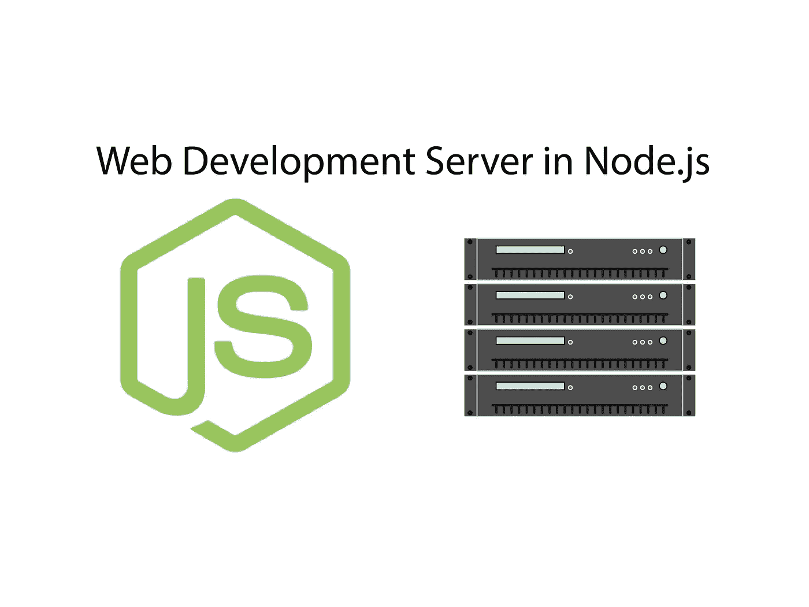
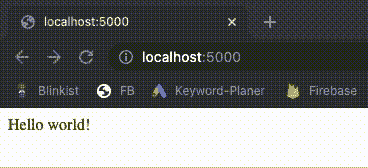

# 如何用 Node.js 从零开始搭建网站开发服务器

> 原文：<https://javascript.plainenglish.io/node-js-development-server-8365a9bf449b?source=collection_archive---------6----------------------->

## 在每次代码更改时重新加载页面



您肯定知道什么是开发服务器。我们可以在任何地方找到它们——当使用 Webpack、create-react-app 或使用像 Live Server 这样的编辑器扩展时。

开发服务器帮助我们在机器上提供 web 应用程序，并在我们更改代码时重新加载页面。这使得开发变得容易。

但是这样的服务器实际上是如何工作的呢？让我们通过自己建造一个来找出答案。目标是一个小服务器，当我们对我们的网站进行更改时，它会重新加载浏览器窗口。我们的结果实际上是这样的:



GIF takes a couple of seconds

# 我们的服务器将如何工作

在我们进入代码之前，澄清一些事情是很重要的。那么，开发服务器是如何工作的呢？

它的核心是我们服务的目录。在这个目录中，我称之为“src ”,我们构建的 web 应用程序存在——因此，一个 index.html、一些 JavaScript，当然还有 CSS 文件都放在那里。

一切都围绕着这个目录——每当目录发生变化时，开发服务器都会强制浏览器重新加载页面。事情是这样发生的:

*   使用节点库“chokidar ”,我们观察“src”目录中的文件变化。无论我们编辑 index.html 还是这个目录中的 JavaScript 文件，服务器都会注意到，多亏了 chokidar。
*   当 chokidar 启动并运行时，开发服务器建立一个客户机可以连接的 web 套接字。每当“src”目录中的文件发生变化时，就会向客户端发出一条 web 套接字消息。但是谁是客户，他如何联系？
*   请兴奋:客户端是“src”目录中的 index.html——因此，是我们正在构建的 web 应用程序的入口点。所以，是的，index.html 包含连接到服务器的 web 套接字的 JavaScript 代码。现在，更大的图景出现了:
*   Dev 服务器开始监视文件→当一个文件改变时，一个 web socket 消息被发送到客户端→客户端接收消息并重新加载浏览器窗口，因此改变变得可见。只剩下最后一个问题:我们如何将 web 套接字代码放入客户端？

开发服务器的目标是服务于一个页面——我们不想强迫开发者默认提供所需的代码。这就是为什么我们在客户端手动注入 web socket 代码。让我们看一个例子。

假设用户正在开发一个网站，该网站目前包含一个空的 HTML 文件:

```
<html>
  <head></head>
  <body></body>
</html>
```

我们的开发服务器读取文件，将其发送到浏览器——但在此之前，他注入了所需的代码。这是怎么回事？通过一个名为 JSDOM 的库。JSDOM 使我们能够像在浏览器中一样操纵 HTML 使用像`document.querySelector`或`element.appendChild`这样的函数。

这样，我们读取用户创建的 index.html，并在将其发送到浏览器之前，向其中注入必要的脚本。结果，注入的代码:

```
<script src="https://cdn.socket.io/socket.io-3.0.0.min.js"></script>
<script>
const socket = io()socket.on('message', (data) => {
  if (data == 'reload') {
    location.reload()
  }
})
```

如您所见，为了连接到服务器的 web 套接字，使用了 SocketIO。当客户端收到信号时，`location.reload()`重新加载页面。

# 让我们进入代码

嗯，那是一大堆理论。我将指导你一步一步地通过代码，你可以在最后找到整个代码。

以下是最重要的几行:

`watcher`是 chokidar 提供的主要对象——通过它，我们可以对任何文件更改做出反应——编辑、添加或删除文件。ignore initial 选项只是意味着 chokidar 不应该对现有的文件作出初始反应——只有在某些内容发生变化的情况下。

然后，我们通过 SocketIO 建立一个 web 套接字。对于“src”目录中的所有文件更改，将向客户端发送一条 web 套接字消息，其中包含字符串“reload”。

现在，事情变得越来越复杂。我们的中央 GET 请求处理逻辑如下:

当应用程序的开始页面，例如，`http://localhost/`被请求时，我们注入 WebSocket 客户端代码——这是我剪下并标有“一会儿有更多代码”的代码。每个请求 URL else **必须**指向一个文件——因为我们不能也不应该将 WebSocket 客户端代码注入到 JS 文件或 CSS 文件中，我们只是从“src”目录中提供所请求的文件。

现在讨论如何注入 WebSocket 代码(该代码属于我所说的“稍后会有更多代码”的部分):

因此，当请求“index.html”时，我们从“src”目录中读取它。“数据”参数包含 HTML 代码。通过 JSDOM，我们基于这个 HTML 的内容创建了一个 DOM。

然后，我们创建两个 HTML 元素——都是脚本标记。第一个名为`scriptSocketLink`的文件保存了到 CDN 上 SocketIO 库的链接。

第二个名为`scriptSocketCode`的脚本标签保存了我之前介绍过的客户端 web socket 代码。

两个新的 HTML 元素都作为子元素附加到文档的头部。最后，我们用`dom.seralize()`将处理好的 DOM 转换成一个字符串，并发送给客户端。

最后但同样重要的是，端口和一个很酷的功能:

```
http.listen(5000)open('http://localhost:5000/')
```

选择端口由您决定。库“open”中的 open 函数打开我们机器上的默认浏览器。当现在执行开发服务器时，所需的窗口打开，您可以看到来自“src”目录的页面——及其所有的 CSS 和 JS 文件。当您更改这些文件中的任何一个时，窗口会自动重新加载。酷吧？

以下是完整的代码:

# 进一步的想法

我们在 Node.js 中有一个网站的最小开发服务器。然而，如你所见，它现在还不完美。首先，重新加载页面很慢——大多数开发服务器使用热重新加载，而不是完全重新加载页面。接下来，dev 服务器在项目中只支持一个 HTML 文件，所以是单页 app。

另一个缺点是 UX——用 Node 执行 JavaScript 文件来启动服务器，需要一个“src”目录，这很不方便。相反，CLI 会更好，它可以服务于任何目录。

现在，我们用这个基本的例子来保持它。然而，如果你有兴趣阅读第二部分，升级这个服务器，让我知道！我很想拍第二部。

感谢您的阅读！

*更多内容看*[***plain English . io***](http://plainenglish.io/)