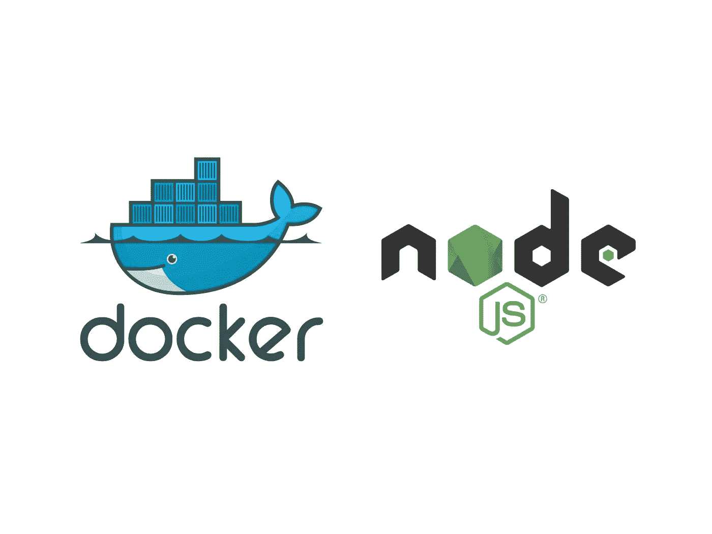
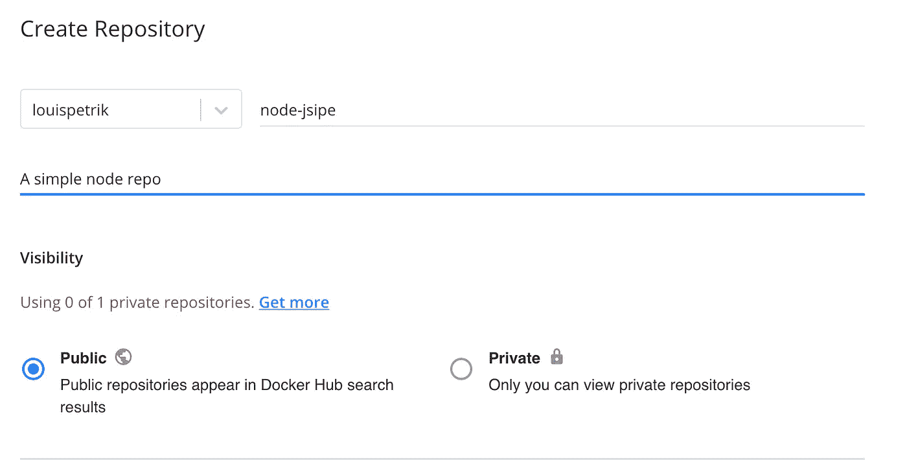
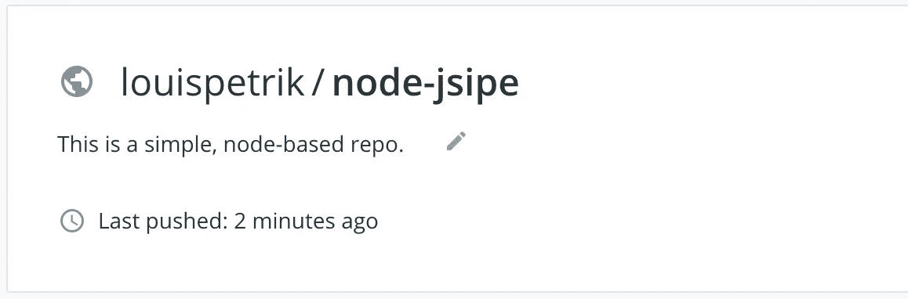

# 如何创建自己的 Node.js Docker 存储库

> 原文：<https://javascript.plainenglish.io/node-js-docker-5b76778830c3?source=collection_archive---------16----------------------->



Source: the author

让我们马上开始吧。要在 Docker Hub 中创建您自己的存储库，您首先需要创建一个帐户——您可以在这里轻松完成。

然后你就可以用你的账号登陆终端了。当然，Docker 必须安装在本地。

```
docker login -p "<password>" -u "<username>"
```

现在，我们可以开始创建一个本地 Node.js 映像，然后将其作为 repo 发布到 Docker Hub。

1.  创建新的项目目录。
2.  进入目录并运行`npm init -y`和`npm install express`
3.  然后，我们创建两个文件:`app.js`和 s `Dockerfile`。

在 app.js 中，我们创建了一个简单的 express 服务器:

我们按如下方式填写 Dockerfile 文件:

之后，我们可以建立我们的形象:

```
docker build . -t node-jsipe
```

为了测试一切是否正常，我们可以在本地运行它:

```
docker run -d -p 8080:8080 node-jsipe
```

如果您在浏览器中打开 localhost:8080，您应该会看到应用程序的输出。一切正常——我们现在可以创建 Docker Hub 存储库了。

为此，我们首先需要在 Docker Hub 中创建一个空的 repo。
还是那句话，我就叫它“node-jsipe”。
您可以在这里创建回购:[https://hub.docker.com/repositories](https://hub.docker.com/repositories)。



Source: [hub.docker.com](https://hub.docker.com/)

您只需要填写名称和描述—我们将公开回购。现在你有一个空的回购——让我们用生命来填充它。

为此，我们将刚刚构建的本地映像链接到回购。这可以通过以下命令完成:

```
docker tag node-jsipe <username>/<repo-name>
```

因为我在本地创建的映像名为“node-jsipe”，所以我在那里指定它。
您仍然需要将用户名和回购名称替换为您自己的名称，您可以在您的回购下找到这两个信息:



就我而言，我给它贴上了`docker tag node-jsipe louispetrik/node-jsipe`的标签。现在两者联系起来了，我们只需要推动。

推就更轻松了:`docker push <username>/<repo-name>`。
同样，我的情况:`docker push louispetrik/node-jsipe`。

# 使用图像

您的存储库现在是公开可用的——这意味着您只需一个命令就可以在其他系统上安装它。

用`docker pull <username>/<repo-name>`安装就行了。
映像现已安装在本地，可按如下方式运行:

```
docker run -d -p 8080:8080 louispetrik/node-jsipe
```

当然，随着时间的推移，你会改变自己的形象。保存更改后，您重新构建映像并再次推送，但随后您意识到没有应用任何更改。正确-您必须首先分配一个新标签。

这是怎么回事:

```
docker tag node-jsipe <username>/<repo-name>:<tag>
```

如何命名标签由您决定。之后，你必须上传更改。这同样适用于 push——只是这一次我们必须定义我们想要推送的标签。

```
docker push <username>/<repo-name>:<tag>
```

在 hub 中，您应该看到多个标签，即版本，存在于您的 repo 中。您可以使用`docker pull`再次安装并运行它们。