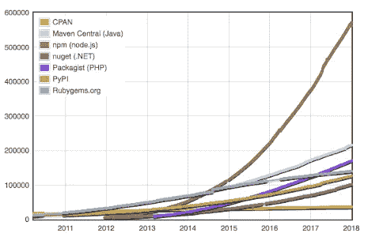
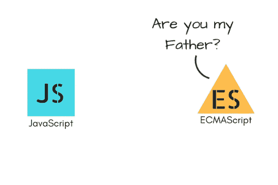
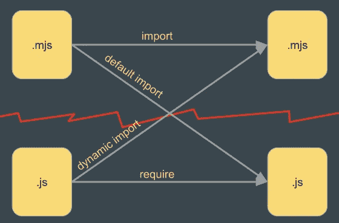
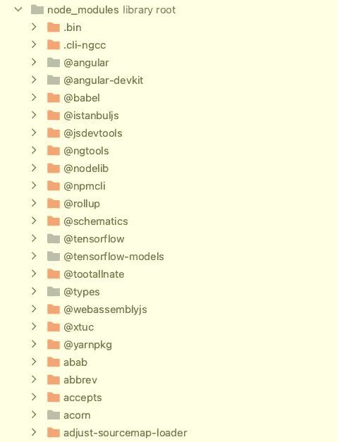

# 为什么 node_modules 是宇宙中最重的对象

> 原文：<https://javascript.plainenglish.io/node-js-esm-npm-yarn-deep-dive-adda15dabce?source=collection_archive---------1----------------------->

## [网页开发](https://rakiabensassi.medium.com/list/software-engineering-7a179a23ebfd)

## Node.js 模块系统、其解析算法及其随时间演变的演练


Photo by [Guillermo Ferla](https://unsplash.com/@gferla?utm_source=medium&utm_medium=referral) on [Unsplash](https://unsplash.com?utm_source=medium&utm_medium=referral) (edited by author, [node_modules image from Reddit](https://www.reddit.com/r/ProgrammerHumor/comments/6s0wov/heaviest_objects_in_the_universe/))

如果你熟悉新闻，你可能听说过 TypeScript 4.5 已经将对 Node.js 的 ECMAScript (ESM)支持推迟到未来的版本，因为担心生态系统的就绪性。

但是这个特性在 [TypeScript](https://levelup.gitconnected.com/features-in-the-new-typescript-release-e5ef6ebba750) 中的存在或不存在实际上意味着什么呢？

我对找出这个问题的答案的好奇心让我在浏览器上打开了一堆文章并阅读了它们。其中一个帖子引起了我的注意，上面有一张宇宙中最重物体的有趣图片。它显示出比太阳、中子星甚至黑洞还要重。

虽然这不是一个严肃的比较，但我知道这并不是完全错误的。

`npm`库实际上是世界上最大的[包库](http://www.modulecounts.com/) ，它的 CLI 的核心依赖`[@npmcli/arborist](https://levelup.gitconnected.com/7-nodejs-vulnerabilities-149094e441c2#2f72)`正在执行一个复杂的算法，以便管理`node_modules`树，解决包之间的循环和重叠连接。

但这是讽刺图片的唯一原因吗？



left: [@npmcli/arborist](https://github.com/npm/arborist) — right: npm is the biggest package repository in the world ([source](https://medium.com/@giltayar/native-es-modules-in-nodejs-status-and-future-directions-part-i-ee5ea3001f71))

我的 Node.js 之旅始于 2014 年——它诞生五年后，它的包管理器`npm`发布四年后。当时，我对 AMD 和 RequireJS 之类的 JavaScript 模块系统有所了解，但结束时我提出的问题比开始时多得多:

*   Node.js 中使用了哪些不同的 JavaScript 模块系统？它们和我们在客户端使用的是一样的吗？
*   ESM 支持为何如此重要？
*   `node_modules`有哪些不同的复杂性和问题让人们把它描述为宇宙中最重的物体？
*   社区[如何解决](https://betterprogramming.pub/problem-solving-techniques-b1ed8b4c729f)与`node_modules`的问题？
*   这和`yarn`等新的包管理器的出现有什么关系？

如果这些问题引发了您的好奇心，并且您希望扩展您对 Node.js 生态系统及其与客户端的关系的了解，您将在下面找到答案和一些更令人兴奋的事实。

```
**Table of Contents**[Module Systems in Node.js](#707f)
   ∘ [CommonJS](#b7c4)
   ∘ [ES Modules (Michael Jackson Scripts)](#99c0)
[Why is ES module support so important?](#8c7e)
[The Challenges of Using CJS and ESM Together](#0b7c)
   ∘ [Introduction of new rules](#2614)
   ∘ [Dual-mode Support: dual ESM/CJS packages](#e9ba)
[How Does Node.js Load Modules?](#8fb3)
[Plug’n’Play: Goodbye node_modules!](#df98)
[Final Thought](#f56c)
```

# Node.js 中的模块系统

JavaScript 领域已经出现了不同类型的模块化，如 RequireJS 和 AMD。但是 Node.js 是建立在 CommonJS (CJS)模块系统上的。

这些模块为开发人员提供了一种更好地组织和构建他们的代码库的方式，并使他们的应用程序更易于管理。

## 1.CommonJS

CommonJS 为服务器端 JavaScript 建立了一个模块生态系统。但是，由于浏览器不支持 CJS，开发者在 babel 等 transpilers 的帮助下也在客户端使用了它。

在 CommonJS 中，可以使用`module.exports`在普通的`js`文件中定义一个模块，并使用`require()`函数将其导入到另一个`js`文件中:

你可以用`node index.js`运行这个例子。

## 2.ES 模块(迈克尔·杰克逊脚本)

ECMAScript 或(ES)是一种 JavaScript 标准，旨在确保不同 web 浏览器之间的 web 应用程序的互操作性，它也用于服务器端应用程序(Node.js)。

*   **2015 年 6 月**，JavaScript 生态系统迎来了 [ECMAScript 6 (ES2015)规范](https://www.ecma-international.org/ecma-262/6.0/index.html)中 ES 模块(ESM)的定义。
*   **2015 年 6 月至 2017 年 9 月**，各大浏览器打着开发者的旗号开始了对 ESM 的实验性支持。



ECMAScript the standard for JavaScript ([source](https://medium.com/@shreyapd06/javascript-ecmascript-a18d3e688526))

与使用`require()`和`module.exports`的 CommonJS 不同，在 es 模块中，您可以使用`import`和`export`语句来实现类似的功能。

要定义一个 [ES 模块](https://nodejs.org/api/esm.html)，你需要在一个扩展名为`mjs`或*迈克尔杰克逊脚本*的文件中编写你的代码。


mjs, or Michael Jackson Scripts ([source](https://medium.com/@giltayar/native-es-modules-in-nodejs-status-and-future-directions-part-i-ee5ea3001f71))

这里有一个例子，`es-module.mjs`:

Defining an ES module — es-module.mjs

要使用该模块，您需要从另一个`mjs`文件导入`mjs`文件:

import an ES module in index.mjs

# 为什么 ES 模块支持如此重要？

JS 模块可以用在客户端(浏览器)，也可以用在服务器端( [Node.js](https://blog.logrocket.com/web-analytics-with-node-js/) )。有时，为了兼容性，你必须把代码从一种模块格式转换成另一种模块格式。

所有这些造成了混乱而复杂的 JavaScript 模块状态，可以通过支持 Node.js 中的 es 模块来改善这种状态，从而允许为客户端和服务器编写模块化的可重用 JavaScript。

我们称这种 ***同构*** *或* ***通用码*** ，这是可能的，如果:

1.  你不要在代码中使用浏览器专用的方法和变量，比如`window`和`document`。
2.  你不使用像`server`和`fs`这样的只有节点的方法和变量。
3.  如果需要这样的场景，您需要向代码中添加条件，或者将它包装在一个函数中，该函数模拟替代环境中的逻辑。

`*console.log*`是一个在 Node.js 和浏览器中工作的例子。

由于对*同构代码*和*浏览器兼容性*需求的爆炸式增长，Node.js 不再是一个独立的生态系统，ESM 支持成为必备。

# 将 CJS 和 ESM 结合使用的挑战

在能够从 CJS 迁移到 ESM 之前，第一步将是允许 ES 模块与 CommonJS 在同一个应用程序中共存，这远不是一项简单的任务。

JavaScript 规范区分了:

*   一个“ ***模块*** ”，定义为“[严格](https://2ality.com/2011/01/javascripts-strict-mode-summary.html)”，是一个扩展名为`mjs`的文件(一个 ES 模块)。
*   不是 ES 模块的“ ***脚本*** ”具有`js`扩展名，不允许使用`import from`语句。

遵循这个规范已经允许 JavaScript 引擎知道一个文件是一个 ***模块*** 还是一个 ***脚本*** 并且作为结果决定 ***执行*** 还是 ***导入*** 它。

也就是说，使用两种不同的扩展不仅是一个美学问题；它在 ESM 和 CJS 之间建立了一条护城河，并提出了一个问题:我们如何才能在两个模块系统之间建立互操作性？

## 新规则的引入

为了填补这个空白，我们已经看到了 es 模块的" ***规则"* "** 和" ***互操作性规则* "** 的引入，它们提供了在同一应用中使用两个模块系统的指南 **:**

1.  只有扩展名为`mjs`的文件才是 ESM
2.  只有扩展名为`js`的文件才是 CJS
3.  ESM 可以使用`export` / `import`语句，但不能使用`require`
4.  CJS 可以使用`require`导入 CJS
5.  CJS *只能使用`await import()`才能*导入 ESM
6.  ESM *只能使用*默认*语句`import .. from ..`才能*导入 CJS



Bridging the two module systems ([source](https://medium.com/@giltayar/native-es-modules-in-nodejs-status-and-future-directions-part-i-ee5ea3001f71))

下面是一个在 ES 模块中使用 CommonJS 模块的示例:

my-esm-module.mjs

另一个是在 CommonJS 脚本中使用 ES 模块。调用`await import()`意味着做这件事的代码应该是一个`async`函数:

my-cjs-module.js

## 双模支持:双 ESM/CJS 包

允许`npm`封装包含两个模块系统(*双模*))对于无缝过渡到没有 CommonJS 的未来非常重要。

为了实施双模式并促进从 CJS 到 ESM 的迁移，Node.js 经历了以下里程碑:

*   **2017 年 9 月:** [Node v8.5](https://nodejs.org/de/blog/release/v8.5.0/) 自带对 ES 模块的实验性支持:开发者可以使用`--experimental-modules`标志运行 ESM。
*   **2017 年 9 月—2018 年 5 月:** [各大浏览器开始支持](https://caniuse.com/es6-module)无开发者标志的 ES 模块规范。
*   **2018 年 10 月:** ES 模块包含一个包含多个阶段的计划，用于替换实验实施。Node.js 应该在不破坏现有 CommonJS 模块的情况下，尽可能地与浏览器类似地工作。
*   **2019 年 10 月:** [节点 12](https://blog.logrocket.com/es-modules-in-node-js-12-from-experimental-to-release/) 进入长期支持:没有`--experimental-modules`标志也可以使用 ES 模块。

# Node.js 如何加载模块？

Node.js 如何加载依赖项的本质是 CJS 模块系统的核心。

虽然这很复杂，但是 resolution [算法](https://nodejs.org/api/modules.html#modules_all_together)的本质归结起来就是在`node_modules`目录中搜索包。



node_modules folder (image by author)

如果我们以语句`import _ from 'lodash'`为例，并且我们过度简化了算法，我们将期望 Node.js 在`node_modules`中寻找一个`lodash`目录，然后检查它的`package.json`以确定要加载的文件。

这听起来很简单，但是算法效率非常低:

*   它生成了包含大量文件的目录，
*   在内存中多次实例化一些包，
*   并导致磁盘使用率高于需要。

为了解决这些弱点并改善整体工作流程，2016 年，脸书发布了一个新的包管理器:`yarn`。

运行`yarn install`可以快速生成`node_modules`，比`npm`所需的时间少 [70%。](https://yarnpkg.com/features/pnp)

但是后来，`npm`团队填补了空白，并实现了他们工具中缺少的特性，比如性能改进和在安装依赖项之前检查安全漏洞。

# 即插即用:再见节点模块！

在他的第二个版本中，`yarn`针对上述问题提出了一个更高效的解决方案:移除`node_modules`！

> Yarn 已经知道了关于你的依赖树的所有信息——它甚至为你把它安装在磁盘上。那么，为什么由 Node 来查找您的包在哪里呢？
> 相反，通知[解释器](https://betterprogramming.pub/compiler-vs-interpreter-d0a12ca1c1b6#6341)软件包在磁盘上的位置并管理软件包之间甚至软件包版本之间的任何依赖关系应该是软件包管理器的工作。”— [纱线团队](https://yarnpkg.com/features/pnp#fixing-node_modules)

这个被称为**即插即用**或***零安装**的新概念让`yarn`直接从缓存中读取依赖文件，这样我们就不需要再次运行`yarn install`。*

# *最终想法*

*当 Node.js 在 2009 年发布时，它通过开创一个开发者不再需要手动下载和管理项目依赖关系的新时代，将 web 开发推向了一个新的水平。*

*在其开发周期中，它经历了许多障碍，尽管我在这篇文章中解决了其中的许多问题，但这还不是全部。*

*还有更多缺点，比如`babel`、`webpack`、`browserify`和其他捆绑器如`parcel`、`rollup`对 CommonJS 使用相同的解析算法，而对 ES 模块使用相同的解析算法。*

*这些工具支持在 Node.js 和浏览器中使用 ESM。然而，他们同步加载 ES 模块*(CJS 时尚)，而异步*加载是意料之中的。***

***但是这个伟大的活跃社区一直在努力使 Node.js 功能更全、更灵活，并提供像即插即用这样的创造性解决方案，这无疑改善了开发人员的体验。***

# ***想要更多吗？***

***我为一群聪明、好奇的🧠人写关于工程、技术和领导力的文章💡。 [**加入我的电子邮件简讯**](https://rakiabensassi.substack.com/) **独家访问**或在此报名媒体。***

****可以在 Udemy 上查看我的* ***视频课程****:*[*如何识别、诊断、修复 Web Apps 中的内存泄漏*](https://www.udemy.com/course/identify-and-fix-javascript-memory-leaks/) *。****

**[](https://betterprogramming.pub/javascript-history-and-future-71b0ceb737aa) [## JavaScript 的 25 年

### 从简单的脚本语言到每个现代 web 应用程序的基础

better 编程. pub](https://betterprogramming.pub/javascript-history-and-future-71b0ceb737aa) [](https://betterprogramming.pub/angular-13-features-ef528a9ae16f) [## Angular 13 的新功能

### 100% Ivy，更好的组件 API，不支持 IE11，等等

better 编程. pub](https://betterprogramming.pub/angular-13-features-ef528a9ae16f) 

*更多内容请看*[*plain English . io*](http://plainenglish.io/)*。报名参加我们的* [*免费周报在这里*](http://newsletter.plainenglish.io/) *。***