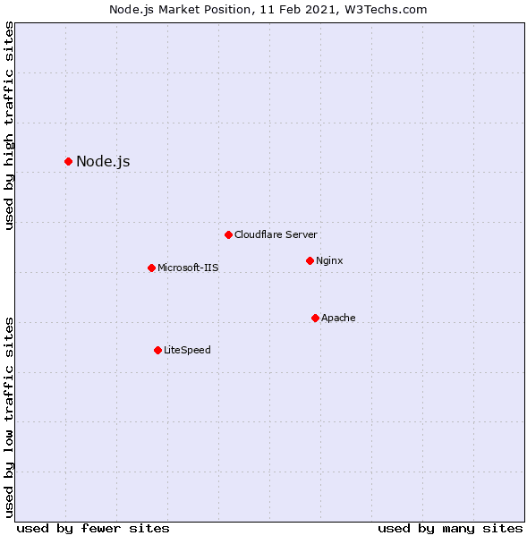

# Node.js 仍然是后端开发的最佳选择

> 原文：<https://javascript.plainenglish.io/node-js-is-still-the-best-option-for-backend-development-8105f552bfa3?source=collection_archive---------6----------------------->

当公司向数以百万计的用户提供服务时，他们总是希望确保他们的系统像一台润滑良好的机器一样为他们的操作和用户运行。只有后端开发负责处理成百上千的日常任务。但是后端的能力取决于你选择用来管理服务的语言、软件和框架。

如今有几十种工具可用于企业的服务器端架构，但早在 2009 年，新技术就已经在后端开发的广阔领域中崭露头角。Node.js 是第一个将 JavaScript 带到服务器端的尝试。今天，它已经成为后端开发 Javascript 框架的首选。

[Image Source](https://www.statista.com/statistics/793840/worldwide-developer-survey-most-used-frameworks/)

通过为后端开发提供持续的支持，并使复杂的应用程序开发过程变得更加简单，今天你几乎不会发现任何 web 开发人员没有听说过 NodeJS。事实上，你可以在许多领先的应用程序中找到它的实现，如网飞、LinkedIn 或优步。

然而，为了跟上现代技术，有必要评估企业和 B2C 应用程序的框架。但是，核心问题仍然是一样的，“从技术和商业角度来看，是什么使这项技术具有吸引力？”所以在这篇博客中，我们直接收集了关于 Node.js 作为后端语言的记录。

**在这篇文章中，我们将要讨论:**

*   *node . js 作为后端的当前状态*
*   *什么是节点。Js 用于？*
*   *为什么说它是后端开发的好选择？*
*   *node . js 的最佳用例*
*   *如何入门 Node？Js？*

让我们深入每一点的细节，以了解更多关于 Node.js 的后端开发。

## ***node . js 的当前状态***

在直接进入开发过程之前，最好回忆一下 Node Js 到底是什么。？

Node.js 是一个由 JavaScript 支持的所谓框架，它为在后端运行 JavaScript 代码提供了一个运行时环境。事实上，它是一个基于 Chrome 的 V8 JS 引擎的 JavaScript 运行时。事件驱动和非阻塞 I/O 模型使 Node.js 成为后端开发的轻量级和高效的框架。

除此之外，Node.js 是[发展最快且最受欢迎的框架](https://w3techs.com/technologies/details/ws-nodejs)，并迅速超越领先技术。现在问题来了，是什么让 Node.js 在应用开发者中如此受欢迎？

[Image Source](https://w3techs.com/technologies/details/ws-nodejs)

它迅速流行背后的主要原因是，它允许移动应用程序开发公司使用 JavaScript 启动 web 应用程序的前端和后端。

尽管 JS 一直有许多支持 web 开发的优秀框架和库，但它从来没有任何用于后端平台的框架。Node.js 解决了这个问题，因此，现在大量的初创公司和企业级项目都在出于各种目的使用 Node.js。

此外，调查报告显示，将 Node.js 用于后端和其他任务可以提高应用程序的性能。这种说法使得程序员将他们的代码语言改为 Node.js。一些最大的例子是微软、Twitter、NASA、PayPal 等等。

# ***node . js 是做什么用的？***

通过上面的陈述，很明显 Node.js 用于用 js 编写应用程序，但它的运行时环境涵盖了允许程序员为未来的应用程序编写和编辑代码并能够流畅运行它们的软件类别。

互联网上到处都是资料，可能会用多种定义来解释 Node.js。但有一点大家都想用简单的话来表达，那就是这个平台被广泛用于用 JavaScript 创建 web 应用程序。

> 但是，除了这些基础知识之外，我将带您了解一些基本知识，并帮助您理解 Node.js 的主要特征:

*   Node.js 是服务器端框架
*   它是一个由广泛社区管理的开源框架
*   适合多种平台

> 在雇佣一个移动应用开发者之前，你们中的许多人对什么是服务器端进程以及它将如何工作一无所知..让我给你解释一下…

*   开发人员将为服务器创建一个任务
*   接下来，任务被发送到文件系统
*   系统正在等待请求
*   一旦它被发送并且文件正在被处理，内容就由系统发送给用户。

*这就是服务器端流程在这类订单中的实际运行方式。*

# ***为什么是后端开发的好选择？***

既然有许多框架和技术可以用来寻找后端开发，你们中的许多人都在寻找 Node.js 比其他技术更好的答案？程序员的 app 开发为什么要选择 Node.js？

## **node . js 的优点和特点**

*   运行时环境的灵活性和响应性是 Node.js 的优点，它允许您管理用户对现代 web 应用程序中最相关的信息和服务的日益增长的需求。
*   Node.js 是一个全面的解决方案，用于全栈开发，并最大限度地减少雇用高技能程序员的需求。此外，它还消除了学习其他技术的需求。
*   Node.js 语言用于前端和后端开发人员，这使得它成为一个更有效、更协调的工作环境。此外，它消除了解释特定功能如何工作以及特定代码在应用程序开发过程中的实际含义的需要。小型项目可以由单个全栈团队处理，从而节省时间和金钱。
*   前端和后端之间的代码共享大大加快了开发过程。
*   它作为一个软件包管理器，为您提供了一组工具，用于安装、配置和删除个人计算机上的程序。而且大部分好用的包管理器都是内置 Node.Js 的。
*   作为节点。Js 与 I/O 子系统一起工作，因此它可以帮助您提高应用程序的速度和性能。
*   借助 Node.js 强大的生态系统，使用 Node.js 构建命令行工具更加容易。这将有助于开发人员利用这些命令行工具构建高质量的应用程序。

除了 Node.js 的这些直接优势，让我们将它与其他技术进行比较，以检查 Node.js 如何与应用程序开发兼容。

## **node . js vs Python for back end**

当比较这些最流行的技术时，你会明白当涉及到执行机器学习或一些数值计算的服务器时，Python 是更好的选择。但另一方面，Node.js 更多的是通用类型的 web 服务，尤其是用于实时应用程序开发。与 Python 不同，NJS 默认支持异步编程，这确保了更好更快的可伸缩性。

## **Node.js vs 后端 Java】**

嗯，这两种选择都很棒，但适用于不同的环境。一方面，Node.js 是桌面应用的理想和受欢迎的选择，而 Java 是 Android 平台的完美选择。另一个区别与螺纹有关。Java web 服务器是多线程的，处理代码的效率更高。而 Node.js 比 Java 易学得多，开发时间也快。最重要的是，节点。js 比 Java 容易学得多，保证开发速度更快。

## **Node.js vs PHP 进行后端开发**

毫无疑问，PHP 从服务器管理系统中为您提供了更广泛的支持，并被推荐给将使用关系数据库或 CMS 的服务。它也需要更少的代码，但是 Node.js 允许软件开发公司重用代码。Node.js 还拥有更快的执行速度，并在服务调用中高效地平稳传递来自服务器的数据。

这个列表还没有结束，还有更多的可以比较这些语言和框架。但是由于 PHP、Java 和 Python 是后端开发最常用的技术，因此我们倾向于将我们的列表限制在这些技术上。然而，通过这个小小的比较，我们并不是强迫你使用 Node.js。有一些用例会促使你使用 Node.js。

# ***node . js 用于后端开发的最佳用例***

考虑到这种技术的规格和潜力，我们已经概述了最适合 Node.Js 的软件项目类型。因此，如果您对可以选择 Node.js 的软件项目类型有疑问，请阅读以下内容:

## **实时应用**

Node.js 架构用于许多协作应用，如 Trello、实时聊天应用、即时消息、在线游戏等。由于这些类型的应用程序需要低延迟才能有效工作，因此，应用程序开发公司更喜欢使用 Node.js，因为它提供了平衡的效率以及功能复杂性、可伸缩性和开发速度之间的比率。这就是 Node.js 应该用于基于 WebRTC 或其他实时通信软件的原因。

## **基于事件的应用**

基于事件的应用程序通常需要超快速同步才能高效工作。Node.js 运行在谷歌的 V8 引擎上，被用作客户端和服务器端的通用语言，因此，它将 JavaScript 直接编译成机器代码，速度比以往任何时候都快。在 event-loop 的帮助下，单线程处理大量的客户端请求。当您处理大量 IO 绑定的请求时，Node.js 真的很方便。

## **用于单页应用**

spa 是完全适合一个网页的应用程序。该应用程序的简单目标是通过降低加载时间和确保无障碍导航到不同页面(如桌面应用程序)来提供无缝的用户体验。这就是为什么任何经验水平的开发人员都喜欢选择 Node.js 和 React for SPAs，这样您就可以在客户端控制应用程序的逻辑，并能够在 DOM 中进行更改。

## **应用可扩展性**

作为一个轻量级的技术工具，许多应用程序开发人员选择使用 Nood.js 进行微服务架构。这实际上有助于将应用程序分成更小的模块，而不是创建一个大的单一代码。借助 Node.js 的模块化，您可以创建小型可扩展应用程序，而不必处理臃肿、过度的生态系统。你所需要的只是为特定的工作选择工具，并根据需要扩展应用程序。

除了这些，还有很多事情一个 [**移动应用开发公司**](https://www.xicom.biz/offerings/mobile-app-development/) 可以帮助你了解，并使我们能够确定 Node.js 如何与你的应用开发需求兼容。

## ***如何入门 Node。Js 应用？***

如果您的项目需求与服务器端 JavaScript 的 NJS 一致，那么是时候深入了解 Node.js 项目的入门过程了。嗯，与其他相比，Node.js 很容易通过以下步骤开始。在开始进行空的开发步骤之前，让我们从最简单的“Hello World”node . js 应用程序开始。

## **第一步。下载 Node.js**

从[官网](https://nodejs.org/en/)下载Node.js 包。

## **第二步。安装软件包管理器并理解 npmjs.com 的安装说明。**

建议您在编写第一行代码之前仔细阅读该指南，掌握基本概念并避免错误。

## **第三步。**从理论到实践，开始编码。

下载 Node.js 并安装到您的计算机上，然后让您的目标在 web 浏览器中显示“Hello World”。

首先，创建一个名为 app.js 的 Node.js 文件，其中包含以下代码:

将该文件保存在电脑的驱动器***C:/users/your name/app . js .***中

> 保存一个文件后，代码会告诉电脑写“ *Hello World* ”。所以你不必理解代码。

## **第四步。命令行界面**

使用**" C:\ Users \ Your Name>_ "**这个命令行在你的电脑上导航文件包含文件 **"app.js"** 。窗口用户可以按下开始按钮，并寻找“命令提示符”或简单地写“cmd”在搜索领域导航文件。

## **第五步。初始化 Node.js 文件**

在进行任何进一步的操作之前，必须由 Node.js 启动您创建的文件。因此，您可以启动您的命令行界面，编写“ *node app.js* ”并点击 enter 按钮。

现在你的计算机作为一个服务器工作，所以如果任何人试图通过端口 8080 访问你的计算机，他们将得到一个“hello world”消息作为回报。

下面是完整的代码:

*恭喜！用户现在将看到 hello world 消息。*

# **闭幕词**

本文的目的不是对 Node.js 是否是唯一最好的后端开发技术做出最终结论，而是阐明 Node.js 和 JavaScript 作为后端语言如何成为解决所有后端开发相关问题的神奇子弹。

总而言之，无论您接受与否，Node.js 后端开发将会持续更长时间！

因此，希望通过这篇博客，现在你知道 Node.js 为什么受欢迎，它什么时候有用，它如何优于其他技术，以及如何开始使用它。有了这些信息，你就可以决定 Node.js 是否适合你，是否有足够的潜力来启动你的第一个后端服务器？确保安装来自真实来源的专有库和定制功能。但是，如果你有任何疑问或困惑，那么建议 [**聘请应用程序开发人员**](https://www.xicom.biz/solutions/hire-developers/) 协助你解决每一个问题。

你对 Node.js 和 JavaScript 作为后端语言有什么想法？关于应用程序开发，你有什么想分享的经验或疑问吗？我相信你们很多人都有一些关于它的分享和想法。所以请在下面发表评论吧！