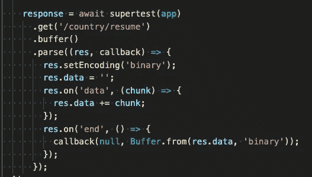
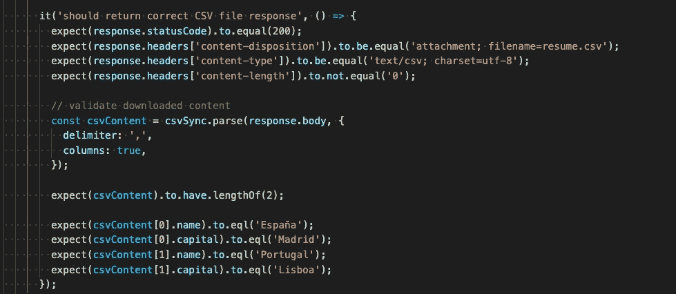

# Node.js —用 Jest + Supertest 测试下载的文件

> 原文：<https://javascript.plainenglish.io/node-js-test-downloading-a-file-with-jest-supertest-cf47f431e417?source=collection_archive---------3----------------------->

几天前，我在做一个任务，在这个任务中，我必须编写一个端点来从服务器下载文件。

像往常一样，对于我们在团队中编写的每一个代码(至少对于后端)，我们都编写了正确的测试用例。到目前为止，我已经编写了测试用例，检查返回的 HTTP 代码、正确的内容类型、内容处置和内容长度头，仅此而已。这一次，我想检查我下载的文件是否正确(检查我接收的内容)。

首先，我认为只是检查响应中的“主体”并验证数据，但这还不够。

*验证下载的内容取决于文件类型，在我最初的案例中，我下载的是一个 zip 文件，因此为了验证内容，我解压缩了内容并检查包含的文件是否正确。在我将要展示的例子中，我正在下载一个 CSV 文件，并检查文件内容是否正确。*

读了一点之后，我意识到我是从服务器上流式传输文件内容，通常是由显示下载/保存对话框的浏览器来执行操作。

在测试用例中，我使用的是[超级测试](https://www.npmjs.com/package/supertest)，默认情况下运行良好。您可以访问所有的响应头，甚至可以访问“content-length ”,它告诉您已经收到了带有数据的响应。但是，如果您想要访问下载的内容，您需要修改典型使用的代码，并添加作为缓冲区处理响应，读取内容并将其写入响应体。

我们从类似于

到

如你所见，魔力就在”。buffer()”将响应作为来自服务器的缓冲区进行处理，然后使用“parse”将接收到的数据写入“res.data”(这里可以使用外部时态变量)，最后返回“end”事件处理程序中的所有内容(将在“response.body”中结束)。

之后，我可以访问“response.body”中的文件内容并验证它。

你可以在 https://github.com/amcereijo/tdd-example 的[上看到所有代码。具体文件有:](https://github.com/amcereijo/tdd-example)

*   端点代码[https://github . com/amcereijo/TDD-example/blob/master/API/controllers/country . controller . js # L66](https://github.com/amcereijo/tdd-example/blob/master/api/controllers/country.controller.js#L66)
*   测试代码[https://github . com/amcereijo/TDD-example/blob/master/API/controllers/country . controller . test . js # L127](https://github.com/amcereijo/tdd-example/blob/master/api/controllers/country.controller.test.js#L127)

我希望这能帮助你改进你的测试用例，如果你知道任何其他方法来进行这些验证，请在评论中告诉我。

*更多内容看*[***plain English . io***](http://plainenglish.io/)