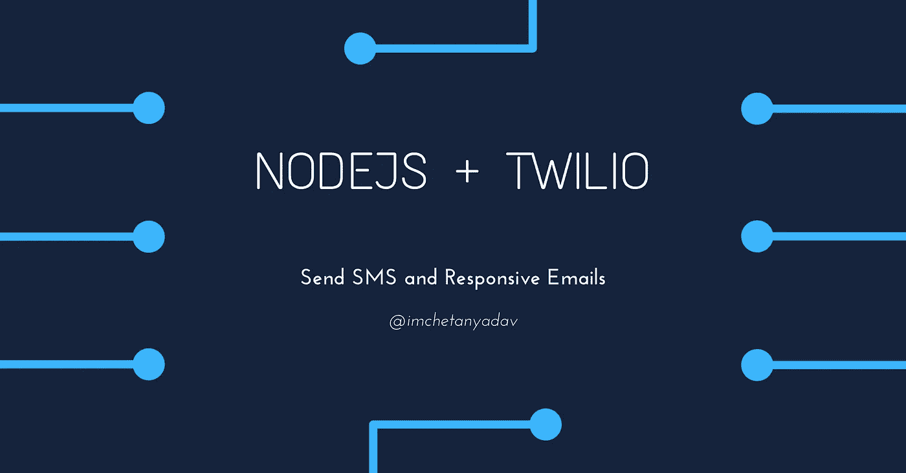

# 使用 Node.js + Twilio 发送短信和回复邮件

> 原文：<https://javascript.plainenglish.io/node-js-twilio-send-sms-and-responsive-emails-759214dfa7a0?source=collection_archive---------6----------------------->



通过这篇文章，您将了解如何设置 Twilio SMS API 来发送 SMS，以及如何设置 Twilio SendGrid API 和 MJML 来发送响应邮件。在此之后，您可以设置紧急短信提醒用户，并发送响应营销或其他类型的电子邮件。

我们将使用 Node.js 作为服务器。让我们开始吧。

# 发送短信

*   对于 Twilio SMS API，您可以在这里设置您的账户[。记下你的 Twilio **账号 SID** (用户名)和你的**认证令牌**，可以在这里](https://www.twilio.com)[查看](https://www.twilio.com/console)。此外，在 Twilio 控制台上启用您的用户可能居住的国家，您可能需要发送短信。
*   安装 Twilio 节点库

```
npm install --save twilio// ORyarn add twilio
```

*   发送短信

```
import parsePhoneNumber *from* "libphonenumber-js/min";
const accountSid = process.env.TWILIO_ACCOUNT_SID;
const authToken = process.env.TWILIO_AUTH_TOKEN;
const twilioClient = require("twilio")(accountSid, authToken);twilioClient.messages.create({
  from: "+15017122661",
  to: "+15558675310",
  body: `This is the ship that made the Kessel Run in fourteen parsecs?`,
});
```

**提示:**将电话号码解析为正确的格式。Twilio 建议将电话号码解析为`E.164`格式。我们可以使用像 [libphonenumber-js](https://www.npmjs.com/package/libphonenumber-js) 这样的库将电话号码解析为正确的格式。

*   安装库

```
npm install --save libphonenumber-js// ORyarn add libphonenumber-js
```

*   用它来解析电话号码。

```
import parsePhoneNumber *from* "libphonenumber-js/min";
const accountSid = process.env.TWILIO_ACCOUNT_SID;
const authToken = process.env.TWILIO_AUTH_TOKEN;
const twilioClient = require("twilio")(accountSid, authToken);twilioClient.messages.create({
  from: "+15017122661",
  to: parsePhoneNumber(user.phoneNo).format("E.164"),
  body: `This is the ship that made the Kessel Run in fourteen parsecs?`,
});
```

# 发送回复邮件

*   我们将使用 Twilio SendGrid 发送电子邮件。您可以在这里设置您的账户[。记下 SendGrid API 密钥，可在此处查看](https://sendgrid.com)。
*   安装 SendGrid 节点电子邮件库

```
npm install --save @sendgrid/mail// ORyarn add @sendgrid/mail
```

*   验证发件人身份

在[发件人验证选项卡](https://app.sendgrid.com/settings/sender_auth/senders)中验证电子邮件地址或域。如果没有这个，当您试图发送邮件时，将会收到一个`403 Forbidden`响应。

*   发送电子邮件

```
import sgMail *from* "@sendgrid/mail";
sgMail.setApiKey(process.env.SENDGRID_API_KEY); // Add API keyconst msg = {
  to: 'test@example.com',
  from: 'test@example.com', // Use the email address or domain you verified above
  subject: 'Sending with Twilio SendGrid is Fun',
  text: 'and easy to do anywhere, even with Node.js',
  html: '<strong>and easy to do anywhere, even with Node.js</strong>',
};

sgMail
  .send(msg)
  .then(() => {
    // mail sent  
  }, error => {
    console.error(error);

    if (error.response) {
      console.error(error.response.body)
    }
  });
```

如果您想发送简单的文本或 HTML 电子邮件，上面的实现是很好的，但是对于复杂的情况，您想发送一封在所有电子邮件客户端和设备上都运行良好的电子邮件。

我们将使用 [MJML](https://mjml.io) 来创建在所有电子邮件客户端和设备上都能很好工作的响应电子邮件。

*   安装 MJML 节点库

```
npm install --save mjml// ORyarn add mjml
```

*   现在我们可以使用任何 [MJML 组件](https://documentation.mjml.io/#components)来创建我们的电子邮件模板，使用它们的节点库生成 HTML，并使用 SendGrid 将 HTML 发送给用户。

```
import mjml2html *from* "mjml";const mjmlToHtml = mjml2html(`
  <mjml>
    <mj-body>
      <mj-section>
        <mj-column>
          <mj-image width="100px" src="/assets/img/logo-small.png"></mj-image>
          <mj-divider border-color="#F45E43"></mj-divider>
          <mj-text font-size="20px" color="#F45E43" font-family="helvetica">Hello ${user.name}</mj-text>
        </mj-column>
      </mj-section>
    </mj-body>
  </mjml>
`, { minify: true });*if* (MPTmjmlToHtml.errors.length > 0) {
 // Some error while generating HTML
}
else {
 // HTML generated, access using mjmlToHtml.html
}
```

*   **提示:**使用 MJML [试用页面](https://mjml.io/try-it-live)创建你的模板。一旦创建了模板，就使用 JS 模板文字来传递动态数据，比如用户名。
*   把所有的放在一起

```
import mjml2html *from* "mjml";
import sgMail *from* "@sendgrid/mail";
sgMail.setApiKey(process.env.SENDGRID_API_KEY); // Add API keyconst mjmlToHtml = mjml2html(`
  <mjml>
    <mj-body>
      <mj-section>
        <mj-column>
          <mj-image width="100px" src="/assets/img/logo-small.png"></mj-image>
          <mj-divider border-color="#F45E43"></mj-divider>
          <mj-text font-size="20px" color="#F45E43" font-family="helvetica">Hello ${user.name}</mj-text>
        </mj-column>
      </mj-section>
    </mj-body>
  </mjml>
`, { minify: true });*if* (MPTmjmlToHtml.errors.length > 0) {
 // Some error while generating HTML
}
else {
  const msg = {
    to: 'test@example.com',
    from: { email: "email", name: "Name" },
    subject: 'Sending with Twilio SendGrid is Fun',
    text: 'and easy to do anywhere, even with Node.js',
    html: mjmlToHtml.html,
  };

  sgMail
    .send(msg)
    .then(() => {
      // mail sent  
    }, error => {
      console.error(error);

      if (error.response) {
        console.error(error.response.body)
      }
    });
}
```

## 结论

本教程到此为止。希望对你集成 Twilio SMS 和 SendGrid API 有所帮助。在 [Instagram](https://www.instagram.com/imchetanyadav/) 和 [Twitter](https://twitter.com/im_chetanyadav/) 上关注我，获取更多信息。