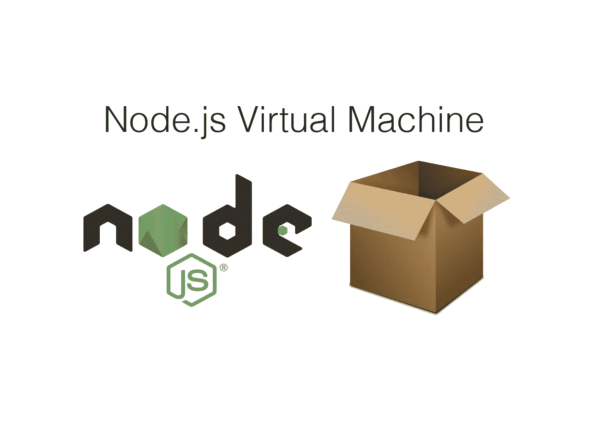

# 探索节点虚拟机模块的可能性

> 原文：<https://javascript.plainenglish.io/node-js-vm-5727c269f8ec?source=collection_archive---------3----------------------->

## 理解上下文、执行和用例



Image by the author, based on official [resources](https://nodejs.org/en/about/resources/) and [pixabay](https://pixabay.com/de/vectors/box-offen-karton-container-152428/)

Node.js 使用 V8 JavaScript 引擎——我想你以前听说过。但是您知道我们可以在 Node.js 中轻松访问引擎吗？

事实上，有一个默认的模块，这给了我们很大的能力去玩。这里是 Node.js 虚拟机(VM)模块的终极介绍。

# 在虚拟机中执行您的第一个代码

Node.js 中的`vm`模块是默认可用的——不需要 NPM。一旦实现了它，我们就可以定义我们想要执行的实际 JS 代码。为了在 VM 中执行代码，我们调用`runInThisContext`。

```
const vm = require('vm')const code = `console.log('hello from the vm')`vm.runInThisContext(code) // hello from the vm 
```

是的，就目前而言，就这么简单——但是还有更多有待发现。您可能已经注意到了关于 VM 对象中特性的其他建议。此外，`runInThisContext`还有`runInNewContext`和`runInContext`。
但这一切意味着什么？

# 理解上下文

在 JavaScript 中，有一个窗口对象。它是“最高”的对象，我们可以通过调用`this`直接访问它。因为 Node.js 不是在浏览器中执行的，所以没有使用`window`对象，而是使用了`global`对象，它包含了所有像`console.log`这样著名的函数。

和浏览器中的 JS 一样，`this`默认也是指全局对象，这里可以看到:`this == global // true`。定义的全局对象在 Node.js VM 的上下文中是指“上下文”。

你注意到我们是如何在 VM 中执行的代码中使用`console.log()`的吗？正确，看起来像是在我们运行`vm.runInThisContext`时定义了`console.log`所属的`global`对象。

这就是这个函数的用途——在 VM 中执行代码，并把代码的全局对象放在它周围。这是另一个很好的例子:

```
global.name = 'Max'const code = `console.log(this.name)`vm.runInThisContext(code) // Max
```

因此，`runInThisContext`保留了关于全局对象的周围环境——顾名思义。既然我们理解了这一点，剩下的就不言自明了——实际上，但这有点棘手。

使用`vm.runInContext`时，我们需要首先自己定义上下文。因此，我们需要一个 context-object，传递给 VM，它保存我们需要的全局变量。

```
const context = {
  name: 'max',
  console: console
}vm.createContext(context)const code = `console.log(this.name)`vm.runInContext(code, context) // max
```

既然`global`默认不可用，`console.log`不也是吗。如果我们想使用它，我们需要将它传递到我们的上下文中。当仅仅在 VM 中记录`this`时，我们看到我们的全局变量有多瘦:

```
{
  name: 'max',
  console: Object [console] { .. }
}
```

# 在虚拟机中导入和运行模块

打印日志很酷，但有时我们想写比这更复杂的代码。幸运的是，我们甚至可以将与 NPM 一起安装的模块导入到我们的虚拟机中。

有多种方法可以使外部模块在虚拟机中可用。
我将坚持我认为最优雅的方式:将我们想要的模块传递给上下文对象。下面是我们如何在虚拟机中导入和运行 Express:

我们现在实际上可以通过浏览器中的端口 8080 访问我们的应用程序，即使它实际上是在虚拟机内部运行的。

# 一个实际的用例

即使没有任何实际的用例，我也从测试这个模块中获得了乐趣。当然，也有一些。最有趣的是我通过谷歌找到的一个。一家公司使用 VM 模块在安全的环境中测试其 Node.js 代码。

还有一个小问题，他们已经用 VM 模块解决了。传递给 VM 进行测试的代码自然包含大量的 console.log。为了给测试环境的日志留下干净的输出，他们使用了一个小技巧:作为 log 函数的上下文，简单地传递一个空函数。

```
const context = {
  console: () => {}
}
```

通过这种方式，内部日志可以被干净地静音。但在我看来，最酷的部分是可以在不改变原始代码的情况下定制 console.log 函数——这就是定制上下文的强大之处。

例如，让日志静音很酷，但是您仍然希望出于分析目的保留它们。对于自定义上下文，有一种方法可以做到这一点:

```
let internalLogs = []const context = {
  console: {
    log: (value) => {
      internalLogs.push(value)
    }
  }
}
```

通过这种方式，所有的 console.logs 都被静默，但是保存在一个数组中。他们写了一整篇关于他们用法的文章[在这里](https://blog.idagio.com/testing-express-js-with-node-vm-63a344075052)。

感谢您的阅读！

更多 Node.js 深度内容:

[](/if-your-code-is-garbage-nodes-garbage-collector-won-t-help-f48d32d3bc9a) [## 如果你的代码是垃圾，Node 的垃圾收集器就没用了

### 以下是你需要知道的

javascript.plainenglish.io](/if-your-code-is-garbage-nodes-garbage-collector-won-t-help-f48d32d3bc9a) 

*更多内容请看*[***plain English . io***](http://plainenglish.io/)