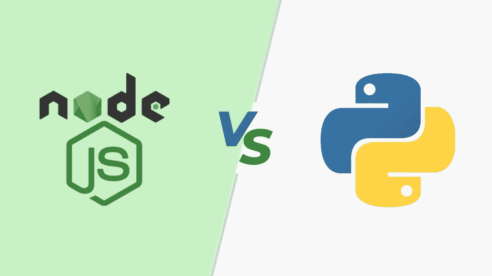
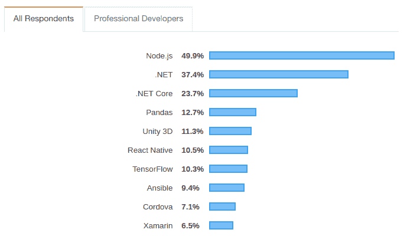
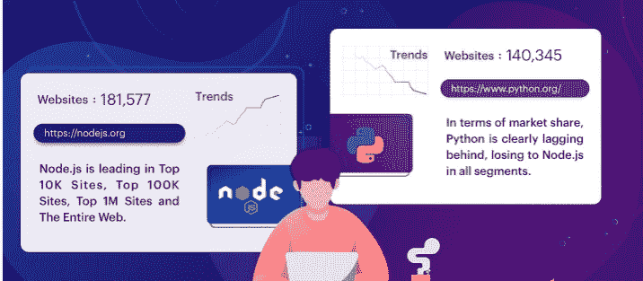
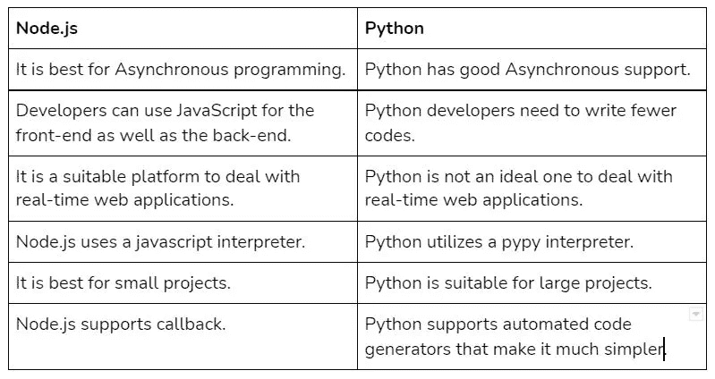
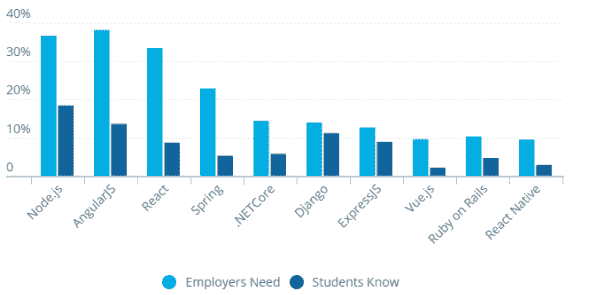
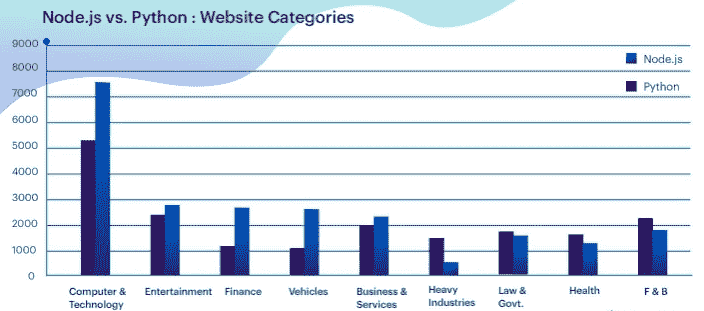
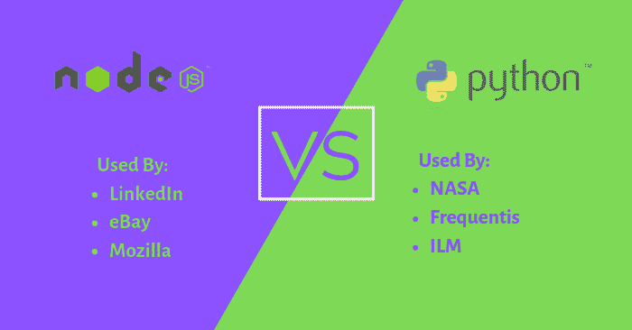

# Node.js 与 Python:最令人困惑的后端困境

> 原文：<https://javascript.plainenglish.io/node-js-vs-python-the-most-confusing-back-end-dilemma-6dcd85a3de8c?source=collection_archive---------1----------------------->

你的下一个项目应该使用哪种后端语言？ Node.js 还是 Python？这是许多企业家在决定下一个 web 开发项目采用哪种语言时经常问自己的问题。

Node.js 和 Python 是印度顶级 [**网站开发公司**](https://www.pixelcrayons.com/web-development/) 用于基于 web 的后端开发的两种流行编程语言。但是在两者之间选择时没有明确的答案，因为两者都有各自的优点和缺点。

有各种各样的因素需要考虑，其中一个重要因素是您是否想要构建一个可伸缩的快速应用程序。根据一份[报告](https://insights.stackoverflow.com/survey/2019)，Node.js 以 49%的分数占据了其他框架的首位。

在这篇博文中，我们将讨论 Node.js 和 Python 之间的一些差异，这样您就可以做出明智的决定，选择最适合您需求的编程语言。

# Node.js 是什么？

Node.js 是一个用 JavaScript 构建的服务器端平台，可以被视为网络两端(浏览器和网络服务器)之间的“中间件”。Node.js 用于构建可伸缩的高性能 web 应用程序和复杂系统，如即时消息应用程序、实时频道和多人游戏。

# Python 是什么？

Python 是一种可以在任何机器上运行的编程语言。由于其简洁的语法和极端的可移植性(这意味着它可以在大多数设备上工作)，它在过去几年里获得了巨大的流行。

它是一种高级的问题解决语言，允许用户创建广泛的程序，可以应用于数字数据科学和机器学习行业。此外，可以将 Python 与 Django 等框架结合使用，这是构建后端网站的完美选择。

# Node.js 和 Python 有什么相似之处？

*   它们都支持异步编程，这允许开发人员创建不会冻结服务器和破坏一切的非阻塞 I/O。这也是 Node.js 优于 Python 的地方，因为它使您能够使用运行在**VM**(虚拟机)上的 JavaScript。
*   您可以使用它们来构建一个 RESTful API。Node.js 率先在其核心库中引入了 Express 的概念。它允许开发人员快速开发 API 和 web 应用程序，而无需安装任何额外的模块或框架。
*   他们都有强大的社区支持。这意味着有成千上万的教程、文档和论坛可以帮助您解决有关这些技术的任何问题。

# **node . js 与 Python 的快速对比**

# Node.js 与 Python:详细比较

> **#1 Node.js vs. Python:架构**

Node.js 是一个提供异步编程的框架，而 Python 是基于一个带有同步编程的旧框架。

Node js 旨在为单线程应用程序提供一种高效使用 CPU 内核和线程的方式。与 Python 相比，它有一个优势，特别是对于实时 web 应用程序，它可以处理比 Python 更多的并发连接。

另一方面，Node.js 有一个用于系统 I/O 和用户代码的线程。Python 基于带有同步编程的旧框架。因此，如果你计划构建一个高性能的 web 应用程序，那么使用 Node js 和 [**雇佣 Node 开发者**](https://www.pixelcrayons.com/hire-node-Js-developers) ，因为在这种情况下它比 Python 更有效。

> *这里的赢家是 node . js*

> **# 2 node . js vs Python:Speed&性能**

如果您正在构建一个实时 web 应用程序，那么 Node.js 可以满足您处理比 Python 更多的并发连接的需求。然而，Python 将在不牺牲性能的情况下为您提供更快的响应时间。

无论选择哪种编程语言，都必须记住 Node.js 需要基础设施维护，而 Python 通常会预装基础设施。

但是这种维护需要资源，所以如果你有一个小的开发团队并且预算紧张，就去用 Python 吧，因为它不需要你做大量的安装和维护工作。

Node js 的可伸缩性比 Python 好得多，内存使用率更高，但 I/O 相关的延迟更低。因此，如果您的应用程序的需求是可预测的，那么就选择 Node js 否则，Python 将是您的正确选择。

> *而且是平局*

> **#3 Node.js vs. Python:可扩展性**

Nodejs 是可伸缩的；有了 NodeJs 的节点包管理器，很容易向上扩展。您可以在另一台机器上创建 NodeJS 的新实例，而无需重新启动以前的模型。Python 的可伸缩性对于大多数用例来说已经足够好了，但是，它不像 NodeJS 那样支持集群。

> *这里的赢家是 node . js*

> **#4 Node.js vs. Python:学习曲线**

与 Python 相比，Nodejs 更足智多谋，更灵活，也更容易学习。Nodejs 的代码更短，这意味着用户很容易理解。用户可以通过一个简单的命令为网络或移动应用创建一个完整的系统。

与 Python 相比，Nodejs 的一个优势是代码简单，这使得程序员可以更快地编写代码，并且在代码中出现错误时不会有太多麻烦。Nodejs 代码的简单性使得开发人员很容易解决代码中的问题。

Python 是一种语法简单的语言，由于其通用性，人们可以根据任何需要使用它。最重要的是，与 Node 或运行时环境等其他语言相比，Python 的代码长度更短，这使得编程比以往任何时候都更容易。

> *这里的赢家是 node . js*

> **#5 Node.js vs. Python:普遍性**

Node.js 是一个多功能的平台，可以创建许多不同大小和形状的应用程序，因为 JavaScript 使它能够与后端系统和前端开发一起工作。

[source](https://www.simform.com/blog/nodejs-vs-python/)

Node 在网站、web 应用程序、桌面应用程序和移动应用程序构建方面也很出色。

Python 是一种流行的编程语言，可以用于所有项目，除了一个项目——移动应用程序。对于物联网解决方案和云服务，程序员比以往更多地转向 Python，因为它具有像 C 或 Java 一样易读的语法。

> *这里的赢家是 node . js*

> **#6 Node.js vs. Python:社区支持**

重要的是要看有多少人使用这些技术，以及哪一种更受欢迎。Node.js 创建于 2009 年，而 Python 自 1991 年就已经存在了。Python 有一个庞大的开发者支持社区。

因此，如果你在项目中遇到任何问题，可以使用谷歌迅速找到解决问题的人。但是，寻找 Node.js 方面的专家是一项具有挑战性的任务，因为了解 Node js 的开发人员数量最近有所增加，以解决此类问题。

> *这里的赢家是 Python。*

> **#7 Node.js vs. Python:扩展性**

编程语言的可扩展性越强，就越容易通过添加功能来修改程序。

在其旧版本中，Node.js 可以与 Babel 配合使用，以实现更流畅的前端开发。Webpack 和 PM2 这两个工具也可以帮助你进行模块捆绑。

使用 Sublime Text，您可以在一个地方快速编辑和测试 Python 代码，而 Robot Framework 有助于自动化任务。

> *这里的赢家是 node . js*

> **#8 Node.js 与 Python:开发成本**

Nodejs 和 Python 都是免费使用的。然而，Python 有一个缓慢的发布周期，随着时间的推移，这使得贡献变得更加困难。另一方面，Node.js 得到了 PayPal(npm)、IBM(IBM Cloud)等公司的支持。，这使得开发者更容易工作，因为他们有一个工作平台。

> 这里的赢家是 Node.js。

> **#9 Node.js vs. Python:用例**

***Node.js 用例:***

*   **Linkedin** : Node.js 一直是 Linkedin 的绝佳选择，因为它速度快，能够在平台上轻松管理大量的连接、消息或用户。
*   易贝:易贝是全球最著名的 C2C 和 B2B 电子商务商店。他们一直使用 Node 来管理他们的高流量网站，这有助于他们跟上需求。
*   **Mozilla** : Node.js 是一个强大而通用的工具，已经被用于 Mozilla 的 Firefox 浏览器的客户端开发和服务器端应用，以创建具有更出色的性能、稳定性、安全性和响应性的平台。

***Python 用例:***

*   **Frequentis:** Frequentis 是一家空中交通管理、运输和公共安全解决方案提供商，使用 Python 的简单语法来开发其导航工具。这使他们能够跟踪天气状况。
*   **工业光魔(ILM)** : Python 是 ILM 的绝佳选择，因为它减少了处理大量数据的时间。

# 最后一次拍摄！

Python 和 Node.js 都是流行的编程语言，可以用于各种项目，包括 web 开发、物联网解决方案、云服务等。

然而，Python 在移动应用开发或后端系统方面并不出色，而 Node.js 可以与前端和后端系统一起工作，因为它是基于 JavaScript 构建的。

话虽如此，如果你正在寻找一种简单易学、用例多样、受广大程序员社区支持的语言，那么 Node.js 就是你的不二之选。但如果你的需求更具体，比如 web 应用或物联网解决方案，Python 可能是更好的选择。对于使用 Python，你可以随时 [**在印度为你的项目雇佣 Python 程序员**](https://www.pixelcrayons.com/hire-python-developers-in-india) 。

*更多内容请看*[***plain English . io***](http://plainenglish.io/)