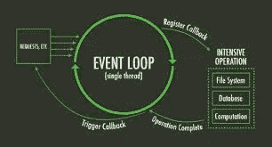
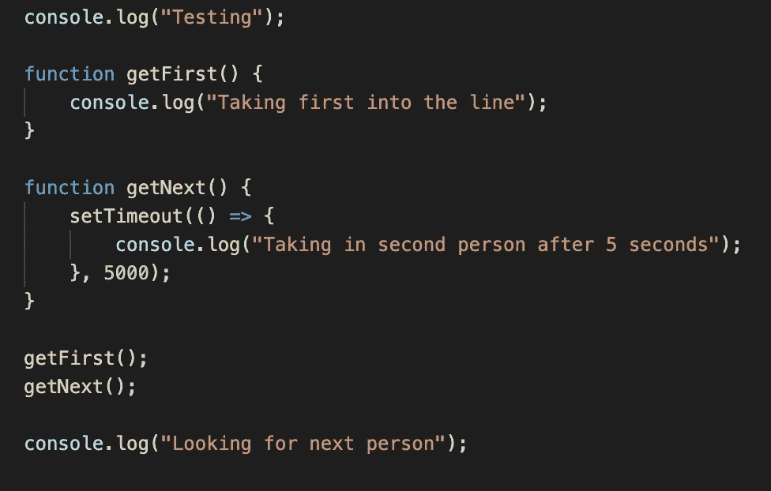
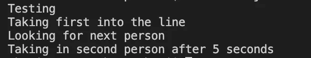
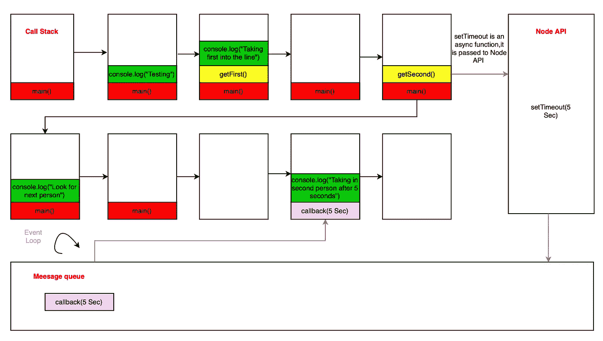

# Node.js 异步和并发模型

> 原文：<https://javascript.plainenglish.io/nodejs-asynchronous-concurrency-model-d4d18e17edf3?source=collection_archive---------3----------------------->

Photo by [James Harrison](https://unsplash.com/@jstrippa?utm_source=medium&utm_medium=referral) on [Unsplash](https://unsplash.com?utm_source=medium&utm_medium=referral)

在本文中，我们将研究 Node.js 如何使用其非常流行的异步和并发模型来处理服务器端的操作。

I/O 操作意味着计算机 CPU 中的单个进程与该 CPU 之外的任何事物之间的通信。它可以是内存、磁盘、网络，甚至是进程。信号在这种通信中被共享。计算机执行的大多数操作都是 I/O 操作。在服务器端环境中，I/O 操作引用磁盘和网络资源访问，这与其他操作相比相对较慢。

有许多方法可以处理这些 I/O 操作。我们可以同步执行，但这是低效的，因为一个操作依赖于另一个操作的执行。我们可以从操作系统派生一个新的进程来处理每个请求，但是在大量请求的场景中，很难执行。还有另一种方法，那就是**线程**，这被认为是一种很好的方法，但当线程访问共享资源时，这就变得很令人头疼。

Node 和 JavaScript 是单线程的。这意味着他们一次只能处理一项任务。但这并不会在运行缓慢的情况下带来更好的性能。Node 使用三种技术:非阻塞 I/O、事件和异步 API 来处理慢速 I/O 操作，而不会阻塞主执行运行时。

**非阻塞输入/输出**

这意味着程序可以在做其他事情的同时请求网络资源，然后，当网络操作完成时，将运行一个回调来处理结果。Node 使用一个名为 libuv 的库来提供对非阻塞网络调用的访问。

> 尽管节点应用程序是单线程的，但它有助于借助事件循环和异步 API 实现非阻塞 I/O。

Node 由谷歌 Chrome V8 JavaScript 引擎提供支持。它将 javaScript 代码编译成机器代码，并处理 JavaScript 代码的解释和运行。正如我已经说过的，处理 I/O 操作的节点 libuv 在 C++绑定层的帮助下与 V8 引擎一起使用。

**事件循环**

V8 引擎有堆和堆栈内存。堆存储对象和函数。堆栈执行函数。堆和堆栈不属于节点。Node 拥有定时器、包装器、操作系统操作发射器等 API。节点还提供事件循环和事件队列(回调队列)。

V8 JavaScript 引擎回调栈通过跟踪当前运行的所有函数来跟踪程序的执行。我们知道堆栈是一种数据结构，后进先出(LIFO)操作在其中发生。Javascript 是单线程的。它只有一个堆栈，一次只能做一件事。当堆栈执行一个函数时，在这个线程中不会发生任何事情。当多个函数相互调用时，它们将形成一个堆栈。那么功能将按照后进先出原则执行。这个回调栈的执行从一个匿名函数开始，这个函数首先被推入栈中。我们也可以把这个叫做 main()。

事件循环是在事件队列(回调队列)和回调堆栈之间运行的循环。它从事件队列中提取事件，并将它们的回调推到调用堆栈中。但是当回调堆栈中至少有一个函数时，事件循环将不会执行它的操作。它将一直等待，直到 V3 引擎中的回调堆栈中不再有要执行的函数。由于队列数据结构是先进先出(FIFO)，在事件队列中，我们首先排队的事件将首先出队。当 Node 将事件出队时，与之相关的函数将被调用并将其推送到堆栈中。那么回调栈将执行它的操作。

**异步 API**

那么，节点 API 在哪里发挥作用呢？当执行 setTimeout、setInterval 等异步函数时，V8 引擎没有任何实现。相反，Node 使用 C++实现。因此，当这些函数被调用时，它们将被事件队列中的事件注册。当事件队列中的事件被执行时，回调将被推到 V8 引擎的堆栈中。

我们可以通过下面的例子来理解上面讨论的事情:

Example code snippet

当我们查看这段代码时，输出将是:

Output of the above example code snippet

从下图可以了解代码执行在 Node 中是如何工作的。

Execution flow of code

当代码开始执行时，main()推入调用堆栈，控制台函数推入调用堆栈。“测试”登录到控制台。

在此之后，控制台功能将会弹出。然后，将 getFits()推入堆栈，然后将控制台函数推入堆栈，并将“第一个进入队列”登录到控制台。

在此之后，控制台函数和 getFirst()将从堆栈中弹出。

调用 getNext()并将其推入堆栈，然后调用 setTimeout 函数。这是一个不被 Javascript 处理的异步函数，它将被发送到节点 API。节点 API 对此保持五秒钟，并将回调发送到消息队列。

在这发生的同时，最终的控制台函数将被执行，被推送到堆栈，然后“寻找下一个人”被登录到控制台并弹出。

现在在调用堆栈中，只有 main()会在那里，它也会弹出。现在调用堆栈是空的。因此，消息队列中的回调将被推入调用堆栈，并且“5 秒钟后接收第二个人”将被记录到控制台。

希望您对 Node.js 异步和并发模型有所了解。我的下一篇文章再见！

*更多内容尽在*[*plain English . io*](http://plainenglish.io/)