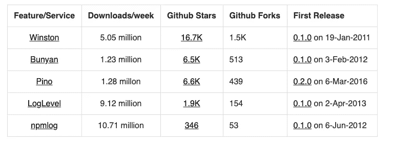

# 比较 5 个不同的 Node.js 日志库

> 原文：<https://javascript.plainenglish.io/nodejs-logging-library-17932e06695a?source=collection_archive---------8----------------------->

最佳日志 Node.js 日志库可以让您对应用程序的工作方式有前所未有的了解。拥有适当的日志记录就相当于在一个空间中拥有一个强大的望远镜，上面有您所有的应用程序。

您是否希望能够看到您的应用程序在生产负载下的行为？在这篇文章中，我们将分析 5 个流行的 Node.js 日志库，它们可以很容易地帮你完成这项工作。

# 目录

[假设](#3717)
[Node.js 日志库评估](#26bd)
∘ [温斯顿](#683c)
∘ [班扬为 Node.js 日志库](#6c62)
∘[Pino](#ceaa)
∘[log level](#d77f)
∘[npmlog](#6b0c)
[node . js 日志库的快速对比](#7d84)
[结论【T26](#408c)

# 假设

1.  您熟悉 Node.js 的工作方式，并且可以在本地运行 Node
2.  您可以安装 npm 库，并对 package.json 和 npm CLI 有基本的了解

在本文中，我们将使用 Express.js 作为一个示例应用程序，来查看将所有 Node.js 日志库的日志写入控制台的代码示例。

# 要评估的 Node.js 日志库

在本文中，我们将评估 NPM 上 5 个流行的 Node.js 日志库。它们每周都被下载超过一百万次，所以它们非常受欢迎。我们开始吧！

## 1.温斯顿

Winston 是一个流行的日志库。它被设计得很简单，支持多种`transports`的通用日志。Winston 将自己定义为“几乎所有事情的记录者”。

通过 Winston，我们可以将您的日志路由到其他服务，如 [AWS cloud watch](https://www.npmjs.com/package/winston-cloudwatch) 、 [graylog2](https://www.npmjs.com/package/@eximius/winston-graylog2) 、 [logz.io](https://www.npmjs.com/package/winston-logzio) ，甚至 [Sematext Logsene](https://www.npmjs.com/package/winston-logsene) 。我们甚至可以添加 express 中间件，让 Winston 更好地使用 Express 记录日志。

下面是 Winston with Express 使用 [express-winston 中间件](https://github.com/bithavoc/express-winston)的代码示例:

当我们用`node winston.js`运行服务器并在浏览器上点击`http://localhost:3001/test/api`时，它会给出如下输出:

上述代码也可作为[拉取请求](https://github.com/geshan/nodejs-logging/pull/2/files)使用。

## 2.Node.js 日志记录的 Bunyan

[Bunyan](https://www.npmjs.com/package/bunyan) 是另一个著名的 Node.js 日志库。班扬由 [Joyent](https://www.joyent.com/node-js/production/modules) 在生产中使用。它将自己定义为一个用于 Node.js 服务的简单快速的 JSON 日志库。

班扬主张日志应该是 JSON 格式的。它的特性包括一个用于漂亮打印的 CLI，序列化器，以及除了 Node.js 之外对多运行时的支持，如 Webpack 和 Browserify。

以下是使用[快速班扬记录器](https://github.com/villadora/express-bunyan-logger)的快速班扬代码示例:

当我们用`node bunyan.js`执行代码并点击浏览器上的`http://localhost:3002/test/api`时，它将显示如下输出:

默认情况下，Bunyan 的日志非常详细。

上述代码也可作为[拉取请求](https://github.com/geshan/nodejs-logging/pull/3/files)使用。

## 3.皮诺

[Pino](https://www.npmjs.com/package/pino) 是一个相对流行的 Node.js 日志库，它将自己标记为“开销非常低的 Node.js 日志记录器”。它将异步日志记录归功于它的快速性能。在其[基准测试](https://github.com/pinojs/pino/blob/master/docs/benchmarks.md)中，Pino 声称在许多情况下比替代产品快 5 倍以上。

其他特性包括[子记录器](https://github.com/pinojs/pino/blob/master/docs/child-loggers.md)和[对多个 web 框架的支持](https://github.com/pinojs/pino/blob/master/docs/web.md)。它有多个核心和社区模块，这有助于形成一个繁荣的[生态系统](https://github.com/pinojs/pino/blob/master/docs/ecosystem.md)。使用 Pino，您可以通过使用适当的传输方式将日志发送到许多服务，如 [MySQL](https://github.com/pinojs/pino/blob/master/docs/transports.md#pino-mysql) 、 [Datadog](https://github.com/pinojs/pino/blob/master/docs/transports.md#pino-datadog) 、 [AWS cloud watch](https://github.com/pinojs/pino/blob/master/docs/transports.md#pino-cloudwatch) 或 [log flare](https://github.com/pinojs/pino/blob/master/docs/transports.md#pino-logflare) 。

以下是使用[快速 Pino 记录器](https://github.com/pinojs/express-pino-logger)的快速 Pino 示例:

当我们用`node pino.js`运行服务器并在浏览器上点击`http://localhost:3003/test/api`时，它将发出如下输出:

与 Bunyan 类似，Pino 的默认日志也很详细。我们可以使用 pino-pretty CLI 来让原木变得更漂亮。

代码示例可以作为[拉请求](https://github.com/geshan/nodejs-logging/pull/4/files)来访问。

## 4.Loglevel

Loglevel 是一个非常流行的日志库，可以在 Node.js 和浏览器中使用。LogLevel 将自己定义为“JavaScript 的最小轻量级简单日志记录”它还声称要取代 console.log，消除 console.log 的缺点。

Loglevel 似乎很容易使用，也很方便。它的自述文件补充道:“这是一个基本可靠的日常日志库。”它不做花哨的事情，但有您实际使用的核心功能。

下面是一个非常简单的 Loglevel 的例子，有一个 Express 服务器，没有中间件:

当我们用`node loglevel.js`运行执行上述代码并点击浏览器上的`http://localhost:3004/test/api`时，它将显示如下输出:

与其他库相比，Loglevel 输出非常简单。此外，我们没有使用任何特定于 express 的中间件来使用 Loglevel 登录。

我们也可以将上面的例子作为[拉请求](https://github.com/geshan/nodejs-logging/pull/5/files)来访问。

## 5.Npmlog

[Npmlog](https://www.npmjs.com/package/npmlog) 是 NPM 使用的另一个非常流行的日志库。根据 NpmLog 的自述文件“这个日志是非常基本的。它为 npm 进行日志记录。它支持自定义级别和彩色输出。”

这个 Node.js 日志库并没有什么特别之处，上一个版本是 4 年前发布的。然而，它是本帖中列出的最受欢迎的日志库。截至 2021 年 1 月，唯一一个每周下载量超过 1000 万的图书馆。

下面是一个 npmlog 在 Express js 和无中间件情况下运行的快速示例:

当我们用`node npmlog.js`启动 Express js 服务器并点击浏览器上的`http://localhost:3005/test/api`时，它将显示如下输出:

与 Loglevel 类似，对于 npmlog，输出很简单，我们也没有使用任何 Express js 中间件。

上述代码也可以作为[拉请求](https://github.com/geshan/nodejs-logging/pull/6/files)获得。

# Node.js 日志库的快速比较

下面是我们到目前为止讨论的 Node.js 日志库的快速比较，所有数据都是在 2021 年 1 月的最后一周收集的:

如果我们看看下载趋势， [NPM 趋势](https://www.npmtrends.com/winston-vs-bunyan-vs-pino-vs-loglevel-vs-npmlog)描绘了一幅如下图:

尽管 npmlog 只有 346 颗星和 53 个分叉，但据报道，它每周的下载量超过 1000 万次。在 GitHub 恒星方面，温斯顿的恒星数量是第二名班扬的 3 倍，有 513 颗恒星。Winston 也是创建于 2010 年 12 月 30 日的最古老的图书馆，于 2011 年 1 月 19 日首次发布。

根据 [npmcompare](https://npmcompare.com/compare/bunyan,loglevel,npmlog,pino,winston) ，Npmlog 积分最多，2550 万分，Buyan 积分最少，290 万分。

# 结论

为了在 Node.js 中获得最佳的日志记录和监控体验，最好是选择适合您需求的库，而不是追求数字。

> 使用最适合你的目的的库，并利用它的插件或特性，使之对你的用例最有意义。

如果你遵循一些[日志记录最佳实践](https://geshan.com.np/blog/2019/03/follow-these-logging-best-practices-to-get-the-most-out-of-application-level-logging-slides/)来获得最大收益，那也是很棒的，因为它们是[软件工程师最好的朋友](https://geshan.com.np/blog/2019/11/laracon-au-2019-overall-a-good-experience/)。很长一段时间以来，我一直在宣扬日志记录的[重要性，它是可伸缩和弹性应用](https://geshan.com.np/blog/2015/08/importance-of-logging-in-your-applications/)的 [4 支柱之一。伐木快乐！](https://geshan.com.np/blog/2015/10/4-pillars-of-a-solid-software-application-and-tools-to-support-it/#logging-with-monitoring)