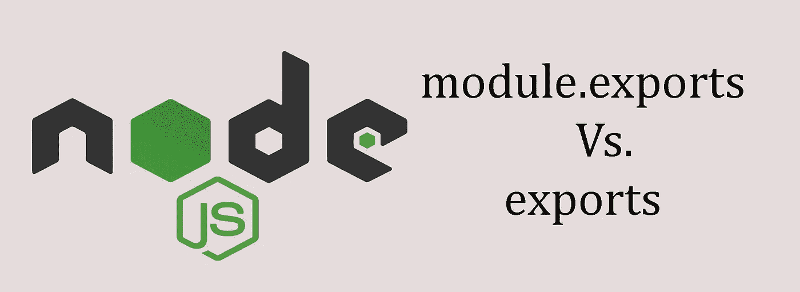
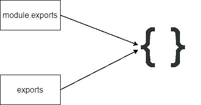

# Node.js — module.exports 与 exports

> 原文：<https://javascript.plainenglish.io/nodejs-module-exports-vs-exports-b7dfff86bfdd?source=collection_archive---------4----------------------->



如果您是 Node.js 开发人员，您可能在代码中使用过 *module.exports* 和 *exports* 。这篇文章是关于深入了解它的。在进入正题之前，最好先了解几件事。

> 除了模块*和*导出*关键字之外，你可能还在 Node.js 中使用了诸如*要求*、* __filename *、* __dirname *的关键字，但是它们实际上是从哪里来的呢*？

假设您有一个 console.log()语句。在运行时，Node.js 会将它转换成如下所示的形式。

```
(function (exports, require, module, __filename, __dirname){
    console.log()
})();
```

这个函数被称为**模块包装函数**。现在你知道 Node.js 魔值*导出*、*模块*、*要求*从哪里来了。这些只是模块包装函数的参数。

只需尝试 console.log(模块)。你会看到这样的东西。

```
Module {
  id: '.',
  path: <path-to-project>,
  exports: {},
  parent: null,
  filename: <path-to-project><filename>,
  loaded: false,
  children: [],
  paths: []
}
```

所以， ***导出*** 是 ***模块*** 的一个对象。那么模块包装函数的*导出*参数呢？过一会儿你就会看到了。

考虑以下代码:

```
console.log(module) // Before assigning the value to exports
const value = "Hello Node!"
exports.value = value
console.log(module) // After assigning the value to exports
```

这将是上述两个日志上的*导出*对象的输出。

```
exports: {} // Before assigning the value
exports: { value: 'Hello Node' } // After assigning the value
```

仔细观察*出口*处两根圆木的物体。 *module.exports* 已经获得了与我们通过 *exports* 给出的值相同的值(exports.value = value)。这是什么意思？

这意味着最初，*模块导出*和*导出*都指向同一个对象。



需要记住的重要事情是**当从其他地方需要一个模块时，将返回 *module.exports* 。不是“*出口*”。**

因此，遵循这两条语句的行为是相同的。

```
module.exports.someFunction = someFunction
exports.someFunction = someFunction
```

您也可以执行以下操作:

```
module.exports = someFunction
```

现在*不是一个对象而是一个函数。*

但是你能做到以下几点吗？

```
exports = someFunction
```

现在 *module.exports* 和 *exports* 不再引用同一个对象。 *module.exports* 仍然是空对象，同时 *exports* 正在引用一个函数。并且提醒一下，当我们从另一个地方需要这个的时候， *module.exports* 将被返回，并且是一个**空对象！**

让我们看一个例子:

假设我们有下面这个简单的 NodeJS 程序，它有两个文件 app.js 和 square.js. square.js 将有一个函数来查找给定数字的平方。

你可以这样做:

square.js

app.js

我们也可以有如下的情况:

square.js

app.js

但是，如果您执行以下操作，它将不起作用:

现在你知道它不起作用的原因了吧！

感谢您的阅读。

*更多内容看* [*说白了. io*](http://plainenglish.io/) *。报名参加我们的* [*免费每周简讯*](http://newsletter.plainenglish.io/) *。在我们的* [*社区*](https://discord.gg/GtDtUAvyhW) *获得独家写作机会和建议。*