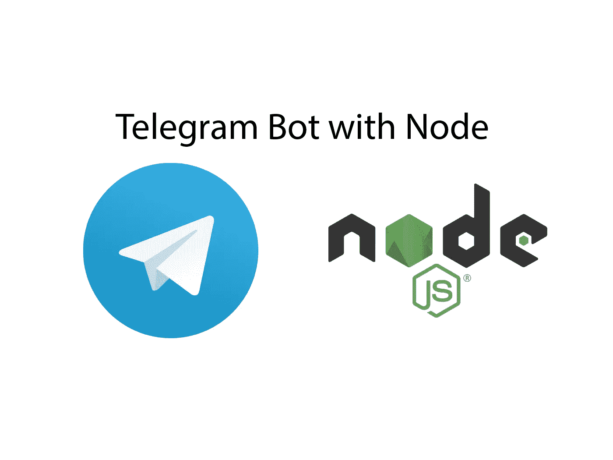
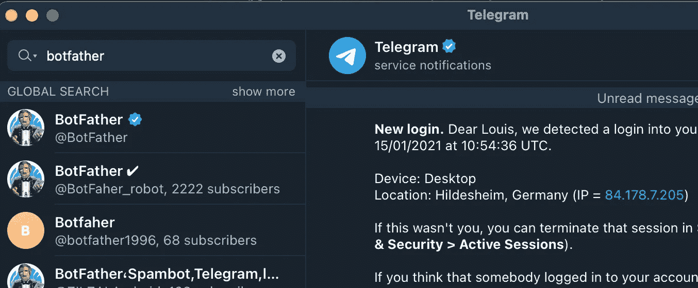

# 如何在 3 分钟内用 Node.js 构建一个电报机器人

> 原文：<https://javascript.plainenglish.io/nodejs-telegram-bot-5e372f67f57?source=collection_archive---------0----------------------->

## 这可能比你想象的要简单



Source: the author

Telegram 是 WhatsApp 的替代品——在我看来，是一个非常好的替代品。它的免费使用被认为是非常安全的。但是最好的:
我们可以编写自己的机器人！

下面是如何用 Node.js 来构建一个
让我们放轻松&构建我们自己的电报机器人吧！

## 入门指南

首先，我们需要注册我们的机器人。我们可以通过联系 ***BotFather*** 在 Telegram app 中完成。

只需在搜索框中键入“僵尸父亲”，然后选择带有蓝色勾号的建议。



Source: the author

只需点击聊天中的“开始”并浏览选项。您只需要选择一个名称和一个用户名，然后就可以保存密钥了。请保密。

你已经可以在电报搜索中找到你的机器人了。寻找
“@<bot-username>”——当然，这个 bot 还不能做任何事情。

让我们开始编码吧。我使用 NPM 软件包来处理 Telegram API。只需安装:

```
yarn add node-telegram-bot-api
```

然后我们就可以用这个包了。将您的令牌放入变量中。

搞定了。现在我们可以开始用机器人做事了。这里有一个简单的例子。

使用***context***我们可以对符合正则表达式模式的消息做出反应。在这个例子中，表达式`/\/echo (.+)/`说我们必须写“/echo”和它后面的一些文本。

变量 **chatId** 是用户的 ID 。只有有了它，我们才能从机器人向电报用户发送消息。因此，如果我们想让机器人自给自足，用户的 id 必须存储在某个地方。

**bot.sendMessage** 用于发送消息(真是惊喜！).resp 是 echo 命令后发送的字符串。是的，机器人会把我们发给它的东西送回来。
运行`node app.js`，打开你的聊天机器人，发送如下内容:


Source: the author

## 自动发送消息

正如我所说的，我们需要使用 **chatId** 向用户发送消息——为此；我们需要把它存放在某个地方。当然，在生产应用程序中，您应该为此选择非易失性存储——MySQL、MongoDB 或其他数据库。

对于我们的例子，我将 id 存储在一个数组中。用户可以用“/register”向机器人注册，然后机器人被允许向他发送消息。机器人每秒钟向每个用户发送一条消息——我们只是用 for 循环遍历用户数组。

一旦我们发送“/register”给机器人，我们就会收到垃圾邮件。

## 回复我的所有邮件

使用**bot . context**我们能够对正则表达式匹配的消息做出反应。但是，如果我们想要处理所有传入的消息呢？这在`bot.on("message")`中是可能的——只要有人发送信息，它就会被触发。

这里有一个简单的例子。机器人会为每条消息被触发，但只有当用户发送“狗”时才会响应。

## 发送投票

在电报上，我们可以交换很多东西。不仅仅是贴纸、视频和短信，还有投票。创建一个很容易:

```
bot.sendPoll(chatId, 'Is Telegram great?', [‘Sure’, ‘Of course’])
```

就在身份证之后，我们通过了投票问题。第三个是一系列可能的答案——当然，您可以有不止两个选择。

这是多么容易，我们可以建立一个电报机器人与节点. js！

感谢阅读——你想在未来看到一个更复杂的项目吗？那就请随意把你的意见留给我。

## [加入我的时事通讯，了解最新动态](http://eepurl.com/hacY0v)