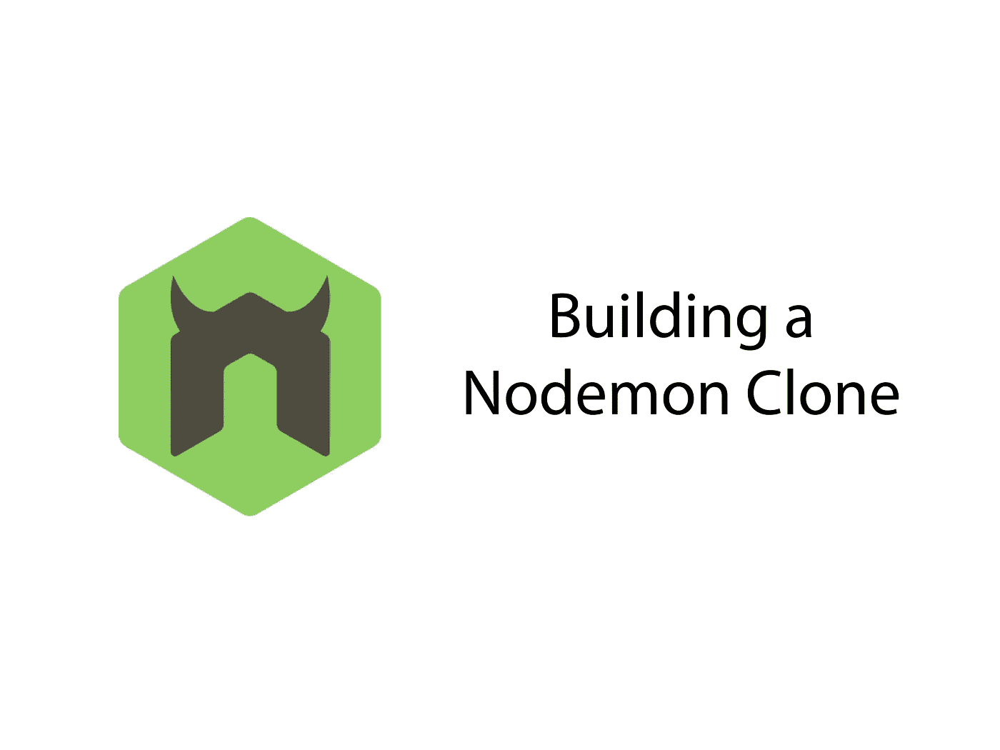
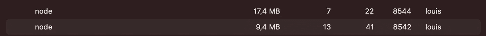
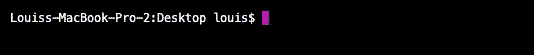

# 用 20 行 JavaScript 代码从头开始构建 Nodemon 克隆

> 原文：<https://javascript.plainenglish.io/nodemon-clone-node-js-9d69c2c5593b?source=collection_archive---------2----------------------->

## 在了解子进程、CLI 和文件更改时



Nodemon 是构建 Node.js 的一个非常有用的工具。全局安装的包可以执行 Node 应用程序——每当我们更改应用程序的代码时，Nodemon 都会以极快的速度重新启动它。这使得用 Node 开发服务器变得特别容易。但是 Nodemon 是如何工作的呢？让我们通过构建一个克隆体来找出答案。

# 我们克隆人背后的想法

如果您想直接进入代码，请随意跳过这一部分。我写这篇文章是为了向您介绍子进程背后的思想。

正如我提到的，Nodemon 做了以下事情:每当 JavaScript 文件发生变化时，它都会重新启动 Node.js 实例。所以首先，我们需要弄清楚 Nodemon 实际上是如何运行代码的。我想到了两种方法:

首先，Nodemon **可以**在幕后使用虚拟机。我[写了更多关于 Node.js 内置模块的细节，它允许我们在虚拟环境中执行 js 代码。然而，还有一个更简单的选择:子进程。](/node-js-vm-5727c269f8ec)

我的第二个想法，Nodemon 如何在幕后工作，是一个子进程。如您所知，当运行 Node.js 实例时，它会在您的操作系统上创建一个进程。Node.js 可以很容易地创建更多的进程，从而执行其他节点实例。

当 Node.js 应用程序使用/创建子进程时，您可以看到它。为什么？因为它创建了更多的进程，我们可以在列出所有进程时看到。在 windows 上，这可以通过任务管理器实现。在 macOS 上，我使用活动监视器。

用一个小服务器启动 Nodemon，我证实了我的怀疑:Nodemon 运行一个子进程，如你所见:



因此，为了构建一个合适的 Nodemon 克隆，我们应该使用一个子进程。让我们开始写代码。

# 编写我们的 Nodemon 克隆

在 Node.js.
中创建一个子进程比听起来容易，有几种方法可以做到。最舒服的是`fork`——它专注于运行另一个节点实例，而不是我们想要的任何东西。

我们的 Nodemon 克隆的目标是运行一个节点应用程序，像 Express server 一样，作为子进程。因此，我创建了一个基本的 server.js，作为试验品:

```
const app = require('express')()app.get('/', (req, res) => {
  res.send('hello')
})app.listen(8080)
```

将这个`server.js`作为子进程运行很容易。创建另一个 JS 文件，并用以下代码填充它:

```
const { fork } = require('child_process')const child = fork('./server.js')
```

当您执行另一个 JS 文件，也就是我们的 Nodemon 克隆时，Express 服务器就启动并运行了——作为一个子进程。

到目前为止，一切都很好——但是当发生变化时重启应用程序会怎么样呢？

## 介绍 chokidar

每当代码发生变化时，Nodemon 都会重新启动我们想要运行的应用程序。这也包括目录中的所有其他文件。也就是说，Nodemon 默认监视当前目录的任何变化——choki Dar 可以帮助我们做到这一点。

这个包可以用`npm install chokidar`安装，默认情况下会监视一个提供的目录。

```
const watcher = chokidar.watch('./', {
  ignoreInitial: true,
})watcher.on('all', () => {
  console.log('a file changed!')
})
```

运行这个命令时，每当我们更改当前目录中的文件时，都会得到一个 console.log。但是重启呢？要终止子进程，我们可以运行:

```
const child = fork('./server')
child.kill()
```

为了重启，我们用一个正在运行的实例覆盖子变量。因此，我们将`const`改为`let`，并实现重启功能:

这就是一个非常基本的 Nodemon-clone。当您运行克隆(我将其命名为`nodemon-clone.js`)时，它将启动`server.js`——并在所有文件更改时快速重启。

# 让它更方便

到目前为止，我们希望用 Nodemon 克隆执行的文件是硬编码的。此外，我们需要执行 Nodemon 克隆本身——而原始包是一个全局 CLI。让我们的克隆也成为一个灵活和方便的 CLI，所以它看起来像这样:



IDK why this GIF is running so slowly

我已经做了一个[教程](/node-js-cli-cef1e080b8a9)关于创建 Node.js CLI，所以一个节点程序，可以在你的机器上的任何地方执行，通过它的名字进入你的终端。没那么难。首先，我们需要为此润色我们的 package.json。确保 main 和 bin 条目指向 Nodemon 克隆的主文件。在我的例子中，我将文件`nodemon-clone.js`重命名为`index.js`:

```
"bin": "./index.js",
"main": "./index.js",
```

然后，确保 package.json 中的 name 条目是您喜欢的名称—那里的值是我们在控制台中称之为它的命令。我选择“nodemon-clone”作为名称值，并建议您也这样做。

接下来，我们需要获取提供的文件作为代码中的参数。因此，当我们输入`nodemon-clone app.js`时,“app.js”就是我们想要提供的文件。这可以通过`process.argv`实现。另一个小变化是文件的第一行—必须是 *#！/usr/bin/env 节点。*以下是更新后的完整代码:

要使该文件作为全局命令可用，请在目录中运行`npm link`。现在，我们完成了！

为了进行测试，您可以在机器上的任何地方创建 Express server 示例。当您在终端中移动到同一个目录时，您可以运行`nodemon-clone <your-file>.js`——它应该工作正常。

如果想看完整代码: [GitHub Repo](https://github.com/LouisPetrik/nodemon-clone) 。感谢您的阅读！

以下是 Node.js 的更多内容:

[](/node-js-development-server-8365a9bf449b) [## 如何用 Node.js 从零开始搭建网站开发服务器

### 在每次代码更改时重新加载页面

javascript.plainenglish.io](/node-js-development-server-8365a9bf449b) [](/node-js-vm-5727c269f8ec) [## 探索节点虚拟机模块的可能性

### 理解上下文、执行和用例

javascript.plainenglish.io](/node-js-vm-5727c269f8ec) 

*更多内容看*[***plain English . io***](http://plainenglish.io/)