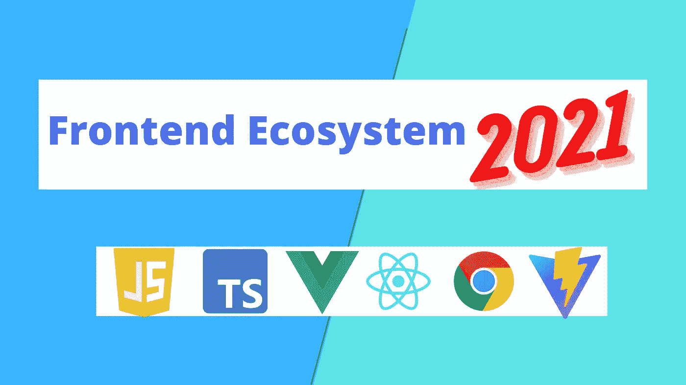
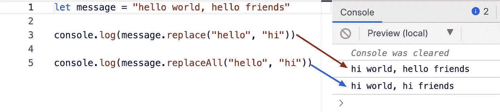
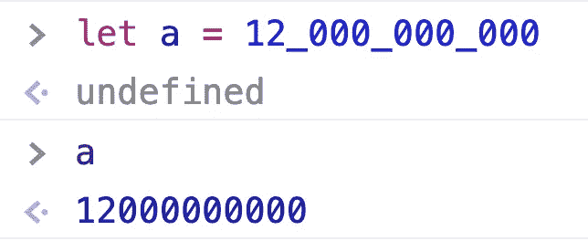
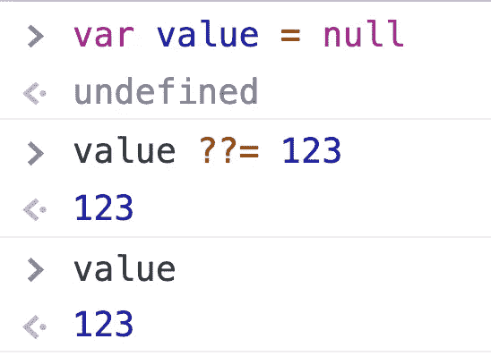
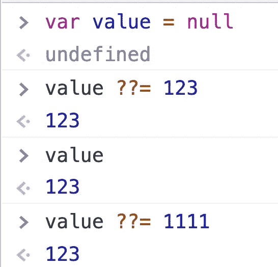
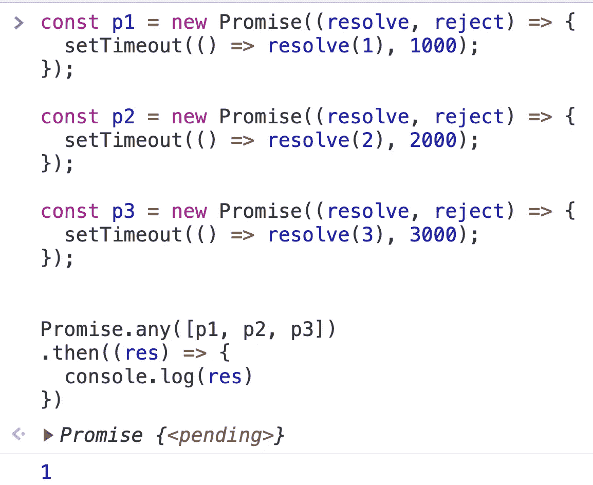
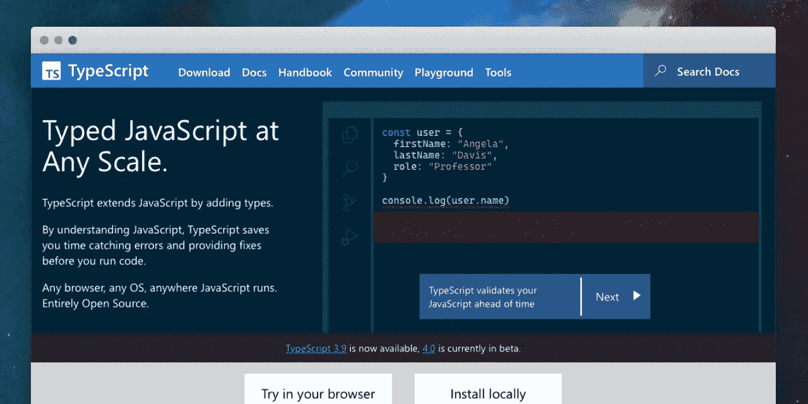

# 2021 年前端生态系统的显著更新

> 原文：<https://javascript.plainenglish.io/notable-updates-of-the-front-end-ecosystem-in-2021-3be445fc0290?source=collection_archive---------15----------------------->

## JavaScript、React、Vue 等都发生了什么变化？



2021 年即将过去。前端生态系统发生了什么变化？以下是简要总结。

# Java Script 语言

**ECMAScript-2021 于 2021 年 6 月发布。**

官方链接:

[](https://262.ecma-international.org/12.0/) [## ECMAScript 2021 语言规范

### 编辑描述

262.ecma-international.org](https://262.ecma-international.org/12.0/) 

新功能:

## replaceAll

`**replaceAll()**`方法返回一个新字符串，其中`pattern`的所有匹配项都被`replacement`替换。先前的`replace`方法只是替换了第一次出现。



```
let message = "hello world, hello friends"console.log(message.replace("hello", "hi"))console.log(message.replaceAll("hello", "hi"))
```

## **数字分隔符**

为了提高可读性和分隔数字组，数字文字使用下划线作为分隔符。



## **无效聚结&等于(？？=)**

符号？？是 JavaScript 中的无效合并运算符。它检查值是否为空或未定义。



由于`value`为空，因此`value`被分配给 123。



这里`value`不为空或未定义，所以`1111`没有分配给`value`。

## 答应我。任何

`**Promise.any**`与`Promise.all`相反。`Promise.any`解决提供的任何承诺是否被解决，不像`promise.all`等待所有承诺解决后再解决。



```
const p1 = new Promise((resolve, reject) => {
  setTimeout(() => resolve(1), 1000);
});const p2 = new Promise((resolve, reject) => {
  setTimeout(() => resolve(2), 2000);
});const p3 = new Promise((resolve, reject) => {
  setTimeout(() => resolve(3), 3000);
});Promise.any([p1, p2, p3])
.then((res) => {
  console.log(res)
})
```

# Nodejs

## 德诺公司成立于 1998 年 3 月 16 日

2021 年 3 月 29 日，Node 的创建者 Ryan Dahl 宣布成立 Deno 公司。

> Deno 是我们为这个生态系统注入新生命的尝试。提供一个符合浏览器 API 的现代、高效的编程系统。Deno 不是一个单一的系统，而是一套我们认为可以重新用于各种需求的技术。不是服务器端 JavaScript 的每个用例都需要访问文件系统；我们的基础设施使得编译出不必要的绑定成为可能。这使得我们可以为不同的应用程序创建定制的运行时:电子风格的 GUI、Cloudflare Worker 风格的无服务器函数、数据库的嵌入式脚本等。

[](https://deno.com/blog/the-deno-company) [## 宣布德诺公司

### 在计算机编程的无数方法中，脚本语言是最轻松实用的一种。其中…

deno.com](https://deno.com/blog/the-deno-company) 

## Nodejs16 于 4 月 16 日发布

主要特点:

*   将 V8 JavaScript 引擎更新到 9.0
*   预构建的苹果硅二进制文件
*   和其它稳定的 API

[](https://openjsf.org/blog/2021/04/23/nodejsv16/) [## 项目新闻:node . js v 16 Available-OpenJS Foundation

### Node.js v 16 现在可以下载了。亮点包括预构建的苹果硅二进制文件和额外的稳定…

openjsf.org](https://openjsf.org/blog/2021/04/23/nodejsv16/) 

## Corepack 包含在 Nodejs 16.9 中

Corepack 是一个包管理器的管理器。它将允许您使用 Yarn 和 pnpm，而不必安装它们——就像当前 npm 的情况一样，默认情况下，npm 在 Node.js 中提供。

[](https://github.com/nodejs/node/releases/tag/v16.9.0) [## 版本 2021-09-07，版本 16.9.0(最新)，@targos nodejs/node

### 值得注意的变化是 Corepack Node.js 现在包含了 Corepack，这是一个在 Node.js 项目和

github.com](https://github.com/nodejs/node/releases/tag/v16.9.0) 

## Node.js 17 发布于 10 月

[](https://medium.com/the-node-js-collection/node-js-17-is-here-8dba1e14e382) [## Node.js 17 来了！

### 这篇博客由贝瑟尼·格里戈斯撰写，Node.js 技术指导委员会提供了额外的资料…

medium.com](https://medium.com/the-node-js-collection/node-js-17-is-here-8dba1e14e382) 

## 下一个 10 年节点

Nodejs 在过去十年中非常成功，为前端开发带来了根本性的进步。同时，Nodejs 团队也发布了对 Node 未来十年的展望。

[](https://github.com/nodejs/next-10) [## GitHub — nodejs/next-10:讨论未来 10 年战略方向的资源库…

### 这个库的目的是在 Node.js 未来 10 年的战略方向上进行合作

github.com](https://github.com/nodejs/next-10) 

# 反应

## React 的创始人于 1 月 20 日离开了脸书

## React 18 alpha 于 2007 年 5 月 15 日发布

React 18 包括开箱即用的改进(如[自动批处理](https://github.com/reactwg/react-18/discussions/21))，新的 API(如`[startTransition](https://github.com/reactwg/react-18/discussions/41)`)，以及内置支持`React.lazy`的[新流媒体服务器渲染器](https://github.com/reactwg/react-18/discussions/37)。

以下是 React18 的计划:

[](https://reactjs.org/blog/2021/06/08/the-plan-for-react-18.html) [## React 18 - React 博客的计划

### 2021 年 11 月 15 日更新 React 18 现处于测试阶段。有关发布状态的更多信息，请访问…

reactjs.org](https://reactjs.org/blog/2021/06/08/the-plan-for-react-18.html) 

## 新的 React 文档发布于 10 月 15 日

主要特点:

*   所有新的学习材料都有挂钩
*   互动示例和挑战
*   可视化剖析钩子如何工作的“代码图”
*   解释 React 如何工作的插图和图表
*   围绕学习体验设计的新网站

[](https://github.com/reactjs/reactjs.org/pull/3965) [## [早期预览 rachelnabors 的新 React 文档拉请求#3965 reactjs/reactjs.org

### 自从宣布开始新的 React 文档工作以来，我们一直忙于编写内容和构建一个…

github.com](https://github.com/reactjs/reactjs.org/pull/3965) 

## **Create React App 5.0.0 于 12 月发布**

Create React App 5.0 是一个主要版本，具有几个新功能和所有主要依赖项的最新版本。

*   顺风支架
*   改进的软件包管理器检测
*   取消固定所有依赖关系，以便更好地与其他工具兼容
*   停止对节点 10 和 12 的支持

[](https://github.com/facebook/create-react-app/releases) [## 发布 facebook/create-react-app

### Create React App 5.0 是一个主要版本，具有几个新功能和所有主要依赖项的最新版本…

github.com](https://github.com/facebook/create-react-app/releases) 

# 某视频剪辑软件

## 8 月 2 日，Vue.js 被选为维基媒体基金会未来的 JavaScript 框架

 [## Vue.js 已经被选为维基媒体基金会未来的 JavaScript 框架- Wikitech-l …

### 编辑描述

lists.wikimedia.org](https://lists.wikimedia.org/hyperkitty/list/wikitech-l@lists.wikimedia.org/thread/SOZREBYR36PUNFZXMIUBVAIOQI4N7PDU/) 

## Vue 3.2 发布于 8 月

单个文件组件(sfc，又名`.vue`文件)的两个新特性已经从实验状态中毕业，现在被认为是稳定的:

*   `<script setup>`是一个编译时语法糖，它极大地改善了在 SFCs 内部使用组合 API 时的人机工程学。
*   `<style> v-bind`在 SFC `<style>`标签中启用组件状态驱动的动态 CSS 值。

[](https://blog.vuejs.org/posts/vue-3.2.html) [## Vue 3.2 发布！Vue 点

### 我们激动地宣布 Vue.js 3.2“精粹五胞胎”的发布！此版本包括许多…

blog.vuejs.org](https://blog.vuejs.org/posts/vue-3.2.html) 

## Pinja 于 11 月正式加入 Vuejs 生态系统

Pinia [开始](https://github.com/vuejs/pinia/commit/06aeef54e2cad66696063c62829dac74e15fd19e)作为一项实验，在 2019 年 11 月左右用[组合 API](https://github.com/vuejs/composition-api) 重新设计 Vue 的商店可能是什么样子。从那以后，最初的原则仍然是一样的，但是 Pinia 对 Vue 2 和 Vue 3 都有效，并且不需要您使用 composition API。除了*安装*和 *SSR* 之外，两者的 API 是相同的，这些文档是针对 Vue 3 的，并在必要时提供关于 Vue 2 的注释，以便 Vue 2 和 Vue 3 用户可以阅读！

Vue 的创始人尤雨溪宣布皮尼亚成为 Vuejs 的官方国家图书馆:

# 有角的

Angular v13 于 11 月 13 日发布

> **从 v13 开始，视图引擎**不再在 Angular 中提供。这是一个好消息，因为 Angular 可以继续创建基于 Ivy 的特性，通过该平台提高您的工作效率。移除视图引擎也意味着 Angular 未来可以减少对`ngcc`([Angular compatibility compiler](https://v13.angular.io/guide/glossary#ngcc))的依赖，团队可以期待更快的编译，因为不再包含元数据和摘要文件。

[](https://blog.angular.io/angular-v13-is-now-available-cce66f7bc296) [## Angular v13 现已上市

### 我们带着全新发布的 Angular v13 回来与大家分享！这个最新版本带来了各种…

blog.angular.io](https://blog.angular.io/angular-v13-is-now-available-cce66f7bc296) 

# 以打字打的文件

## 微软在 8 月 15 日宣布了新的 TypeScript 网站

这个网站的新版本是出于让 TypeScript 的文档感觉像它的类型系统一样扩展的愿望而建立的，其设计符合现代的微软风格。



[https://devblogs.microsoft.com/typescript/announcing-the-new-typescript-website/](https://devblogs.microsoft.com/typescript/announcing-the-new-typescript-website/)

[](https://devblogs.microsoft.com/typescript/announcing-the-new-typescript-website/) [## 发布新的 TypeScript 网站

### 了解 TypeScript 网站的新版本，该网站是从零开始构建的，对手册《playground…

devblogs.microsoft.com](https://devblogs.microsoft.com/typescript/announcing-the-new-typescript-website/) 

## TypeScript 4.5 于 11 月 1 日发布

> 自测试版以来，我们所做的最大变化是 [ECMAScript 模块对 Node.js 12 的支持已经被推迟](https://devblogs.microsoft.com/typescript/announcing-typescript-4-5/#esm-nodejs)到未来的版本，现在只在夜间版本中作为实验标志提供。这不是一个容易的决定，但我们的团队有一个关于生态系统准备就绪的[关注和如何/何时使用该功能的一般指导的组合](https://github.com/microsoft/TypeScript/issues/46452)。

[](https://devblogs.microsoft.com/typescript/announcing-typescript-4-5/) [## 发布 TypeScript 4.5

### 今天我们很兴奋地宣布 TypeScript 4.5 的发布！如果您还不熟悉 TypeScript，它是一个…

devblogs.microsoft.com](https://devblogs.microsoft.com/typescript/announcing-typescript-4-5/) 

# NPM

2021 年 2 月 2 日，npm 7.0 全面上市。

npm 7.0 实际上是 2020 年发布的，但直到 2021 年 2 月才加上`latest`标签。

该版本的主要特点:

*   将我们的开发速度/节奏提高到每周发布一次，最值得注意的是:自 8 月以来，我们发布了 [45 个版本(平均每周 2 个)](https://www.npmjs.com/package/npm?activeTab=versions#versions)
*   将依赖性降低约 46%(NPM 7 中的[67](https://www.npmjs.com/package/npm/v/7.4.3?activeTab=dependencies)和 npm 6 中的[123](https://www.npmjs.com/package/npm/v/6.14.11?activeTab=dependencies))
*   将代码覆盖率提高了约 17%([NPM 7 中的 94%](https://coveralls.io/github/npm/cli)比[NPM 6 中的 77%](https://coveralls.io/github/npm/cli?branch=v6))

官方博客:

[](https://github.blog/2021-02-02-npm-7-is-now-generally-available/) [## npm 7 现在已经普遍上市了！GitHub 博客

### 期待已久的 npm CLI 版本 7 现已正式发布！除了新功能和一些…

github.blog](https://github.blog/2021-02-02-npm-7-is-now-generally-available/) 

# V8

2021 年 3 月 17 日，V8 9.0 发布。

主要特点:

*   从 v9.0 开始，开发人员可以选择获取正则表达式匹配中匹配捕获组的开始和结束位置的数组。当正则表达式有`/d`标志时，该数组通过 match 对象的`.indices`属性可用。
*   访问`super`属性(例如`super.x`)已经通过使用 V8 的内嵌缓存系统和优化的涡扇代码生成进行了优化。

为了更快地为用户提供新功能和漏洞修复，Chrome 加快了发布周期。为了跟上 Chrome 的新发布节奏，V8 在 2021 年开始每 4 周(之前为 6 周)标记一个主要发布分支。

从他们的官方博客中，我们可以看到他们今年几乎每个月都会发布一到两个新版本:

 [## V8

### 编辑描述

v8.dev](https://v8.dev/blog) 

# jQuery

## jQuery 3.6.0 发布于 2009 年 3 月 16 日

2020 年 5 月 jQuery 3.5.1 发布后，jQuery 等了差不多一年才更新。这个版本没有新功能，也不包含安全修复。主要修复 JSONP、Ajax 等 API 的问题。

官方博客:

[](https://blog.jquery.com/2021/03/02/jquery-3-6-0-released/) [## jQuery 3.6.0 发布！

### jQuery:少写多做的 JavaScript 库

blog.jquery.com](https://blog.jquery.com/2021/03/02/jquery-3-6-0-released/) 

你现在在用 jQuery 吗？

## jQuery Mobile 已于 10 月 1 日弃用

jQuery Mobile 是一个基于 HTML5 的用户界面系统，旨在创建可在所有智能手机、平板电脑和桌面设备上访问的响应性网站和应用程序。

自该项目于 2010 年启动以来，移动应用开发的新技术不断发展。所以他们决定弃用它。

 [## jQuery 维护者继续进行现代化倡议，弃用 jQuery Mobile

### 作者:micha Go biowski-Owczarek、Felix Nagel 和 jQuery 团队编者按:以下博客文章最初是…

blog.jquerymobile.com](https://blog.jquerymobile.com/2021/10/07/jquery-maintainers-continue-modernization-initiative-with-deprecation-of-jquery-mobile/) 

# 轻快地

2021 年 2 月 17 日，Vite 2.0 发布。

[Vite](https://github.com/vitejs/vite) 是一个前端的构建工具。它提供了一个快速和自以为是的构建工具，使用插件提供高度可定制的 API。

虽然之前 Vite 1.0 进入了 RC 阶段，但是 Vite 团队还是决定进行一次彻底的重构，解决一些设计上的缺陷。所以 Vite 2.0 其实是 Vite 的第一个稳定版本，带来了很多改进:

*   多框架支持:Vite 官方提供 Vue、React、Preact 模板。
*   新的插件机制和 API:设计基于 Rollup 插件 API，并使用了一些额外的特定于 Vite 的 API。
*   使用 ESBuild 来减少模块/请求的数量，并支持 CommonJS 依赖项。

官方网站:

[](https://vitejs.dev/) [## 轻快地

### 通过本机 ESM 按需提供文件服务，无需捆绑！热模块更换(HMR ),无论如何都能保持快速…

vitejs.dev](https://vitejs.dev/) 

# 积雪场

Snowpack 3.0 发布于**2021 年 1 月 6 日**。

Snowpack 是一个构建工具，它利用了浏览器对 ESM 的支持，允许我们构建单个文件并将其发送到浏览器。构建的每个文件都会被缓存，每次我们修改一个文件，只有这个文件会被 Snowpack 重新构建。

这是其迄今为止最大的版本更新，包括许多非常新的功能，例如:

*   预捆绑的流导入—按需导入任何 npm 包。
*   集成的构建优化—内置的捆绑、预加载、缩小等功能。
*   JavaScript API——与 Snowpack 全新的原生 JS API 集成。
*   Node.js 运行时 API —将 Snowpack 构建的文件直接导入 Node.js。
*   错误修复，稳定性改进，以及更多！

官方网站:

[](https://www.snowpack.dev/tutorials/getting-started) [## 开始一个新项目

### 欢迎来到 Snowpack！本指南向您展示了如何在 Node.js 项目中从头开始设置 Snowpack。沿着这条路学习…

www.snowpack.dev](https://www.snowpack.dev/tutorials/getting-started) 

前端有哪些额外的重要变化？