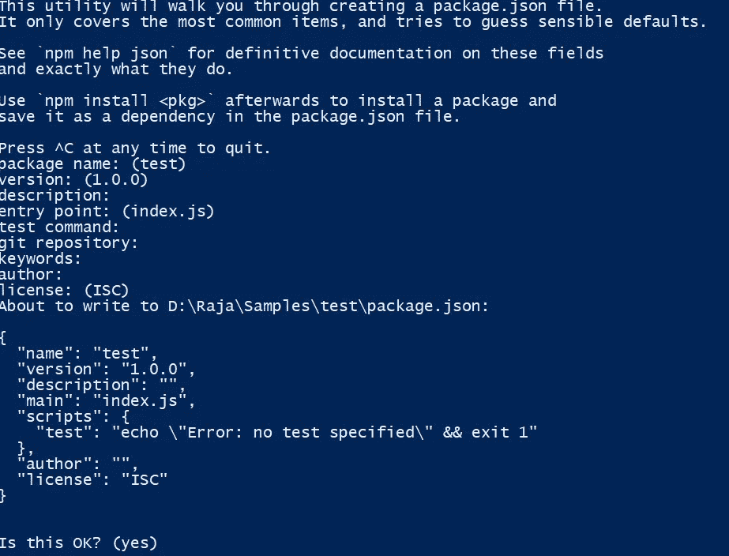

# NPM 入门

> 原文：<https://javascript.plainenglish.io/npm-basics-f30f5620c0b2?source=collection_archive---------22----------------------->


如果您使用 Node 进行开发，那么您确实使用了 Node Package Manager (NPM)来安装、升级、配置和删除软件包。但是当你只是说 npm 的时候，它意味着很多事情。它可以指，

*   默认的 [Node.js](http://nodejs.org/) 包管理器，允许开发者共享模块。
*   一个 NPM 注册表，一个公共和私有包的在线数据库，开发者可以在那里下载/上传包。
*   一个命令行客户端，让开发人员与 NPM 注册表互动。
*   公司 npm，Inc .托管和维护上述所有内容。

这是一个快速介绍，

## NPM 知识库

http://npmjs.org[是一个存储库，在这里维护节点包。在这里可以搜索到 **moment** 等节点包，使用 NPM CLI 安装。](http://npmjs.org/)

你也可以免费添加你的定制包。但是任何人都可以使用它。如果你需要保持你的包是私人的，那么也有一个付费的计划。

## NPM CLI

没有必要单独安装 NPM，因为它现在与节点捆绑在一起。您可以通过运行以下命令来验证 npm 版本

```
npm -v
```

或者使用 NPM 升级最新的 NPM。

```
npm install npm@latest -g
```

您可以使用相同的命令来安装特定的模块/包，如 moment。

```
npm install moment
```

该模块将安装在当前目录的 node_modules 文件夹中。您也可以通过传递-g 来全局安装该模块

```
npm install moment -g
```

该模块将被全局安装，symlink 将被添加到文件夹/usr/local/bin/中。

您也可以通过运行“卸载”命令来删除该软件包。

```
npm uninstall moment
```

💡在计算中，符号链接或符号链接是一个术语，指的是以绝对或相对路径的形式包含对另一个文件或目录的引用并影响路径名解析的任何文件。 *—来自维基百科*

## package.json 文件的用途是什么？

package.json 是一个保存项目元数据(如名称、描述)的文件。它必须在项目的根目录中可用。节点程序包管理器使用此文件来管理依赖性。

可以通过运行下面的命令来创建 package.json 文件

```
npm init
```



下面是 package.json 的重要属性

*   **名称:**正在开发的模块的名称。
*   **版本:**模块的版本。它必须遵循[永远](https://docs.npmjs.com/misc/semver)的模式。
*   **依赖关系:**包含当前项目所需模块的列表。
*   包含当前项目所需模块的列表。依赖项的不同之处在于，本节中列出的模块将被排除在生产版本之外。例如，仅用于开发的模块(例如，Typescript、mocha、chai、eslint)。
*   **脚本:**包含在包的生命周期中的不同时间运行的命令列表。

没有必要将全局安装的模块保存在 package.json 文件中。

你可以在这里查看 package.json [的完整属性。](https://docs.npmjs.com/files/package.json)

可以使用“install”命令安装 dependencies 和 devDependencies 中列出的模块

```
npm install
```

运行上述命令时，NPM CLI 将与 NPM 注册表交互，下载 dependencies/dev dependencies 中列出的所有软件包，并安装在 Node_Modules 文件夹中。

💡如果您只需要安装依赖项部分中的包，那么下面的标志需要和 install 命令一起传递

```
npm install --only=prod
```

或者

```
npm install --only=production
```

## **package . lock . JSON 的作用**

修改 node_modules 树或 package.json 时，Package.lock.json 是自动生成的文件。这保证了在开发期间使用的完全相同的版本被安装在所有的环境中。因此，这个文件必须被推送到源代码控制中，并在源代码部署期间包含在内。

你可以在这里查看 package.lock.json [的完整属性。](https://docs.npmjs.com/files/package-lock.json)

## 审计包

当你开发一个应用程序时，需要很多包，并且在内部他们使用更多的包作为依赖。所以我们需要确保没有安全漏洞。npm 提供了一种方法来评估 package.json 文件的 dependencies、devDependencies、bundledDependencies 和 optionalDependencies 中提到的包。

可以通过运行以下命令来执行审核。

```
npm audit
```

一旦命令被执行，你可以看到安全漏洞报告，包括软件包名称，严重性，路径等。此外，如果可用，它还显示了应用修补程序来解决这些漏洞的命令。

该审计有助于发现可能导致数据丢失、服务中断等的漏洞。当我们运行 **npm install** 时，上面的命令也会自动执行