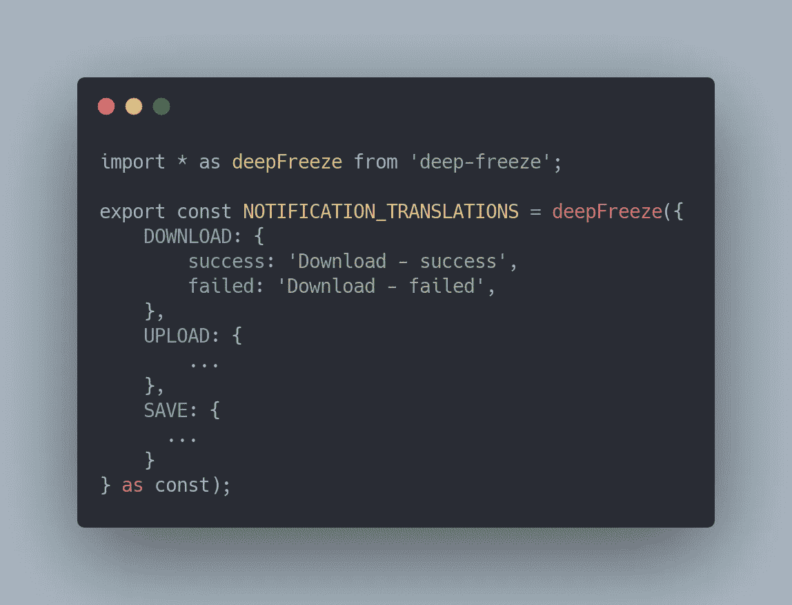
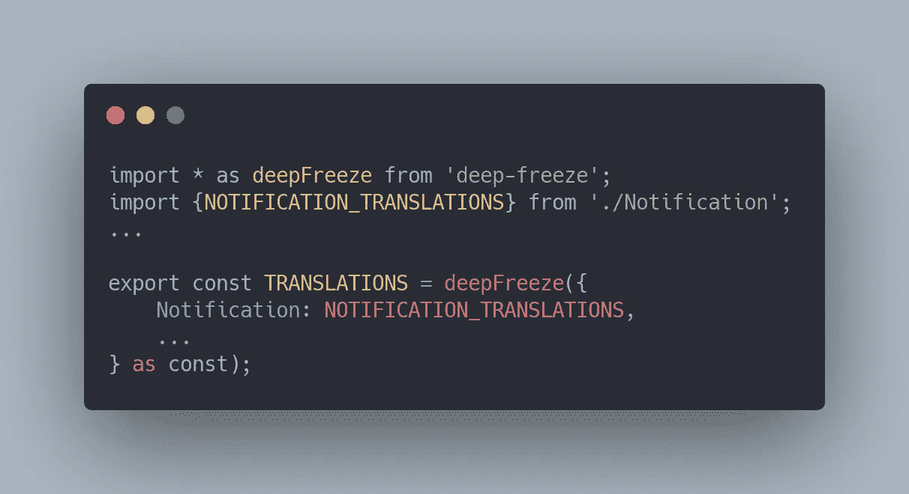
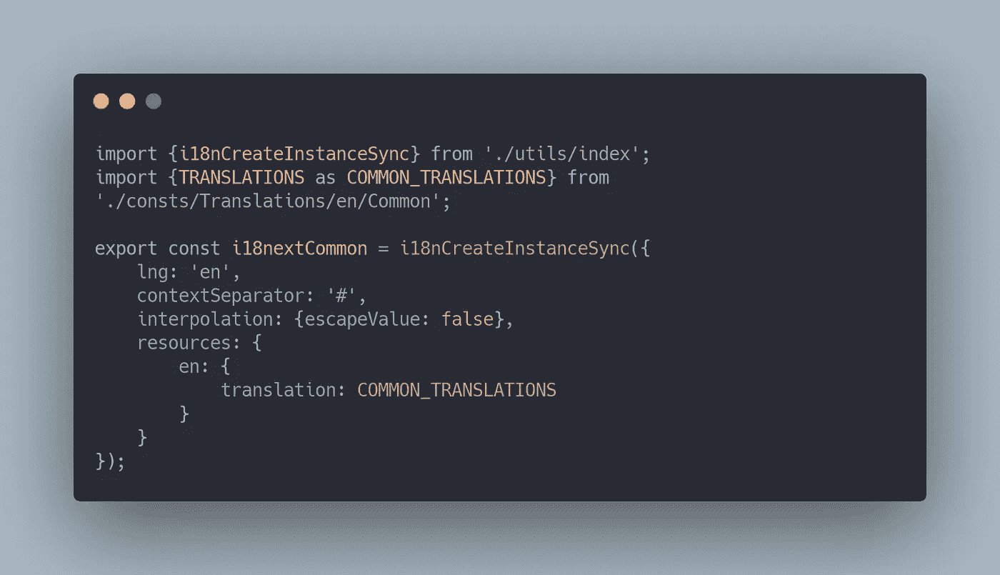
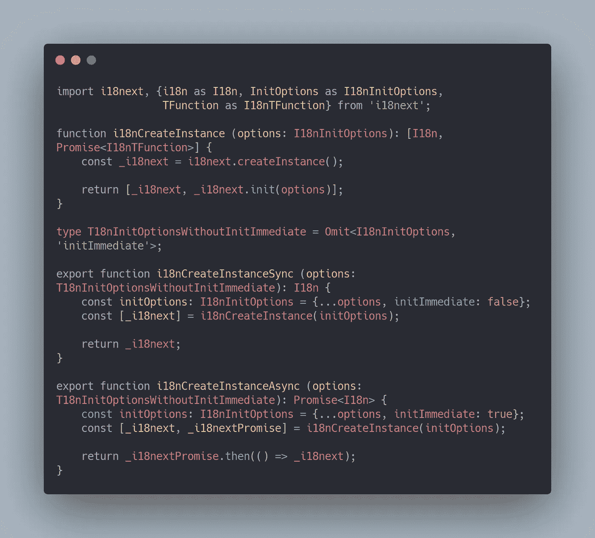
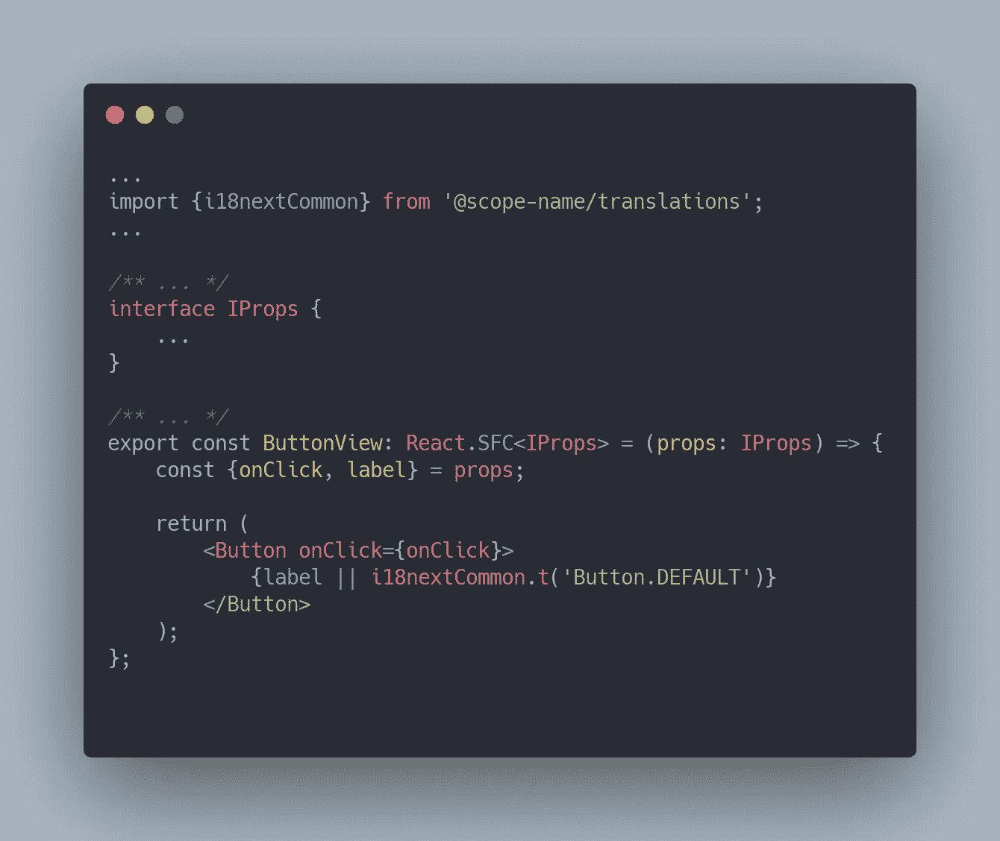
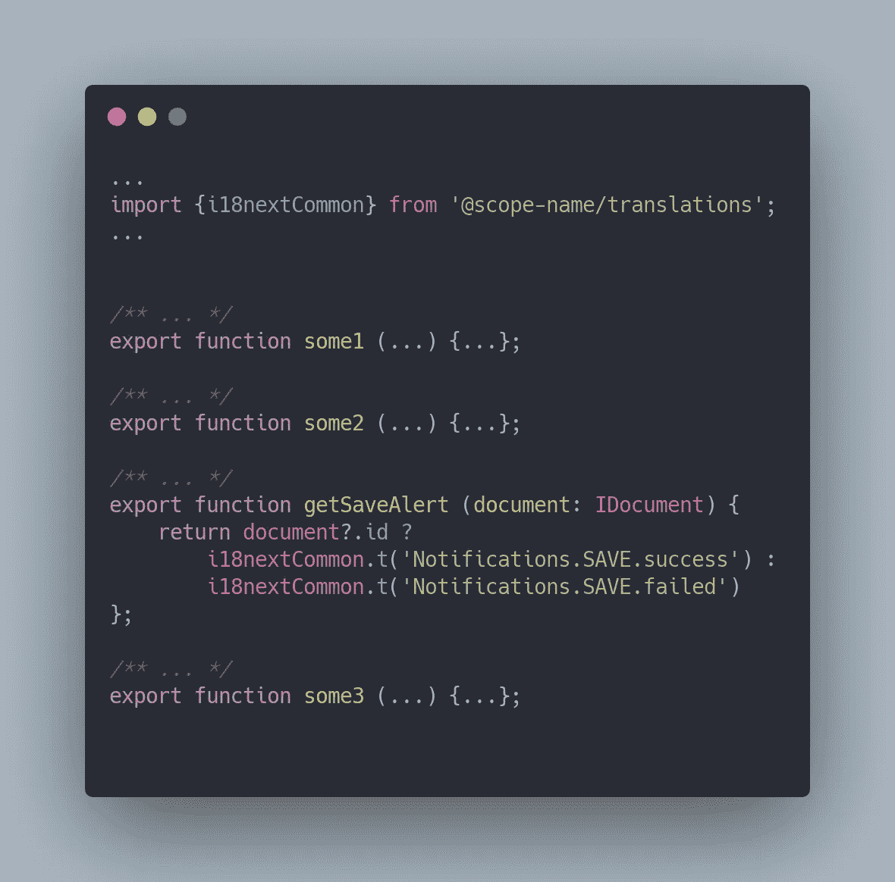
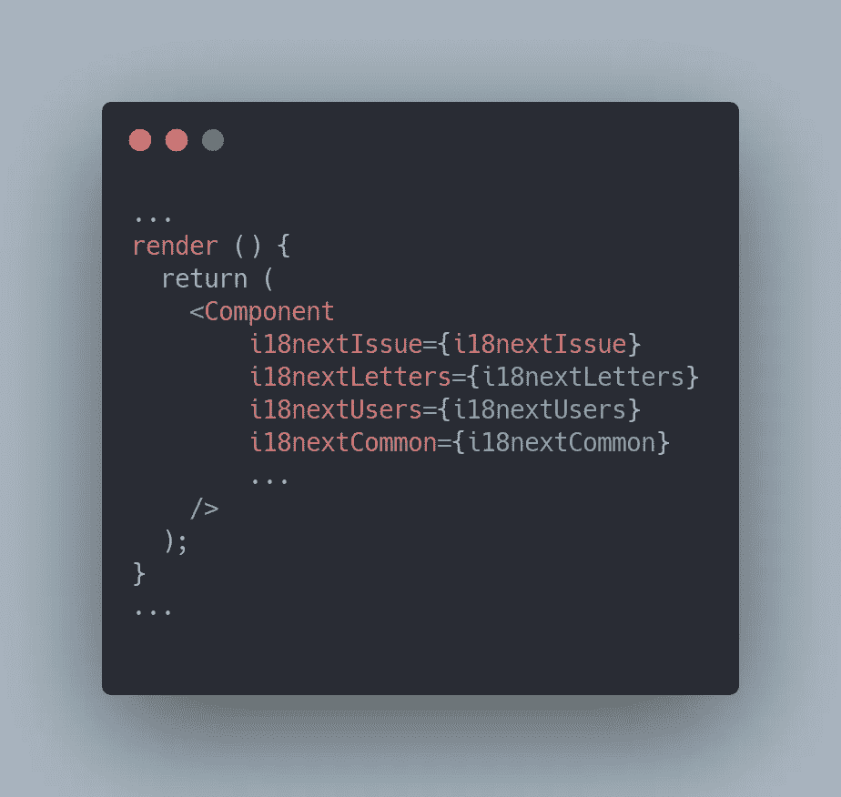

# 大型微前端系统的国际化(i18n)

> 原文：<https://javascript.plainenglish.io/npm-i18n-internationalization-25da8201b3b8?source=collection_archive---------6----------------------->

当实现微前端和/或私有 NPM 模块时，我们需要在整个系统中保持一致的国际化。每个模块都应该使用同一来源的通用文本和翻译。在本帖中，我将分享我在这方面的经验。一切都极其简单。

Photo by [Paul Hanaoka](https://unsplash.com/@plhnk?utm_source=medium&utm_medium=referral) on [Unsplash](https://unsplash.com?utm_source=medium&utm_medium=referral)

## 我们的方式

我们需要创建一个私有的 NPM 包，包含所有常见的翻译/文本+一个实例来初始化它们。

## 第一步。准备

第一步是创建一个私有的 NPM 包。我不会描述完整的创建过程，互联网上有很多这样的信息。我唯一的建议是命名新的 NPM 包`@scope-name/translations`。它应该是一个单独的包，系统中的其他模块将在这个包的基础上构建。

## 第二步。履行

我们的翻译将被创建为 TypeScript 方言中的基本常量。有些情况下，开发人员会像 json 文件一样加载 **i18n** 并异步初始化它们，但在我看来，就浏览器的“网络”负载而言，这并不是最佳选择。现在，我们将把必要的翻译直接注入到我们的 js 块中。

此时只有页面/组件所需的翻译将被嵌入到块中。有条件地，**我们正在国际化层面上实现树抖动**。相比之下，`i18n.json`异步加载方法有一个数据过剩的问题:它要么下载 100 多个小文件，要么在单个 json 文件中加载比当前所需多得多的翻译。

顺便说一下，在[上一篇文章](https://podumaihorosho.medium.com/npm-packages-in-ts-modules-format-7f64aa87591)中，我谈到了 **ts-modules** ，其中我谈到了将 TypeScript 源代码发布到 NPM 包的好处。翻译也将作为源代码发布，我们仍然使用[副本](https://www.npmjs.com/package/copy)来准备`public`版本。

例如，让我们为通知创建一个通用转换常数:

@scope-name/translations/src/consts/Translations/en/Common/Notification.ts

接下来，我们将所有的翻译收集在一起，并发送给一个公共的 i18n 实例:

@scope-name/translations/src/consts/Translations/en/Common/index.ts

@scope-name/translations/src/i18nCommon.ts

为创建 i18n 实例创建了一个特殊的工厂函数，首先，除了这个 NPM 包之外，这个实用程序还可以在微前端和项目的主应用程序中创建翻译，例如，为一些独立的组件创建翻译。让我们仔细看看这个实用程序:

@scope-name/translations/src/utils/i18nCreateInstance.ts

`i18nCreateInstanceSync`函数允许我们从常量创建翻译实例。和 Async 函数是通过 json-file 创建实例所需要的(遗留方法的后备)。在下文中，我将只考虑同步函数。

## 第三步——使用

当将带翻译的 NPM 包连接到主应用程序或微前端，或独立的 NPM 包(例如，组件库)时，我们只需导入 i18n 实例并使用它:

Using common translations from NPM

我们也可以通过常规导入在实用函数中使用翻译。在我们的系统中，早些时候，我们在组件级别接收翻译，并通过组件和功能的整个树将带有 i18n-instance 的 props 代理给消费者。现在我们直接用在需要的地方。例如:

No ‘junk’ props + translations are allowed anywhere

> T 感谢发布带翻译的 **TS-constants** 的源代码，如果现成的 i18nextCommon 实例的冗余不适合我们，我们可以使用预制的 **TS-constants** 构建我们自己的通用翻译实例。即给予消费者完全的行动自由。

## 步骤 4 —创建本地翻译

因为除了 NPM 包中的翻译本身，我们额外提供了一个创建 i18n 实例的函数，这意味着我们可以创建自己的实例(例如，改善项目的语义)。

假设我们现在在自己的微前端工作，我们需要将项目的业务实体划分为 i18n 个实例。为此，我们必须重复本文中的`Step 2`，使用`i18nCreateInstanceSync`函数，但是带有本地翻译。

我们实现了项目的每个业务实体的翻译都在自己的 i18n 实例中，例如:`i18nextIssue`、`i18nextLetters`、`i18nextUsers`、`i18nextCommon`。只有这个列表的最后一个在系统的所有微前端之间是公共的，其余的都是本地的。如果您需要代理或以某种方式同步使用这些实例，这将是非常语义化的:

Semantics of decomposed i18n-instances

## 安排

我们**不直接使用**任何没有常量的文本。这是可重用的，系统的文本库保持干净+将来创建 i18n-实例更容易。

此外，如果翻译**不需要** i18n 功能，例如，动态语言变化、词尾变化、翻译中的变量等。—然后我们以导入一个 **TS-constant** 的形式直接使用翻译，而不需要创建一个单独的 i18n 实例。

为了优化对 i18n 实例的调用，可以使用 currying，例如，通过传递当前语言的参数。

## 结论

开发人员不应该忘记 **DRY** 即使是在国际化这样看似简单的话题中。尤其是在大型微前端系统中。