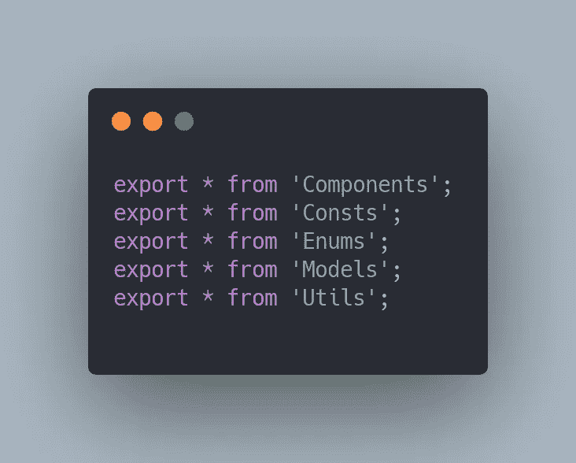
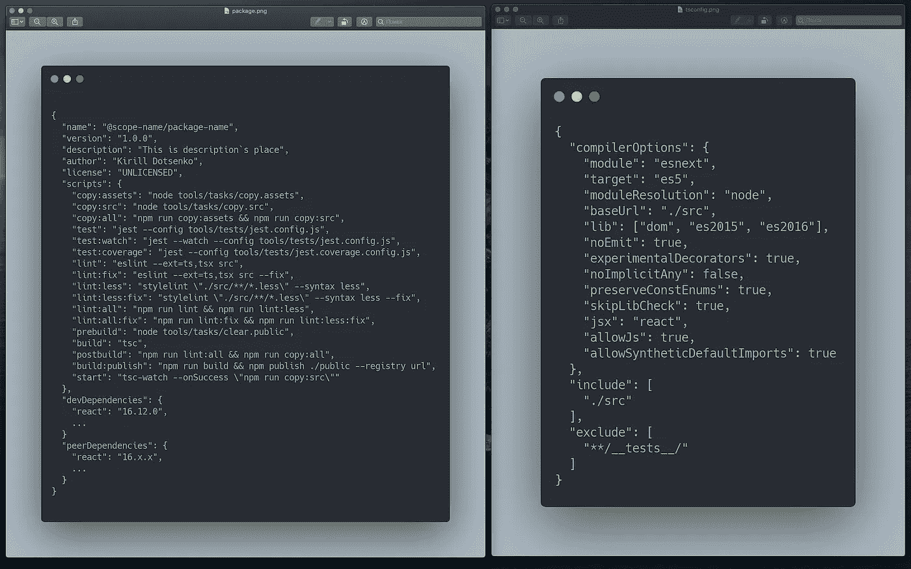

# ts 模块格式的 NPM 包

> 原文：<https://javascript.plainenglish.io/npm-packages-in-ts-modules-format-7f64aa87591?source=collection_archive---------14----------------------->

我注意到一个趋势，我们大多数人沿着某个“标准”的路径创建私有的 NPM 包:一个`index`文件，它包含一个模块的所有内部的重新导出(整个层次结构依次类推)，ES5-cjs 模块(或`asset.min.js`)以及发布后输出中的`d.ts`。但是，如果我说什么可以做得更好呢？

Legacy NPM-package`s master file (module`s entry point)

通常，我们使用 Rollup 构建 NPM 包，因为它不像 Webpack 那样向包中添加垃圾代码。但对我个人来说，Rollup 非常慢，因为组件/实体越多，处理它们的时间就越长，甚至看起来不像是线性依赖。虽然我通过它得到了 ES5-cjs 模块，它们已经能够在 css 模块中使用，但是这个解决方案仍然有许多缺点:

1.  当添加实体和组件时，模块的冷构建会非线性地变慢(我现在有超过 100 个实体和组件)
2.  增量构建也不令人鼓舞
3.  当连接 cjs 规范中的 NPM 包时，树抖动不起作用——因此，包的大小不受控制——这里您需要更改规范，但这并不总是可能的
4.  许多使用 NPM 包的工具并没有简化工作，而是增加了特殊性，特别是对于新开发人员
5.  如果一个已配置的 webpack 已经存在于主项目中(并且 dll 可以被实现用于优化)，为什么我们(我强调，**为我们自己**)需要收集一些东西，用不同的方言编译，这在意识形态上是不可理解的
6.  精简的 jsDoc NPM 包类型已经震撼了所有人。在开发自己的应用程序时，我们为什么要查看自己模块的缩短版`d.ts`?就像我们在轮子里放棍子一样…

我突然想到，我们为什么需要这些？为什么要把事情复杂化？为什么我们需要在 ES5 + `d.ts`中编译一些东西，建立构建系统，保持两个项目总是打开的(main + NPM 用于实现分析)，而我们所有的项目都是用 TypeScript 编写的，并通过一个已经配置好的 webpack 构建，这些 NPM 包的消费者**只是我们自己**。如你所知，这个演讲纯粹是关于私人 NPM 包，但最后我会给出一个银弹，如何让开发者的生活更轻松，并取悦外部消费者。

Photo by [Norbert Kundrak](https://unsplash.com/@trebron?utm_source=medium&utm_medium=referral) on [Unsplash](https://unsplash.com?utm_source=medium&utm_medium=referral)

> NPM 包标准只不过是公众意见，聚集在一起看 10-50 个 npmjs 包，并根据我们自己对美的想法在它们中找到共同的格式。

## 批判性思维的结果

我的想法很简单，那就是 **NPM 包是一个普通的云存储**，就像 DropBox 一样，我们可以在里面做任何我们想做的事情，当然，唯一的事情就是`package.json`存在。我想——既然我们在任何地方都用打字稿写作，那么我的 NPM 软件包的公开版本也可以在 TS 上。它看起来像原始的 ts 代码，在发布之前通过 typescript 编译器和 eslint 进行了验证。我称之为 **ts 模块**。

工作原理:

*   在 NPM 包中，我们像以前一样工作在通常的类型+ less + css-modules + esLint +任何你想要的技术上
*   用一个简单的 tsc 命令构建一个 NPM 包，但是**不要使用`tsconfig.json` `noEmit: true`中的特殊指令发出它**
*   编译成功后(为我们进行类型检查)，将所需的源代码复制到一个文件夹中，这个文件夹将在以后发布，姑且称之为`public`
*   使用 [tsc-watch](https://www.npmjs.com/package/tsc-watch) ，我们为增量构建创建一个可观察对象，并在它成功时挂起复制源代码的命令
*   在主应用程序中，我们直接访问 NPM 包模块，就像这个`@scope-name/package-name/components/inputs/input`，因为`d.ts`文件不见了+我们正在使用本地 TS
*   在 Webpack 设置中的样式加载器规则的指导下，文件与其余的源文件一起被复制，并被收集到主应用程序端的 css 模块中。
*   NPM 包是和主应用程序一起构建的，最重要的是——根据它的规则(css 模块、块等的命名)。)

package.json + tsconfig.json for ts-modules system

我在 Rollup 上移除了构建器，稍微调整了一下`tsc`，这样**就不会发出**构建，并且还挂起了复制源代码的钩子，得到了以下结果:

1.  易用性 NPM 包。所有团队成员都理解唯一的`tsc`命令，该命令生成节点复制`[copy](https://www.npmjs.com/package/copy)`
2.  NPM 软件包的冷构建从 6 分钟减少到 1.5 分钟，增量构建从 20 秒减少到 2 秒(与汇总相比)
3.  主应用程序包的构建增加了 20 秒。我强调，正如我前面所说的，您可以分解程序集并连接 dll 组件，并提交构建的资产来保存结果
4.  当连接 NPM 包和 ts 模块时，最终包的大小已经减小，因为主 webpack 中的树摇动开始工作(应用程序的大小已经减小了 1.5MB)。只是在我的情况下，早期的 Rollup 是给 ES5-cjs 模块。
5.  NPM 包的本地开发不再让开发者害怕，因为从改变包中的代码到 webpack-dev-server 更新页面只需要 10-15 秒(在此期间，会发生两次增量构建:首先在 NPM，然后在主应用程序)。以前，这个操作需要 30 到 60 秒。
6.  **重要！**现在，指向我的包的节点(`node_modules/@scope-name/…`)的命令`cmd + click`不仅显示了我的函数/类/组件的压缩 jsDoc，就像使用`d.ts`一样，还显示了完整的实现，因为它现在是一个完整的文件，您可以在其中立即分析实体的所有细节。

我将补充最后一点，因为这是一个非常令人痛苦的话题，当你结合你自己的 NPM 包开发你的项目，当你从节点模块进入实体时，你得不到你的问题的答案，然后你再一次打开第二个项目，用这个 NPM 包的实现进行一些“深入”的分析——这一切都非常令人困惑。现在，这个动作不再相关，因为源代码位于节点模块中，并且对于此时此地的感知是尽可能清晰的。

> 为您的应用和团队创建方便的系统！你不应该追逐想象中的普遍性，这(根据经验)你在短期内不会实现。

Photo by [Priscilla Du Preez](https://unsplash.com/@priscilladupreez?utm_source=medium&utm_medium=referral) on [Unsplash](https://unsplash.com?utm_source=medium&utm_medium=referral)

## 一些实现细节

*   我从`package.json`中删除了`main`和`types`指令，因为我们不再有索引文件，所有的调用都是“直接的”
*   在源文件中，索引文件也被删除
*   在 NPM 包的`tsconfig.json`中，你必须指定`includes`(不是`files`)指令指向带有我们 ts 代码的文件夹。TypeScript 编译器将理解您需要处理该文件夹中的每个文件，并将按顺序开始编译它们
*   把已发布的 NPM 包中使用的所有东西都移到了`peerDependencies`(等待 npm7，谁知道，他会明白的:)
*   在主应用程序的`tsconfig.json`中，我们需要添加带有 NPM 包路径的`path`指令，这样编译器就可以解析包的路径。这是因为在使用 **ts-modules** 时，没有带有声明空间`declare module’ @name...’`的`index`文件+在`package.json`中没有对它的引用。虽然这个 d.ts 文件可以手动创建…

## 特别焦虑者的退路

作为后备，我们需要修改 NPM 包的组件，并添加带有`name.min.js`的`asset`文件夹(到`public`)或带有已编译模块的`es5/es6`文件夹。而且……我们的 **ts 模块**在`public/ts`中。换句话说，我们将发布两个文件夹`src`和`dist`。

在接下来的文章中，我将继续讨论 NPM 在大型项目中的能力([分解、工具](https://podumaihorosho.medium.com/composing-of-private-npm-packages-in-the-microfrontend-systems-86249c8075dd?source=your_stories_page-------------------------------------)、 [i18n](https://podumaihorosho.medium.com/npm-i18n-internationalization-25da8201b3b8) 等)。)