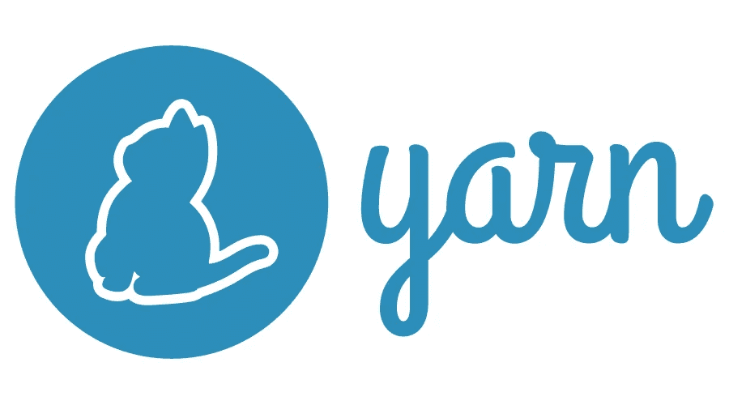
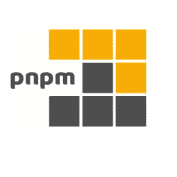

# NPM vs 纱 vs PNPM:应该用哪个 Node.js 包管理器？

> 原文：<https://javascript.plainenglish.io/npm-yarn-pnpm-which-node-js-package-manager-should-you-use-a2a1378694f7?source=collection_archive---------3----------------------->

既然您点击了这篇文章，我假设您已经知道 Node.js 有几个包管理器——NPM、yarn、pnpm 等等。

但是哪一个是最快的，最可靠的，并且提供最好的开发者体验呢？让我们检查一下规格，看看哪一个是最好的！

Photo by [Claudio Schwarz](https://unsplash.com/@purzlbaum?utm_source=medium&utm_medium=referral) on [Unsplash](https://unsplash.com?utm_source=medium&utm_medium=referral)

# 什么是包管理器？

对于那些还不知道什么是软件包管理器的人来说，这是一个很好的起点。

Node.js 是围绕包构建的，您可以在需要时安装这些包。为了改善开发人员的体验，各种开发人员已经创建了包管理器来负责这些包的安装、更新和删除。不仅如此，他们还负责处理依赖关系。
假设您安装了一个软件包，但它需要另一个软件包才能正常运行。您的包管理器将查找所需的依赖项并安装它们！这不是很好吗？

大多数时候，包管理器是基于 CLI 的，并提供类似于`npm install`或`yarn add`的命令。

现在你知道了这些信息，让我们看看你的选择吧！

# NPM

[npm](https://www.npmjs.com/) 是默认的 Node.js 包管理器。它随 Node.js 安装一起提供，是大多数教程中的特色。它在任何方面都不突出，但对大多数人和项目来说是完美的。

## 基本命令

一些最常用的命令是:

*   `npm install package`
*   `npm uninstall package`
*   `npm update`

# 故事

好吧，如果你认识我，那么你已经知道我是一个[纱](https://yarnpkg.com/)的超级粉丝。我会尽量不偏心，但我不能保证什么😉。
node . js 不附带纱线包管理器，需要单独安装。
讽刺的部分来了，我们要用 npm 装纱…
你可以用`npm install -g yarn`装。

## 迅速的

Yarn 并行安装你的包，这使得它比 npm 快很多。

## 工作区

一个很大的优势是纱线工作空间。一个使 monorepos 工作更容易的工具。

> Yarn workspaces 旨在使使用 [monorepos](https://yarnpkg.com/advanced/lexicon#monorepository) 变得简单，以一种更加声明性的方式解决`yarn link`的一个主要用例。简而言之，它们允许您的多个项目共同生活在同一个存储库中，并相互交叉引用——对一个项目源代码的任何修改都会立即应用到其他项目中。

工作空间是一个更复杂的主题，但是不要担心，你可以在不久的将来期待一个教程😉

## 基本命令

一些最常用的命令是:

*   `yarn add package`
*   `yarn remove package`
*   `yarn upgrade`

# PNPM

Pnpm 或 performant npm 是另一种 npm 替代方案。顾名思义，它比普通的软件包管理器要快得多。不仅如此，pnpm 的磁盘效率也比其他两种更高。
就像纱线一样，我们需要先用 npm 安装。为此，我们将使用以下命令`npm install -g pnpm`。

## 它是如何工作的？

与 npm 或 yarn 不同，pnpm 只安装一次依赖项。这样，您的项目可以共享依赖项，您将节省大量磁盘空间。

看看官方文档中的解释。

> 1.如果您依赖于依赖项的不同版本，则只有不同的文件才会添加到存储区中。例如，如果它有 100 个文件，并且一个新版本只在其中一个文件中有变化，`pnpm update`将只添加 1 个新文件到存储中，而不是仅仅为了单一的变化而克隆整个依赖关系。
> 
> 2.所有文件都保存在磁盘上的一个地方。安装软件包时，它们的文件是从那个地方硬链接的，不消耗额外的磁盘空间。这允许您跨项目共享相同版本的依赖项。

由于这种依赖关系的链接，它也比它的替代品快 2 倍。通过使用这项技术和一些真正高性能的缓存解决方案，您可以在眨眼之间安装软件包！

## 基本命令

一些最常用的命令是:

*   `pnpm install package`
*   `pnpm uninstall package`
*   `pnpm update`

如你所见，pnpm 的界面和 npm 的界面非常相似！

# 你应该用哪一个？

一个没有明确答案的难题。正如我已经告诉你的，我更喜欢纱线，但这并不意味着它是最好的…这是一个重要的决定，但至少你现在有了所有你需要的信息！

如果我必须选择一个，我会这样选择:

*   Npm，用于需要使用标准 Node.js 安装的基本项目
*   Yarn，用于工作区等更高级的用例
*   Pnpm，如果磁盘效率对您或您的项目很重要

祝你有丰富的一天！💙

*更多内容请看*[***plain English . io***](http://plainenglish.io)