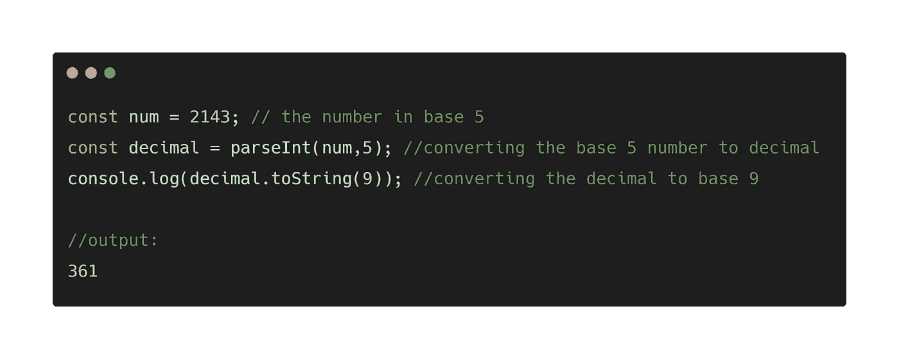

# JavaScript 中的基数转换

> 原文：<https://javascript.plainenglish.io/number-base-conversion-in-javascript-8bc44219b4ab?source=collection_archive---------3----------------------->

## 在 JavaScript 中，从一种基础转换到另一种基础比您想象的要容易

Photo by [Sigmund](https://unsplash.com/@sigmund?utm_source=medium&utm_medium=referral) on [Unsplash](https://unsplash.com?utm_source=medium&utm_medium=referral)

您知道在 JavaScript 中从一种基础转换到另一种基础比您想象的要容易吗？

你需要掌握的只是两个函数。你想知道这些功能是什么吗？他们是`parseInt()`和`toString()`

在本文中，我们将探索:

*   什么是`parseInt()`？
*   什么是`toString()`？
*   如何从其他基数转换到十进制
*   如何从十进制转换成其他基数
*   如何从十进制以外的基数转换到另一个基数。

## parseInt()是什么？

`ParseInt()`是一个 JavaScript 内置函数，它接受`string`和`radix`作为参数，并返回指定基数的字符串的等效十进制数。

`parseInt(string, radix)`

string 参数是必需的，radix 是可选的。但是要使用它进行基本转换，这两个参数是必需的。

让我们来看一个例子。

看看这个例子，string 参数接受 1011，它是一个字符串，数字的基数是 2。

代码将 1011 的基数 2 转换为基数 10。

## toString()是什么？

`toString()`是一个 JavaScript 方法，它返回使用它的数据的字符串转换。

对于基数转换，`toString()`将十进制转换为指定的基数。

让我们来看一个例子。

上面的代码片段显示了`toString()`在`num=36`上使用，并接受`4`作为其参数，即基数。

代码将 10 进制的 36 转换为 4 进制的 210。

这很重要。

## 如何从其他基数转换到十进制

记住！，`parseInt()`用于从其他基数转换为基数 10(十进制)。

让我们来看一个例子。

在上面的代码片段中，`num`作为字符串传入，而`radix`为 2，59 作为十进制的等效值产生。

你困惑吗？让我们深入了解另一个案例。

`parseInt()`接受字符串 436 作为第一个参数，基数 8 作为第二个参数，然后将其转换为 10 进制的 286。

你明白了吗？

现在，让我们转到下一个。

## 如何从十进制转换成其他基数

要从十进制转换到其他基数，你需要的就是`toString()`方法。

让我们来看一个例子。

上面的代码片段显示`num`的值为 78，基数为 10。然后将`num`中的 78 转换为基数 2，这是在`toString()`方法中指定的`radix`。

是不是很混乱？让我们深入了解另一个案例。

在上面的代码片段中，`toString()`方法用在了`num`上，它是一个十进制数(基数为 10 ),接受基数为 8 的参数。

代码只是将十进制的 537 转换成八进制的 1031(基数为 8)。

## 如何从十进制以外的基数转换到另一个基数

我们所做的就是从 10 进制转换到其他进制，反之亦然。

有可能从基数 3 转换到基数 8 吗？还是从基数 7 到基数 2？

耶！这是可能的。

要从一个基数(不是 10)转换到另一个基数，你所要做的就是使用`parseInt()`将数字转换为基数 10，然后使用`toString()`将基数 10 的数字转换为所需的基数。

上面的代码片段显示了如何从基数 5 转换到基数 9。首先使用`parseInt()`将基数 5 转换为基数 10，然后使用`toString()`将基数 10 转换为基数 9。

耶！你终于坚持到了最后。感谢阅读。我希望你觉得这很有用。如果是这样，请在下面留下您的评论。我将等待答复。