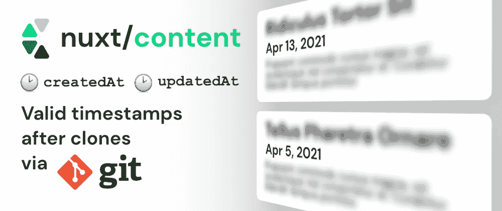

# 如何在克隆 Nuxt 项目后保持“createdAt”和“updatedAt”有效

> 原文：<https://javascript.plainenglish.io/nuxt-content-how-to-keep-createdat-and-updatedat-valid-after-cloning-f80fc7e9633b?source=collection_archive---------22----------------------->

我最近试用了一个用于 nuxt 项目的基于 Git 的 CMS[@ Nuxt/content](https://github.com/nuxt/content)。而且我真的很喜欢！它允许我编写 markdown 文件，并在我现有的项目中托管它们。

在将项目部署到我的服务器时，我注意到的一件事是,`createdAt`和`updatedAt`字段总是被重置，并不反映实际日期。原因是 Git 不保存文件元数据。这意味着`@nuxt/content`所依赖的时间戳毫无用处。

## 快去救援！

解决这个问题的一种方法是不使用文件 stats，而是使用 Git 历史记录。特别感谢安德鲁·克罗伊泽最初的想法。我们检查每个文件的历史，并将最早的提交日期作为`createdAt`，最晚的作为`updatedAt`。

对此的要求是，Git 安装在构建系统上，并且历史记录实际上是签出的。如果在 CI 上进行浅层克隆，将会出现问题，在这种情况下，必须相应地配置克隆。

## 使用 nuxt-content-git 模块使事情变得简单

我创建了 Nuxt 模块 [nuxt-content-git](https://github.com/dword-design/nuxt-content-git) 来使设置即插即用。你可能不希望在每个项目中重新发明轮子。

安装带有`npm install nuxt-content-git`的模块，并将其添加到您的`nuxt.config.js`中，如下所示:

注意，在 `@nuxt/content`之前添加**很重要，这样`@nuxt/content`就知道我们的助手模块安装的钩子。**

## 结论

基本上就是这样！其余的在幕后工作。您的日期应该是最新的。

如果你喜欢这个模块，请告诉我，并在 GitHub 留下一颗[星。](https://github.com/dword-design/nuxt-content-git)

**如果你喜欢我正在做的事情，请关注我的** [**Twitter**](https://twitter.com/seblandwehr) **或查看我的** [**网站**](https://sebastianlandwehr.com/) **。也可以考虑在** [**给我买杯咖啡**](https://www.buymeacoffee.com/dword)**[**PayPal**](https://www.paypal.com/paypalme/SebastianLandwehr)**或者**[**Patreon**](https://www.patreon.com/dworddesign)**进行捐赠。非常感谢！****

***原载于*[*sebastianlandwehr.com*](https://sebastianlandwehr.com/blog/nuxt-content-how-to-keep-createdat-and-updatedat-valid-after-cloning)**

***更多内容请看*[*plain English . io*](http://plainenglish.io/)**