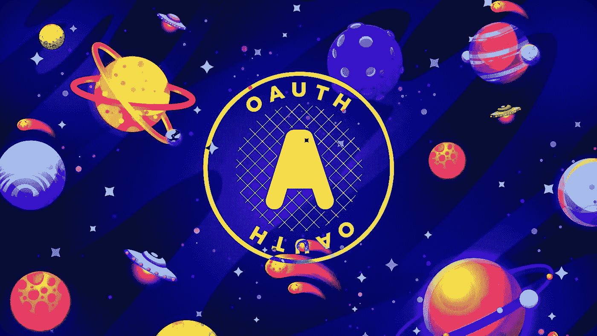
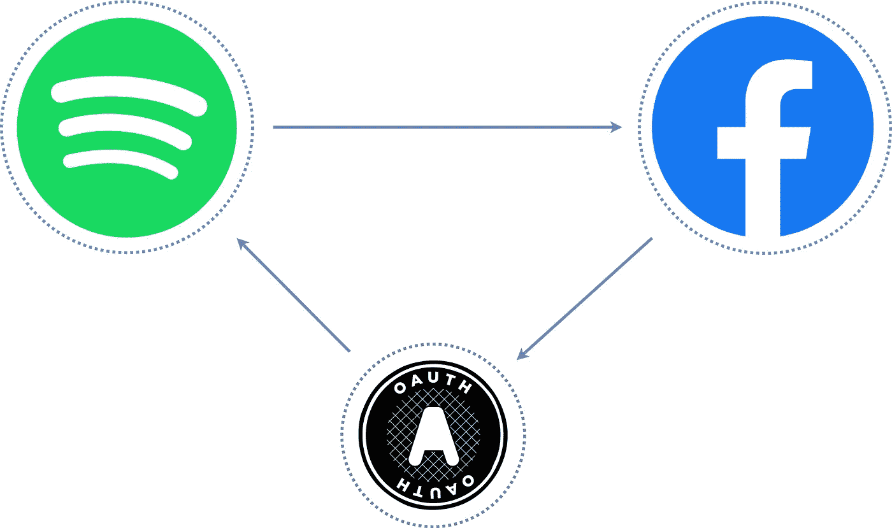
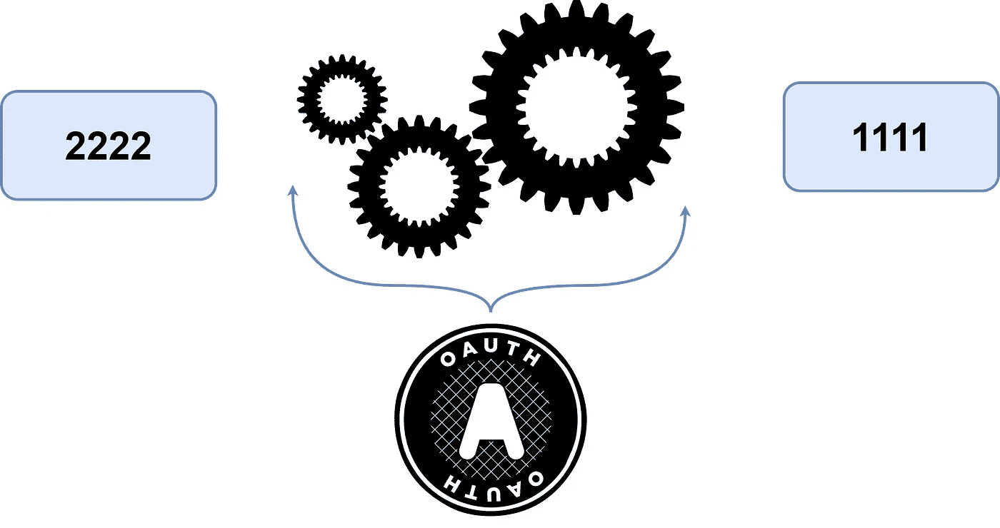

# OAuth 在 4 分钟内解释

> 原文：<https://javascript.plainenglish.io/oauth-explained-in-4-minutes-84081720a4f7?source=collection_archive---------9----------------------->

## 使用 OAuth 进行快速简单的授权

OAuth 是一种应用程序授权标准，在 web 上广泛使用，用于应用程序中的快速无缝授权。它允许您安全地共享对应用程序和权限的访问，这简化了控制应用程序访问的障碍。

## OAuth 和我们为什么需要它

OAuth 代表 ***开放授权*** 是一种安全的行业标准协议，允许我们在不共享密码和其他信息的情况下批准应用程序与另一个应用程序的交互。OAuth 不是在应用之间共享用户密码和凭证，而是通过使用访问令牌的 **HTTPS** 在应用之间传递授权。

***例如:***

*   比方说，你可以通知**脸书****Spotify**访问你的个人资料并在你的时间线上发布更新，而无需向 Spotify ***(脸书密码&凭证)*** 。通过这种方式，它更加安全，并且在 **Spotify** 上的数据泄露的情况下，你的**Facebook**密码将保持安全。
*   同样，当用户授权一个应用程序访问他们的 Spotify 帐户数据时，它不应该存储他们的用户名和密码，因为开发人员不想对任何敏感信息负责，相反，他们依赖一个安全的 **OAuth** 协议，该协议在 ***访问令牌*** 的帮助下负责授权流程。

> **注意:** OAuth 完全专注于一个**授权**而非认证。授权是指当您请求特定的权限来执行操作时。而**认证**就是通过提供凭证**(用户名** & **密码)来证明你是正确的人。**

## 4 个 OAuth 角色

为了执行对应用程序的授权，OAuth 需要一系列的**握手**，如果所有都成功完成，则生成访问令牌，稍后在应用程序间授权的最后一步使用该令牌。

***进行通信以获得访问令牌所需的四个主要角色:***

*   **资源服务器:**存储应用想要访问的数据的 API(**例如** Spotify API)。
*   **资源所有者:**拥有资源服务器中的所有数据(想要登录 Spotify 的用户将是其 Spotify 帐户的所有者)。
*   **客户端:**需要访问您的数据的应用程序(**例如**您的应用程序)。
*   **授权服务器:**从客户端接收请求的服务器访问令牌，并在认证成功时发布这些令牌(**例如** Spotify 账户服务)。

## OAuth 中的作用域

> 在使用 **OAuth** 概念之前，您还需要知道一件事，OAuth 中的作用域概念让我们可以准确地决定哪些资源应该给予请求授权的客户端。它们只是让第三方应用程序的用户确保只有选择的信息会被共享，仅此而已。

## OAuth 令牌

到目前为止，您一定已经理解了 OAuth 主要是生成访问令牌，您可以将它看作是一个 t **双因素身份验证**系统，您通过文本消息接收代码以便登录。与这些双因素授权码类似，OAuth 访问令牌的有效时间有限，过一会儿每个令牌都会过期，您需要生成一个新令牌。

***为了理解 OAuth 访问令牌的过程，我以* Spotify & 脸书*为例，将整个过程分为 5 个步骤。***

在**客户端**和**服务器**之间请求的任何初始步骤之前，客户端需要**客户端 ID** 和**客户端秘密**来启动 OAuth 流程。它们只是两个 ***字符串*** ，用于在请求访问令牌时识别和验证您的特定应用。一旦达到这两个值，我们就可以开始 OAuth 流程了。

*   **客户端请求授权访问数据(步骤 1):** 在该步骤中，客户端 app 向授权服务器发送包含**客户端 ID** 和**秘密**的授权请求，该请求包含授权服务器向其发送访问令牌的**范围**和**重定向 URI** 。
*   **授权对客户端的访问(步骤 2):** 在此步骤中，授权服务器使用**客户端 ID** 和**秘密**对客户端进行身份验证，稍后验证所请求的范围是允许的。
*   **用户授予应用程序访问权限(步骤 3):** 现在，用户被重定向到一个不同的页面，在那里他们可以授予应用程序对其 Spotify 帐户的访问权限。
*   **客户端接收访问令牌(步骤 4):** 一旦用户通过登录其 Spotify 帐户授予访问权限，授权服务器会使用访问令牌将用户重定向回客户端。
*   **使用访问令牌(步骤 5):** 最后一步，客户端使用访问令牌从资源服务器访问资源。

 [## 你不知道 CSS 能做的 4 件事

### 鲜为人知的 CSS 特性及示例

javascript.plainenglish.io](/4-things-you-didnt-know-css-can-do-13b364296570)  [## 2021 年你需要知道的 25 个 CSS 最佳实践

### 编写更好 CSS 的最佳实践

javascript.plainenglish.io](/25-css-best-practices-you-need-to-know-69f9192babdd)  [## Web 开发人员的 9 个专业 CSS 技巧

### 你需要知道的 CSS 技巧

javascript.plainenglish.io](/9-pro-css-tips-for-web-developers-508b8302ff6f) 

*更多内容尽在*[***plain English . io***](http://plainenglish.io)